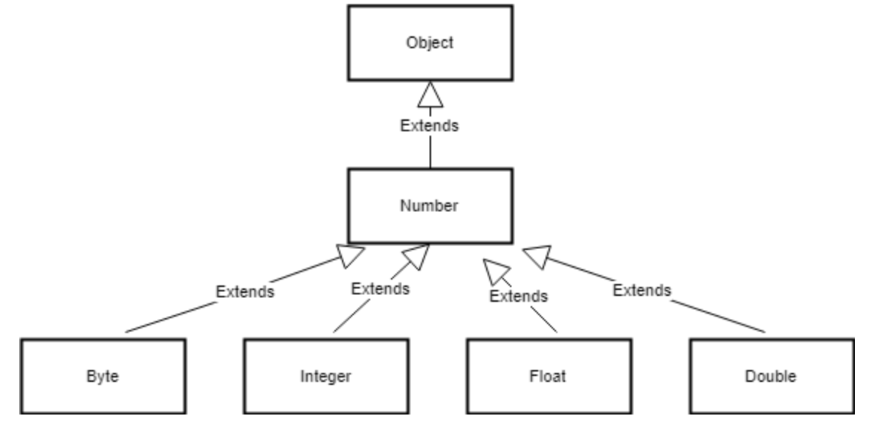
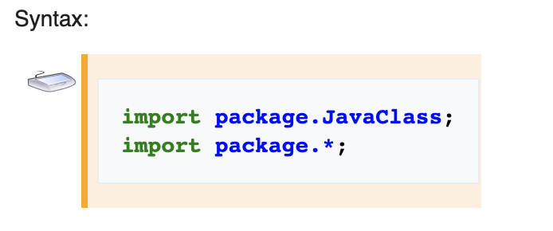

# Monday -  First Day 

🔴 Important! Here you will find your Day 1 [Assessment](https://coding.revature.com/AuthenticateKey?id=4a53e844e7). 

🔴 You will have **1 hour** to complete it


## Computer fundamentals: Types of Memory


### Click [here](https://github.com/220613-Reston-Java-Angular-AWS/Curriculum-Notes/blob/main/Week-1/types-of-memory.md) for more details.

## OS: Operating Systems - Fundamentals 


An OS, or operating system, is the software that allows you to interface with your computer. It takes care of managing the different parts of your computer, such as hardware, memory, and processes. Some common operating systems are Microsoft Windows, macOS, and Linux, but mobile operating systems like Android and iOS are also part of this category.

Windows is the most popular operating system, primarily because it comes pre-installed on PCs and is fairly easy to use. Similarly, macOS comes pre-installed on Mac (Apple) computers. Linux is most commonly found on servers, though it can be installed on personal computers as well, and it is an open-source operating system with many different distributions that differ slightly from each other (such as Debian and Red Hat Linux).

### [Memory Usage and Computers](https://github.com/220613-Reston-Java-Angular-AWS/Curriculum-Notes/blob/main/Week-1/Memory%20Usage%20and%20Computers.md)
More notes here.

## Unix

Unix is a family of operating systems that derive from one built in the 1970s at Bell Labs by AT&T. The current owner of the Unix license is The Open Group, however, Novell, Inc currently holds the copyrights. Linux operating systems and OS X operating systems are based on Unix. One of Unix's standard features is the command-line shell that is used to interface with the operating system. In Linux, this shell is commonly Bash.

 **Bash
The Bourne Again Shell or Bash is based on the original Unix shell, which was called sh. Bash is compatible with sh and incorporates other features as well. Bash was created in 1989.**

Good tutorial that we will use in class [here](https://www.hpc.iastate.edu/guides/unix-introduction/unix-tutorial-1) .


## Commands

### Through the tutorial above we will pratice writing and executing commands in the terminal - however, [here](https://github.com/220613-Reston-Java-Angular-AWS/Curriculum-Notes/blob/main/Week-1/commands.md) is a breakdown of more commands in detail


## Command-Line Text Editors

You can write/view files in the shell by making use of built-in text editors such as `nano` and `vim` or `vi`.

**Guides -**

* [Beginner's Guide to Nano](https://www.howtogeek.com/howto/42980/the-beginners-guide-to-nano-the-linux-command-line-text-editor/)
* [Beginner's Guide to Vim](https://www.linux.com/training-tutorials/vim-101-beginners-guide-vim/)

[Here](https://github.com/220613-Reston-Java-Angular-AWS/Curriculum-Notes/blob/main/Week-1/Command-line-Text-Editors.md) we can find more details about command line text editors.

### Text Editors - Not in command line 

> [Sublime Text](https://www.sublimetext.com/) - You can navigate to where it says "Download" if you want.
> TextEdit - that comes on all Mac OS
> Notepad - that comes on all Window OS


## Introduction to SDLC
This module introduces the Software Development Lifecycle, the Waterfall and Agile methodologies, and the Scrum, Kanban, Scrumban, and eXtreme Programming frameworks.

 
* [Lecture Notes](https://github.com/220613-Reston-Java-Angular-AWS/Curriculum-Notes/blob/main/Week-1/SDLC-Software-Development-Life-Cycle.md)

### Table of Contents

* Team Development in the Software Industry
* Software Development Lifecycle (SDLC)
* The Waterfall Methodology
  * Waterfall Drawbacks
  * Benefits of Waterfall
* Term Definitions
* The Agile Methodology
  * Agile Drawbacks
    * Benefits of Agile
    * The Scrum Framework
      * Scrum Advantages
      * Scrum Disadvantages
    * Kanban
      * Kanban Advantages
      * Kanban Disadvantages
    * Scrumban
    * eXtreme Programming (XP)
      * XP Downsides
      * XP Benefits
    * Agile Planning
* A Home for Waterfall

<br>

# Tuesday

## Environment Variables

Environment variables are values that are accessible in an entire working environment. In Unix, these values are set in the shell when it is started. For example, your home directory is an environment variable called `$HOME`. If you wish to see the value of a particular environment variable, you can use the `echo` command like so: `echo $HOME`.

To set your own environment variables, you can use the `export` command. For example, if you wanted to create an environment variable to store the password to your server, you could issue the following:
```
export SERVER_PASS=password
echo $SERVER_PASS
```

However, if you issue the above command into your console, when you close the shell and open it again, your environment will no longer be present. To keep these environment variables, you will have to place the command in one of your startup files, usually 
```
~/.bashrc
```

You can also remove environment variables with the `unset` command: 
```
unset SERVER_PASS
echo $SERVER_PASS
```
> [Here](https://www.youtube.com/watch?v=bd65z5VZ7L4) && [There](https://www.youtube.com/watch?v=ADh_OFBfdEE&t=194s) are great in depth videos to the explain Environment Variables. 

<!-- While setting up your environment you had to update your envirnonmemt variables a few times. More so on Windows, than on Mac devices.   -->

## Package Managers

Package managers are a type of software that you can use to manage installations and updates for other software on your machine. Typically they allow you to use a CLI (command line interface) to install and update your software. This means that you can easily run commands to install things like Git, Java, .NET, Docker, and more. There are a variety of different package managers, many of which are specific to the operating system that you're using.

- Common Windows package managers:
    - [Scoop](https://scoop.sh/)
    - [Chocolatey](https://chocolatey.org/)
- Common Linux package managers:
    - APT (Debian Linux)
    - YUM (Red Hat Linux)
- Common macOS package managers:
    - [Homebrew](https://brew.sh/)
    - [Fink](https://github.com/fink/fink)


## File Permissions

In Unix, file permissions can become very important. Every file in Unix has three types of permissions.
1. Owner permissions - What the owner of the file is allowed to do to the file.
2. Group permissions - What the group of users that the file belongs to is allowed to do to the file.
3. Other (world) permissions - What everyone else is allowed to do to the file.

Each type of permission can have any combination of read (`r` or `4`), write (`w` or `2`), and execute (`x` or `1`) permissions. You can represent these permissions as either a number or a string of characters. For example, someone with read and write permissions has `6` or `rw` permissions.


## Viewing permissions

You can see the permissions of files in a directory by using the `-l` flag on the `ls` command to get it to print the "long listing format"

`ls -l .`

## Changing permissions

You can change the permissions on a file using the `chmod` or change file mode bits command.

If you are using the numbers, it is as simple as specifying the correct permissions for the `owner`, `groups`, and `other` types and issuing the command targeting the file. For example, if I wished the owner to have read, write, and execute, groups to have read and execute, and other to have read permissions on `hello.text` I would issue the following command:

`chmod 754 hello.txt`

Otherwise, if you are using the strings, you have to specify which groups you are granting or revoking access to. Owner (u), group (g), and other (o) can be specified or all (a) can be used. The `+` indicates a granted privilege, `-` indicates a revoked privilege, and `=` allows you to set privileges.

Examples:
```
# Everyone has all permissions
chmod a+rwx hello.txt
# Revoke write access to other
chmod o-w hello.txt
# Set group access to be the same as other
chmod g=o hello.txt
```


## How To Do Well in QC :pencil2:

Performing well in technical interviews, including QC, requires confidently answering both high-level conceptual questions on specific technologies as well as low-level details about how you’ve worked with them.
<br>
<br>
For example, as a developer you’ve most likely worked with git before. A common interview question to test your proficiency might be **“Tell me about your experience working with git”.** 
- How would you answer this? 
- Take a minute to think about it and then consider the sample responses below. Which answer would impress you more as an interviewer? Which one demonstrates an understanding and proficiency with the tool better?

## Response 1 :cold_sweat:
*“Well, **uh**, for git **uh** I think I’ve used it on a few projects for pushing code… it’s really **helpful, pretty easy** to work with, it lets me **keep track** of **stuff going on** in the project and **work with other** people well.”*

## Response 2 :sunglasses:
*“So I’ve used git for almost all of my projects. It’s a really useful **distributed version control system** for managing **source code** - I’ve used it **on the command line to add, commit, and push** code to an **online repository**, usually **GitHub**, as well as switch between different **feature branches** that my team members and I work on. I like it because it **smooths the process of collaborating** on the same codebase and **merging or integrating changes**.”*

Note a few problems in the first response: the use of filler words (“ummm”, “ahh”) - you should remove these as much as possible. Don’t lower your voice and trail off at the end of sentences, it implies uncertainty. Also note the vague words that are **bolded** - it doesn’t answer **how** git is helpful, how it is easy to work with, or how it lets you keep track of “stuff” (whatever that is). Finally, the only technical word mentioned is “pushing” code.

In contrast, the second answer is well-structured and smooth, and it drops in several technical keywords that demonstrates knowledge in the domain - it explains **what** (“distributed version control”), **how** (“add, commit, push code”), and **why** (“smoothing the process of collaborating”). Putting these together, it **sounds like the person giving the second answer has worked in-depth with git**.

Review one more high-level sample question and answer below.

*Q: “Tell me about the Spring framework”*

*A: “The Spring framework is a **Java framework** for **production-ready enterprise applications** based on the concept of **inversion of control** where we hand off control over **instantiation of our objects** to an external entity. In Spring this entity is the **IOC container** which manages the **lifecycle of the application beans**, provided either through **XML, Java, or annotation configuration**. We can achieve **loose coupling** of our code by letting Spring **inject our bean dependencies** directly into our classes.”*

Remember, there are 3 key questions you should ask for every technology you learn about - **what is it and what does it do, how does it work, and why is it useful?**

As you go through training, think about this approach for structuring your responses in QC, one-on-ones, and panels. To really improve at answering these conceptual questions, you **MUST** practice your own responses. **Also, it’s not enough to memorize the keywords to say - you must fully understand and internalize the knowledge, otherwise you will not be able to back yourself up when asked follow-up questions.**

# Technical Exercise
The exercise below should help you improve your answers in QC, one-on-ones, panels, and interviews. <br>
 **You should complete this exercise each week as you cover new technologies throughout training.** 

1. Find a blank sheet of paper or open a text editor on your laptop
2. List the technologies, languages, libraries, and frameworks you have learned this week (e.g. HTML, CSS, JavaScript)
3. For each one, write a response to the question “Tell me about your experience with X” where X is the given technology.
4. Review your answers and practice saying them out loud. Note any verbal miscues or awkward phrasing
5. Bold the important keywords in your responses
6. Revise your answers. Look for ways to improve clarity, be specific, improve the structure, and make the answers more cohesive.
7. Find a partner (a classmate or your trainer). Practice saying your answers out loud and gather feedback from your partner. Make final revisions to your answers.
8. Record yourself practicing your answer and watch the video to notice any problems you need to correct

If you do this every week, at the end of training you will have a complete set of answers to each language, framework, and major concept you’ve covered. You can use these to improve the bullet points and written sections in your portfolio as well as prepare for the final, cumulative QC session. :shipit:

### Credits
Andrew Crenwelge - Lead Quality Analyst at Revature <br>
Sophia Gavrila - Senior Trainer at Revature

## Coding Challenges - 
**I will be giving you Coding Challenges through [LeetCode](https://leetcode.com/), [Hackerrank](https://www.hackerrank.com/), or [CodingGame](https://www.codingame.com/). This will be Mondays, Wednesdays, and Fridays.**

<br>

# Wednesday

Practice Coding Challenge

## Pillars of OOP
**Learning Objectives**

After completing this module, associates should be able to:
- List the four pillars of Object Oriented Programming
- Explain the "Diamond Problem" with respect to inheritance
- Explain abstraction using real-world examples.
- Explain the differences between method overloading and method overriding.
- Discuss the concept of encapsulation.


# Description for the OOP Concepts topic

## The Four Pillars of OOP
There are four principles that are often referenced when talking about object-oriented programming. They are as follows:
- [Abstraction](#abstraction)
- [Polymorphism](#polymorphism)
- [Inheritance](#inheritance)
- [Encapsulation](#encapsulation)

An easy way to remember these is with the acronym **A PIE**. These concepts provide guidance when designing object-oriented programs. Let's walk through each of these "pillars" of OOP one by one.

### Inheritance
We start with inheritance as it is easiest to understand conceptually. In OOP languages, classes contain a blueprint for the state and behavior of objects. Most languages have a method whereby classes (and thus, objects) can **inherit** the state and behavior (read: fields and methods) of other classes. The class from which other classes inherit from is called a "base" or "parent" class, and the class which inherit the parent is called a "child" or "sub"-class. 

For example, we could have an `Animal` class as our base class which has a field `numOfLegs` and a method `speak`, and a `Dog` class which extends `Animal`. Thus `Dog` will also have the `numOfLegs` field and `speak` method:

#### Interfaces and the Diamond Problem
Another way for classes to inherit is through **interfaces**. Interfaces are like a contract which specify behaviors that other classes must provide. Interfaces only supply method signatures which other classes must implement and provide method bodies for. Interfaces can also have variables, which are attached to the interface itself and are constants that cannot be reassigned.

Multiple inheritance- that is, a class inheriting from more than one class, is not allowed in most OOP languages. However, in some OOP languages, classes can extend from other classes at multiple levels, which is known as **multi-level inhertance** - for example, class `C` extends `B` which extends `A`. If multiple inheritance were allowed, imagine what would happen if a class were to extend multiple other classes which both contain the same method. Which method implementation would the subclass inherit? This ambiguity is called the "diamond problem", shown below.


### Abstraction
**Abstraction** is a programming principle in which we centralize common characteristics and generalize behavior into conceptual classes. In the example above, the `Animal` class contains characteristics and behaviors common to all animals.

Through abstraction, we hide underlying complexity through a simplified interface. Think of a car - you do not need to know how the car works, just how to use the accelerator, brake, and steering wheel. Thus, a car "abstracts" away the internal details of the engine, motor, driveshaft, and other parts. If our `Animal` class were part of a library for creating animals in Java, the user of the library wouldn't need to know exactly how each animal speaks, because the `speak` method is defined on the `Animal` class. We can also use the generic `Animal` type for reference variables without worrying about which specific animal the object is.

 When creating an instance of a Dog, we will declare the object to be of type `Animal`, not `Dog`. The advantage of writing code this way is that later if we decide we instead need to create a `Cat` here, we can easily change the constructor being invoked. Because the `.speak()` method belongs to the `Animal` class, it is guaranteed to exist for all animals. (Here we are assuming `Cat` would extend `Animal`.)


#### Abstract Classes and Interfaces
Abstract classes are more general classes which cannot be instantiated. They instead act as templates for other classes to extend from. Abstract classes can have both concrete and abstract methods - the `abstract` methods must be implemented by concrete subclasses. 

Interfaces also cannot be instantiated. They instead serve as contracts for methods that classes must implement. In order to inherit from interfaces, a class declares that it implemenets some interface, or multiple interfaces. 

Abstract classes are better suited for defining *common characteristics* of objects and are named as nouns by convention, whereas interfaces are better for defining common *behavior* the implementing class promises to provide.

### Polymorphism
By definition, **polymorphism** means "taking on many forms". In the realm of programming, it describes how objects can behave differently in different contexts. The most common examples of polymorphism are method overloading and overriding.

#### Method Overloading
**Method overloading** is when there exist two or more methods in a class with the same method name, but different method signatures by changing the parameter list. 

We can change the number of parameters, the types of the parameters, or the order in which the parameters are passed. Which version of the method is executed is determined by the parameters passed when the method is invoked. Note that varying the return type of the method alone is not permitted in some OOP languages.

Because the argument list is known at compilation, the compiler knows which version of the method will be executed. Therefore, method overloading is a type of **compile-time** - or **static** - polymorphism.

#### Method Overriding
**Method overriding** is when a method in a child class has the same method signature as a method in the parent class, but with a different implementation. Thus, child classes can change the default behavior given by a parent's method. Overriding methods makes class hierarchies more flexible and dynamic. For example, we could change our `Dog` class we used before and have it override the `speak` method from `Animal`.

When we declare the reference variable, it uses the class `Animal` as its type but refers to an actual *instance* of a `Dog` in memory. So we can call the `speak` method declared in `Animal`, but since the reference variable refers to a `Dog` object, it will use that `Dog`'s implementation of `speak`. This is referred to as **virtual method invocation** and is key to method overriding. The `Animal` class (if it is abstract) does not even need to define any implementation for `speak`, since the method to be executed will be determined at runtime depending on the object referred to in memory. This is the reason why method overriding is classified as **runtime** - or **dynamic** - polymorphism.

One more item to note with method overriding is that static methods cannot be overridden. Instead, if a subclass implements the same static method as its parent, the method is hidden. **Method hiding** replaces the parent method in the calls defined in the child class.

#### Covariant return types
When overriding a method, we also have the option of changing the return type - _provided that the overridden return type **is a subtype of the original type**_. This is called **covariant return types**. We can also choose to change the access modifier of an overridden method - _provided that the new modifier for the overriding method provides **more, not less, access** than the overridden method_. An example is below:

### Encapsulation
Finally, **encapsulation** is the OOP principle of containing related state and behavior together inside a class, and also hiding and preventing change to an object's data members. An object encapsulates or controls the access to its internal state. This prevents arbitrary external interference, which could bring the object into an invalid or inconsistent state.


# Real Time Examples for the OOP Concepts topic.

The core OOPs concepts:

Abstraction
Encapsulation
Inheritance
Polymorphism

- Abstraction
   - Abstraction means hiding lower-level details and exposing only the essential and relevant details to the users.
   - Example 1: Let's consider a Car, which abstracts the internal details and exposes to the driver only those details that are relevant to the interaction of the driver with the Car.
   - Example 2: Consider an ATM (Automatic Teller Machine); We perform operations on the ATM like cash withdrawal, money transfer, retrieve mini-statement…etc. but we don't know the internal details about ATM.

- Encapsulation
   - Encapsulation is a process of wrapping data and methods in a single unit is called encapsulation. In OOP, data and methods operating on that data are combined together to form a single unit, which is referred to as a Class. 
   - Encapsulation is the mechanism that binds together code and the data it manipulates and keeps both safe from outside interference and misuse. One way to think about encapsulation is as a protective wrapper that prevents the code and data from being arbitrarily accessed by other code defined outside the wrapper.
   - Real-world examples
      - The capsule, it is wrapped with different medicines. In a capsule, all medicine is encapsulated inside capsule.
      
    
      - A Java class is an example of encapsulation. Java bean is the fully encapsulated class because all the data members are private here.
      

- Inheritance
   - Inheritance is a process of obtaining the data members and methods from one class to another class, plus can have its own is known as inheritance. It is one of the fundamental features of object-oriented programming.
   - Inheritance is a relationship between a superclass and its subclasses.
      - Super Class: The class whose features are inherited is known as a superclass (or a base class or a parent class).
      - Sub Class: The class that inherits the other class is known as a subclass(or a derived class, extended class, or child class). The subclass can add its own fields and methods in addition to the superclass fields and methods.
    - Real-world example: 
       - The real-life example of inheritance is child and parents, all the properties of a father are inherited by his son.
        
       - In the Java library, you can see extensive use of inheritance. The below figure shows a partial inheritance hierarchy from java.lang library. The Number class abstracts various numerical (reference) types such as Byte, Integer, Float, Double, Short, and BigDecimal.
       

- Polymorphism
   - The process of representing one form in multiple forms is known as Polymorphism.
   - Different definitions of Polymorphism are:
      - Polymorphism allows us to perform a single action in different ways.
      - Polymorphism allows you to define one interface and have multiple implementations
      - We can create functions or reference variables that behave differently in a different programmatic context
      - Polymorphism means many forms.
    - A real-world example of polymorphism:
       - Suppose if you are in a classroom at that time you behave like a student, when you are in the market at that time you behave like a customer when you at your home at that time you behave like a son or daughter, Here one person present in different-different behaviors.
       


* Source: https://www.javaguides.net/2019/08/oops-concepts-in-java-with-realtime-examples.html

## Introduction to Java

Who invented Java?
> Java was invented at Sun Microsystems by a team led by James Gosling. It was first released in 1995.

Who currently maintains Java?
> Java is currently owned and maintained by the Oracle Corporation, which acquired Java when it acquired Sun Micros

Java is a high-level, class-based, object-oriented, programming language that is designed to have as few implementation dependencies as possible. 
 - **high level** - No direct memory management, abstracted away from hardware
 - **class based** - Everything written is inside a class, inheritance based on class
 - **object oriented** - Bundle data and behavior into a single logical unit, the class. (Encapsulation)

Java is a general-purpose programming language intended to let developers ***write once, run anywhere***. Compiled Java code can run on any **Java Virtual Machine (JVM)** regardless of the hardware and software environment.  
  
Java is a C derivative, which means its syntax is similar to that of C/C++. While Java has fewer low-level features such as direct memory access, it has high-level features C and C++ lack, such as reflection.  

## JDK, JRE, JVM
Java is write once, run anywhere (WORA) thanks to the JVM. Java code is compiled into **bytecode**, which are instructions the JVM understands. The JVM is specific to the operating system - there is a JVM for Windows, one for Mac, one for Linux, etc. The JVM reads the compiled Java bytecode and translates it to machine code to be executed on the given system.
  
In order to run Java code on a machine, the **JRE** or **Java Runtime Environment** is also required. The JRE contains all the runtime libraries that your code will be using. The JRE includes the JVM. When users talk about "installing Java" this usually refers to installing the JRE. In order to run Java applications, all you need is the JRE.
  
To develop Java applications you need the **JDK**, or **Java Development Kit**. The JDK provides developer tools like a compiler, debugger, documentation tools (javadoc), and other command-line utilities. The JDK also includes the JRE, and by extension the JVM, so when you write your code you can compile and run it as well. 
  
  

  
  
So, to recap - the JDK contains tools for Java development as well as a JRE, which contains the built-in Java libraries as well as a JVM, which actually executes our Java bytecode and runs it on the specific operating system it is installed upon.

## First Java Program: HelloWorld

The history of [Hello World](https://github.com/220613-Reston-Java-Angular-AWS/Curriculum-Notes/blob/main/Week-1/history-of-hello-world.md).

Let's walk through a simple HelloWorld program. You must have a JDK intalled in order to do this.
1. Open up your command-line terminal application
2. Check that you have a JDK installed:
```bash
javac -version
# if you get something like "command not found" on your terminal, you don't have the JDK installed
# if you get a valid java version (e.g javac 1.8.0_211), the jdk is installed properly

```
3. Create a directory, move to it, and create a file called `HelloWorld.java`
```bash
mkdir java-practice
cd java-practice
touch HelloWorld.java
```
Now open this file with a simple text editor program and write the HelloWorld application.
```java
public class HelloWorld {

  public static void main(String[] args) {
    System.out.println("Hello, world!");
  }
}
```

4. Now that the source code is written, we can compile it into bytecode using the compiler (`javac`):
```bash
javac HelloWorld.java
# If this command executes without any errors, your code has compiled successfully
```
You should now see a `HelloWorld.class` file in your directory - this contains the compiled bytecode of the program. If you open it up in a text editor, it will appear as gibberish because the bytecode is not human-readable, it is merely instructions that the JVM can understand and run.
    
5. Finally we can run the compiled bytecode using the `java` command
```bash
java HelloWorld
# Hello World!
```
This command loads and executes the `HelloWorld.class` file. Note that we **do not** include the `.class` extension when using the `java` command.

#### Summary of HelloWorld

- "Hello, World!" programs are used to illustrate how the process of coding works, especially for introductory programmers.
- Sometimes more experienced programmers use "Hello, World!" programs as a "sanity test" to make sure the components of a language have been correctly installed.
- "Hello, World!" can also be used to compare the executable file sizes of different programmers.
- The "Hello, World!" program has been implemented in nearly every programming language.
- 
## Class vs Object

**Classes** are the *blueprints* for how to create objects that contain  a certain **state** - which is represented by *fields* (variables) - and **behavior** - which is defined via *methods*. Classes are complex data types.

* Example: A Person has a name and a age.

```
class Person {
  String name;
  int age;
}
```

**Objects** are instances of class definitions.

* John is a Person instance
* when we use the `new` keyword, we create an object

```
Person john = new Person();
```


## Methods and Parameters

### Methods

* a block of code that I can invoke / call
* black box
  * give it *input* and get back *output*
  * I do not know what happened inside - hypothetically 
* **Method Signature**
  * return type
  * method name
  * **parameters**

examples
```
void someMethod() {

}

someMethod(); //invoke method
```

```
int someMethod() {
  return 5;
}

int a = someMethod(); //invoke method. a is 5
```  

```
int add(int x, int y) {
  return x + y;
}

int a = add(3, 4); //invoke method. a is 7
```

notice the **arguments** do not have to have the same names as the **parameters**
* where are the **arguments**?
* where are the **parameters**?

```
int add(int x, int y) {
  return x + y;
}

int first  = 3;
int second = 4;

int a = add(first, second); //invoke method. a is 7
```

<br>

# Thursday

## Constructors

* special method
* does not have a return type
  * the return type is *implicitly* an object
* must have the same name as the class
  * case matters
* Constructors are invoked when we use the `new` keyword

example of no arg constructor

```
public class Person {

  public Person() {

  }

}
```

more verbose example
* `this` points to this object
* it essentially gives you a reference to yourself

```
public class Person {

  String name;
  int age;

  public Person(String name, int age) {
    this.name = name;
    this.age = age;
  }  
}
```

we can invoke that constructor as follows

```
Person john = new Person("John", 28);
```

we can also overload constructors
* **method overloading** is when you define two or more methods with the same name in the same class
  * we cannot be ambiguous, so either the number of parameters or the parameter data types must be different
* you can overload normal methods too  

```
public class Person {

  String name;
  int age;

  public Person(String name) {
    this.name = name;
  }

  public Person(String name, int age) {
    this.name = name;
    this.age = age;
  }  
}
```

invoke the first constructor

```
Person john = new Person("John");
```

invoke the second constructor

```
Person john = new Person("John", 28);
```

How were we able to create instances without defining a constructor?
* When Java sees there are no constructors in a class, Java will insert a **default constructor**
* the **default constructor** is a no arg constructor: `public Person(){}`

## Static Keyword
`Static` denotes a method, or field to be part of the class itself, rather than part of an object instantiated from the class. This means that all objects of that class share a single method or field. Consider the class below:
  
```
public class Example {
    public static int x = 5;
}
```
  
That static int x will be shared among all instances of this class. If we create two different objects from the class and print the value of x for each, they will both be 5. If we change one to 10 and then print them both again, both will show 10. There is only one version of x, which is kept in memory with the class itself.
  
Likewise we can classify methods as static as well. Static methods can be invoked on a class itself, and do not have access to non-static fields and methods. Consider a class with a non-static field, y. If you never instantiate an object from the class, y never exists. If you can invoke a static method without ever instantiating an object, and that method tries to access the field y, it would throw an error. Static methods can be invoked on a class object as well, and can be invoked on sub-classes as though inherited. 
  
Lastly, we can modify some classes to be static as well. We can't make a top-most class static (every .java file must contain one top-most class which the file is named after) but we can "nest" a class inside another. These nested classes can be made static. Static nested classes can only access static members of the outer class. Nested classes can access even private members of the outer class.
  
## Return Type
Many methods return some data upon completion. Almost all methods must specify a return type. The only methods that do not are constructors. A method which does not return any data must have the `void` return type. When a method is invoked, it is eventually resolved as a returned value.

## Packages and Imports

#### A package in Java is used to group related classes. Think of it as a folder in a file directory. We use packages to avoid name conflicts, and to write a better maintainable code.

#### *import* is a Java keyword. It declares a Java class that can/will be used in the code below the import statement. Once a Java class is declared, then the class name can be used in the code without specifying the package the class belongs to. Use the '*' character to declare all the classes belonging to the package.




## Wrapper Classes

Wrapper classes are classes that let you treat primitives as Objects. This is necessary - for example - for certain methods which only accept objects and not primitives. **Boxing** is the process of converting a primitive to its wrapper class. Java has a feature called **autoboxing** which will automatically convert primitives to wrapper classes implicitly. **Unboxing** is the reverse - converting a wrapper class to its primitive. Below the wrapper classes are listed:

| Primitive | Wrapper Class | Size | Description |
| --------- | ------------- | ------- | ----------- |
| boolean   | Boolean       | N/A     | True/False. Size unspecified, depends on JVM |
| byte      | Byte          | 8 bits  | numerical, integer value |
| short     | Short         | 16 bits | signed numerical, integer value |
| char      | Character     | 16 bits | unsigned numerical, Unicode character |
| int       | Integer       | 32 bits | numerical, integer value |
| long      | Long          | 64 bits | numerical, integer value |
| float     | Float         | 32 bits | floating point value |
| double    | Double        | 64 bits | floating point value |

Wrapper classes have static helper methods like `.parseX()` and `.valueOf()` for explicit primitive conversion.

```java
public class AutoboxingExample {

  public static void main(String[] args) {
    int n = 5;
    someMethod(n); // autoboxing is done here!
	// 8
  }
  
  public static void someMethod(Integer i) {
    System.out.println(i + 3);
  }
}
```
## Java Compilation
"Compilation" is a term that refers to the process of turning your source code into executable instructions (often called binaries). In the early days of programming compilation was one small set in a larger pipeline from source to binary. Now days we sort of include all of the steps into the blanket term "compile". You may also see people say "build". this is the same idea, and probably a more accurate term.
  
Many programming languages produce executable files when built, however Java does not. Executable files are binary files that contain a series of CPU instructions, called machine code. In this way your program is able to tell the CPU what to do. Java doesn't do this directly, instead Java produces bytecode when compiled. This bytecode, similar to machine code, contains instructions for the Java virtual Machine, which then in turn tells the CPU what to do. This is how Java can be run on so many platforms. All of the bytecode is the same, regardless of target environment. As long as there is a JVM present to interpret bytecode and convert it into machine instructions, Java programs can be run there.
  
### Compile/Build Steps:
First, the source ‘.java’ file is passed through the compiler, which then encodes the source code into a machine-independent encoding, known as Bytecode. The content of each class contained in the source file is stored in a separate ‘.class’ file. While converting the source code into the bytecode, the compiler follows the following steps:

1. **Parse**: Reads a set of *.java source files and maps the resulting token sequence into AST (Abstract Syntax Tree)-Nodes.
2. **Enter**: Enters symbols for the definitions into the symbol table.
3. **Process** annotations: If Requested, processes annotations found in the specified compilation units.
4. **Attribute**: Attributes the Syntax trees. This step includes name resolution, type checking and constant folding.
5. **Flow**: Performs dataflow analysis on the trees from the previous step. This includes checks for assignments and reachability.
6. **Desugar**: Rewrites the AST and translates away some syntactic sugar.
7. **Generate**: Generates ‘.Class’ files. 

### Execution:

The class files generated by the compiler are independent of the machine or the OS, which allows them to be run on any system. To run, the main class file (the class that contains the method main) is passed to the JVM and then goes through three main stages before the final machine code is executed. These stages are:
These states do include:

1. ClassLoader
2. Bytecode Verifier
3. Just-In-Time Compiler


#### Stage 1: Class Loader

The main class is loaded into the memory bypassing its ‘.class’ file to the JVM, through invoking the latter. All the other classes referenced in the program are loaded through the class loader.
A class loader, itself an object, creates a flat namespace of class bodies that are referenced by a string name. The method definition is provided below illustration as follows:

Illustration:
```java
// loadClass function prototype

Class r = loadClass(String className, boolean resolveIt);

// className: name of the class to be loaded
// resolveIt: flag to decide whether any referenced class should be loaded or not.
```

There are two types of class loaders

 - primordial
 - non-primordial
The primordial class loader is embedded into all the JVMs and is the default class loader. A non-primordial class loader is a user-defined class loader, which can be coded in order to customize the class-loading process. Non-primordial class loader, if defined, is preferred over the default one, to load classes. 

#### Stage 2: Bytecode Verifier

After the bytecode of a class is loaded by the class loader, it has to be inspected by the bytecode verifier, whose job is to check that the instructions don’t perform damaging actions. The following are some of the checks carried out: 

 - Variables are initialized before they are used.
 - Method calls match the types of object references.
 - Rules for accessing private data and methods are not violated.
 - Local variable accesses fall within the runtime stack.
 - The run-time stack does not overflow.
 - If any of the above checks fail, the verifier doesn’t allow the class to be loaded.


#### Stage 3: Just-In-Time Compiler

This is the final stage encountered by the java program, and its job is to convert the loaded bytecode into machine code. When using a JIT compiler, the hardware can execute the native code, as opposed to having the JVM interpret the same sequence of bytecode repeatedly and incurring the penalty of a relatively lengthy translation process. This can lead to performance gains in the execution speed unless methods are executed less frequently.


**Now were are going create our very first Project using our IDE IntelliJ**


## Introduction to Git


Git is a **distributed version control system**. This means that the entire codebase and history of a project is available on every developer’s computer as a **local repository** , which allows for easy branching and merging. 

This repository contains all of the information that the **remote repository** has, based on the last time that you synced those two together.

Even if you don't have access to the **remote repository**, you can still view all of the changes that have been made, and contributers can maintain a copy of this record on their own machines.

### Working directory

* Untracked and modified files will exisit within the **Working Directory**. The files in the **Working Directory** are listed when we run `git status`.

* The **Staging Area** is where we organize what we want to be commited to our repository.  The **Staging Area** allows us to pick and choose which files we want to commit and when.  Commits should be details regarding what changes were made in individual files.

1. To add files to the **Staging Area** run the commmand `git add <file-name>`. To add all of the changes we've just made, run the following command.

```
$ git add .
```

When you run `git status` again, you should see the recently staged files in green.

2. To **commit** these changes run:
```
$ git commit -m "initial commit"
```


### Commits

Commits are the core building block units of a Git project timeline. Commits can be thought of as snapshots or milestones along the timeline of a Git project. Commits are created with the git commit command to capture the state of a project at that point in time.

### Committing work

By default, git commit will open up the locally configured text editor, and prompt for a commit message to be entered. However, passing the -m option will forgo the text editor prompt in-favor of an inline message. 

```
git commit -m "Here is where you give a brief description of what you are committing to your repository"

```
#### Remember the steps you will take whenever commiting changes: As we practice you will develop your own specfic order BUT you always want to have the most recent code in your local repositiry before pushing your code to prevent conflicts. 
```
$ git add .
$ git commit -m "a message about changes"
$ git pull
$ git push
```

The `git pull` command is used to fetch and download content from a remote repository and immediately update the local repository to match that content, **before** you push your changes.


### Branches


Branching is a feature available in most modern version control systems.  Instead of copying files from directory to directory, Git stores a **branch** as a reference to commit.  The branch itself represents the `HEAD` of a series of commits.

The default branch name in Git is `master`, which commonly represents the official, working version of your project.  As you start making commits, the master branch points to the last commit you made.  Everytime you commit, the master branch pointer moves forward automatically. Think of a branch as a timeline of versions of a project as it progresses.

Branching is a strategy that allows developers to take a snapshot of the master branch and test a new feature without corrupting the project in production. If the tests are successful, that feature can be **merged** back to the master branch and pushed to production.


#### Create a login branch 
**NOTE** this must be done in a directory that is already under git

Imagine that you want to create a login functionality feature on your project.

1. To create a new branch called `login`, within your directory run: 
```
$ git branch login
```
2. To `checkout` to the newly created branch, run:
```
$ git checkout login
```
Now you will be able to create and edit files that will only exist on this branch until you merge it with `master`.


### Pull requests

A pull request – also referred to as a merge request – is an event that takes place in software development when a contributor/developer is ready to begin the process of merging new code changes with the main project repository.

It is best to do this process in Github becuase Github offers interfaces and options that we just cannot have in command line.


*Break into groups - We are going to practice branches, committing, pushing and making pull requests*

<br>

# Friday

Practice Coding Challenge

## Control Flow Statements

### Decision Making 

#### If-Then
The most basic control flow statement is the if-then statement. This statement evaluates if some predicate is true or false, and if the predicate evaluates to true the code in the block is executed, otherwise it is skipped.
```
if(x == 5 /*predicate statement*/ ) {
    //do something
}
```

#### If-Then-Else
An else clause can be added to the basic if-then to get an if-then-else statement. This statement evaluates if a predicate is true or false just like above. If true, the first block is executed, if false the else block is executed.
```
if(x == 5) {
    //do something
} else {
    //do something else
}
```
These stataments can be further expanded by chaining else-if statements. We simply add another if-then after the else and we can chain alternatives as long as we want.
```
if(x == 5) {
    //do something
} else if(x == 6) {
    //do something else
} else if(x >= 7) {
    //do a different thing
} else {
    //finally, if all else fails do this
}
```
Eventually we can optionally end the if-then-else-if chain with a single else that only executes if none of the other predicates were true. In the above example only one of the blocks of code will ever be executed.

#### Switch
Switch statements are very similar to the above chain of if-then-else-ifs. We consider one variable and enter a block depending on its value.
```
switch(x) {
    case 5:
        //do something
        break;
    case 6:
        //do something
        break;
    case 7:
        //do something
        break;
    default:
        //finally, if all else fails do this
        break; //break is not strictly necessary here
}
```
Here we can see we are considering some variable x, and we execute code under one of the `case` statements depending on the value of x. If x is neither 5, 6, nor 7 we execute the code under the `default` statement. Inside each case the `break` keyword is used. This keyword breaks you out of any control flow block and skips the remainder of it. Execution continues after the end of the block. In this case each of the `break` keywords causes execution to skip the remainder of the block and begin again after the closing `}`. We must use `break` in switches unless we want to "fall-through" where we continue to execute the code in the other cases.


### Loops

#### While Loop
The while loop executes a block of code over and over as long as some predicate holds true. Keep in mind that we must include some way for the loop to end, or else it will continue endlessly until the program terminates.
```
while(x < 5) {
    x++;
}
```
In this example as long as x is less than 5 the loop will continue, but eventually x will be greater than 5 as with each loop 5 increases by one. Once x is equal to or greater than 5 the predicate will be false and the loop will exit. Note that the while loop won't execute one last time, even though the check is at the top of the code, once it is false the block of code is exited imedately and execution continues after the `}`.

### Do-While Loop
Similar to the while loop, the do-while loop has it's predicate check at the end of the block of code. This type of loop will always execute at least once, as the first execution happens before any check is done. Otherwise it behaves similar to the plain while loop. Once the predicate is false looping stops and execution continues after the block.
```
do {
    x++;
} while (x < 5)
```

### For Loop
One of the most common types of loop, the for loop is bounded by beginning and end conditions. Eventually (hopefully) the conditions are met to cease looping and execution continues after the block. The logic that controls looping has three parts, separated by `;`. 
```
for(i = 0; i < 10; i++) {
    //do something 10 times
}
```
In this example i is set to 0, looping continues as long as i is less than 10, with each iteration i is increased by one. Note that there is no logic inside the block to stop iterating, that is all contained within the conditional statement. The first section is initialization, the second is the looping condition, and lastly is advancement.

### For-Each Loop
The for-each loop, sometimes called the enhanced for-loop loops once through a collection of elements. Any collection that implements the `Iterable` interface can be looped through in this way. A for-each loop executes a block of code once for each element in a collection.
```
for(type element : collection) {
    //do something
}
```
This example just shows the parts of the statement, and is not valid. Here is a working example:
```
for (Integer i : integerList) {
    i *= 2;
}
```
For each Integer object in a collection of Integers, take that Integer and double it. Once every member of the collection has been acted upon, the loop is complete end execution continues after the `}`.

### Jumps

#### Break
We saw break earlier, commonly used in switch statements to avoid fall-through execution. Break can also be used to break out of any loop or switch statement. Break will cause execution inside the block to stop and execution to continue after the block ends.
```
while(true) {
    x++;
    if(x > 5) {
        break;
    }
}
```
This example is silly, but shows the use of break to conditionally break out of a while loop.

#### Continue
Continue is similar to break in that it will cause the current execution inside a loop to cease, however instead of breaking out of the loop, it continues with the next iteration.
```
for(i = 0; i < 5; i++) {
    System.out.println("Hello");
    continue;
    System.out.println("Goodbye");
}
```
This example will print "Hello" 5 times, and will never print "Goodbye". Note that the use of continue still increments i normally.


## Casting
[Casting](https://www.w3schools.com/java/java_type_casting.asp) is the process of converting a data type to another data type. This is also called **type casting**. Casting is necessary is some situations like when receiving a data type that needs to have some actions performed on it that its original form cannot handle.

If the original data type has a smaller size value than the needed type, Java will automatically do the conversion. In the example an int (size of 32 bits) is being cast to a double (size of 64 bits). Due to this the conversion is able to be done without the loss of any data.

```java
public class AutomaticCasting {

  public static void main(String[] args){
    int n = 10;
    double d = n; //This is now converted from an int to a double.
    double e = (double) n; //This is explicit, and otherwise the same as the above syntax.
  }
}
```

However cases where the original data type is larger than the needed type, you will have to explicitly convert them using a parenthesis. However there can be data loss using this method.

```java
public class ExplicitCasting {

  public static void main(String[] args){
    double d = 10.60;
    int n = (int) d; //Casting is happening here
    // The 0.60 is lost in conversion.
  }
}
```

In some cases you will have to use the data type's own methods to convert. Some of these methods are listed in the table below.

| Original |   Target  |           Method         |
| ---------| --------- |--------------------------|
| String   | int       |Integer.parseInt(String); |
| int      | String    |String.valueOf(int);      |

You are also able to cast subclass objects to their superclasses which is called upcasting and cast superclass objects to their subclasses (This has some limitations and prerequisites).


## Agile vs Waterfall (Review)

##### [Waterfall model](https://en.wikipedia.org/wiki/Waterfall_model)


As seen in the image above, the waterfall model has 5 main stages:

- **Requirements definition**
  - The system's components, goals, functionalities, services, and constraints will be determined and written in detail in the documentation. This documentation will be known as the system specification.
- **System and software design**
  - Determine the overall system architecture
- **Implementation and unit testing**
  - This stage involves breaking down the software design into components and verifying whether the components address requirement specifications
- **Integration and system testing**
  - Every component is combined to form a single system and is tested to see if they components mesh well with each other.
- **Operation and maintenance**
  - The system is shipped out and maintenance (improving the system and fixing any bugs that were not discovered earlier.

The waterfall model is a straight forward model where the software process follows a linear pattern; for it to advance to the next stage, the prior stage must be completed. Only after the "operation and maintenance" step is completed can the project go to earlier steps as it sees fit. The waterfall model is commonly known as a plan-driven model.

In trying to develop innovative software, the model has these shortcomings:

* The users don't really know how they want the software to behave without trying it out.
* The analysis and design phases ignore the difficulties that might be faced in actually implementing this innovative idea.
* The implementation phase proceeds without testing all along the way, so problems aren't detected until after it is completed.
* The "environment" the software was designed for will be changing while this long process, with major decisions locked-in at the start, is proceeding. Examples:
* The laws regarding the real-world activity the software is meant to enhance can change.
* The competitive environment of the real-world activity can change.
* The technological landscape assumed by the analysis phase can change.

However, these strict step-by-step processes and lack of foresight into potential future changes do not mean that this model is useless. Because each stage must be fully completed and understood, this model is very beneficial for large projects that multiple teams from multiple sperate locations work on a workflow would be more efficient if each team was on the same page/understanding as each other.

##### [Agile](https://www.agilealliance.org/)

Rapid development and delivery is an important factor for software engineering as software needs to be able to address new changes to requirements. To address this, agile methods were created to put more emphasis on the end product rather than the documentation that may be made along the way. In other words, of working long hours on documentation, the agile approach aimed to cut the overhead caused by the documentation and focus on the development of the actual code.

Every agile method share these characteristics:

* Specification, design, and implementation are mixed as system specification, design documentation, and user requirements are usually minimized to save time during development or are automatically generated.
* Systems are usually developed in increments so that consumers and other stakeholders can give their input during the development phase
* Many tools are used to aid during development. Examples of such tools are tools that automatically test your code, help you make the process of designing and creating the user interface easier, etc.

Agile has the following limitations:

* It is not the ideal solution for small developer teams.
* It has a higher cost compared to other workflow models.
* The project can go off target if the project manager is not sure of the direction to take.


The above image depicts a plan based development lifecycle vs an agile development cycle.

<br>

