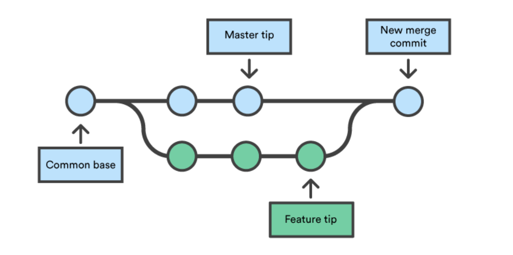

# Monday

## Non- Access Modifiers

### Static Keyword
`Static` denotes a method, or field to be part of the class itself, rather than part of an object instantiated from the class. This means that all objects of that class share a single method or field. Consider the class below:
  
```
public class Example {
    public static int x = 5;
}
```
  
That static int x will be shared among all instances of this class. If we create two different objects from the class and print the value of x for each, they will both be 5. If we change one to 10 and then print them both again, both will show 10. There is only one version of x, which is kept in memory with the class itself.
  
Likewise we can classify methods as static as well. Static methods can be invoked on a class itself, and do not have access to non-static fields and methods. Consider a class with a non-static field, y. If you never instantiate an object from the class, y never exists. If you can invoke a static method without ever instantiating an object, and that method tries to access the field y, it would throw an error. Static methods can be invoked on a class object as well, and can be invoked on sub-classes as though inherited.
  
Lastly, we can modify some classes to be static as well. We can't make a top-most class static (every .java file must contain one top-most class which the file is named after) but we can "nest" a class inside another. These nested classes can be made static. Static nested classes can only access static members of the outer class. Nested classes can access even private members of the outer class.

### Final

The keyword `final` can be applied to a class, method or variable. In all cases it means the structure _cannot be changed_, but what that actually means depends upon the construct that it is applied to.

When applied to a variable, it means that you cannot reassign the variable to another value. You must initialize a final variable when declaring it.

```java
public final int x = 124;
```
When applied to a method, it means that you cannot _override_ the method.

```java
public final int someMethod(){ . . . }
```

When applied to a class, it means that you cannot create a subclass of this class.

```java
    public final class FinalClass { . . . }
```

A common example of a final class is the String class.

### Abstract

The abstract modifier is used to define methods that will be implemented in a subclass later on. Most often it's used to suggest that some functionality should be implemented in a subclass, or (for some reason) it can't be implemented in the superclass. If a class contains an abstract method, it must also be declared abstract.

Note: You can not create an object of an abstract class. In order to do that, you need to provide an implementation for all the abstract methods.

An example would be if we had a simple class called Employee that encapsulates data and methods for an employee. Let's say that not every employee is paid in the same way, some types of employees are paid by the hour and some are paid a fixed salary.

```java
   abstract class Employee {
    int totalHours; // In a month
    int perHour;    // Payment per hour
    int fixedRate;  // Fixed monthly rate
    
    
    
    abstract int salary();
    
}
```

```java
     class Contractor extends Employee {
   
    // Must override salary if we wish to create an object of this class
    int salary() {
        return totalHours*perHour; 
    }
   
}
```

```java
        
    class FullTimeEmployee extends Employee {
   
    int salary() {
        return fixedRate; 
    }

}
```

```java
     
    
    class Intern extends Employee {
   
    int salary() {
        return 0; 
    }
  
}
```

[Here](https://github.com/220613-Reston-Java-Angular-AWS/Curriculum-Notes/blob/mainBackup/Week-2/Access_and_NonAccess_Modifiers.md) we can find all of the modifiers and their access levels. 

<br>

## Variable Scopes
When a variable is declared in a Java program, it is attached to a specific **scope** within the program, which determines where the variable resides. The different **scopes of a variable** in Java are:
* Instance, or object, scope
* Class, or static, scope
* Method scope
* Block scope

Instance scope means that the variable is attached to individual objects created from the class. When an instance-scoped variable is modified, it has no effect on other, distinct objects of the same class.

Class scoped variables reside on the class definition itself. This means that when objects update a class-scoped variable, the change is reflected across all instances of the class. Class scope is declared with the `static` keyword. Methods can also be declared as class scope. However, `static` methods cannot invoke instance methods or variables (think about it: which specific object would they reference?). Static methods and variables should be referenced through the class directly, not through an object. For example: `MyClass.myStaticMethod()` or `MyClass.myStaticVariable`.

Method scope is the scope of a variable declared within a method block, whether static or instance. Method-scoped variables are only available within the method they are declared; they do not exist after the method finishes execution (the stack frame is popped from the stack and removed from memory after execution).

Block scoped variables only exist within the specific control flow block, of which there are several in Java: `for`, `while`, and `do-while` loops, `if/else-if/else` blocks, `switch` cases, or even just regular blocks of code declared via curly braces (`{}`). After the block ends, variables declared within it are no longer available.


## Introduction to Git
[Into To Git Video](https://git-scm.com/video/what-is-version-control)

[Git Cheat Sheet](https://training.github.com/downloads/github-git-cheat-sheet/)

Git is a **distributed version control system**. This means that the entire codebase and history of a project is available on every developer’s computer as a **local repository** , which allows for easy branching and merging. 

This repository contains all of the information that the **remote repository** has, based on the last time that you synced those two together.

Even if you don't have access to the **remote repository**, you can still view all of the changes that have been made, and contributers can maintain a copy of this record on their own machines.

### Working directory

* Untracked and modified files will exisit within the **Working Directory**. The files in the **Working Directory** are listed when we run `git status`.

* The **Staging Area** is where we organize what we want to be commited to our repository.  The **Staging Area** allows us to pick and choose which files we want to commit and when.  Commits should be details regarding what changes were made in individual files.

1. To add files to the **Staging Area** run the commmand `git add <file-name>`. To add all of the changes we've just made, run the following command.

```
$ git add .
```

When you run `git status` again, you should see the recently staged files in green.

2. To **commit** these changes run:
```
$ git commit -m "initial commit"
```


### Commits

Commits are the core building block units of a Git project timeline. Commits can be thought of as snapshots or milestones along the timeline of a Git project. Commits are created with the git commit command to capture the state of a project at that point in time.

### Committing work

By default, git commit will open up the locally configured text editor, and prompt for a commit message to be entered. However, passing the -m option will forgo the text editor prompt in-favor of an inline message. 

```
git commit -m "Here is where you give a brief description of what you are committing to your repository"

```
#### Remember the steps you will take whenever commiting changes: As we practice you will develop your own specfic order BUT you always want to have the most recent code in your local repositiry before pushing your code to prevent conflicts. 
```
$ git add .
$ git commit -m "a message about changes"
$ git pull
$ git push
```

The `git pull` command is used to fetch and download content from a remote repository and immediately update the local repository to match that content, **before** you push your changes.


### Branches

[Quick Tutorial](https://www.atlassian.com/git/tutorials/using-branches#:~:text=A%20branch%20represents%20an%20independent,staging%20area%2C%20and%20project%20history)

Branching is a feature available in most modern version control systems.  Instead of copying files from directory to directory, Git stores a **branch** as a reference to commit.  The branch itself represents the `HEAD` of a series of commits.

The default branch name in Git is `main`, which commonly represents the official, working version of your project.  As you start making commits, the master branch points to the last commit you made.  Everytime you commit, the master branch pointer moves forward automatically. Think of a branch as a timeline of versions of a project as it progresses.

Branching is a strategy that allows developers to take a snapshot of the master branch and test a new feature without corrupting the project in production. If the tests are successful, that feature can be **merged** back to the master branch and pushed to production.



  **DEMO - We'll create personal projects and push them to github.**

#### Create a login branch 
**NOTE** this must be done in a directory that is already under git

Imagine that you want to create a login functionality feature on your project.

1. To create a new branch called `login`, within your directory run: 
```
$ git branch login
```
2. To `checkout` to the newly created branch, run:
```
$ git checkout login
```
Now you will be able to create and edit files that will only exist on this branch until you merge it with `main`.


### Pull requests

A pull request – also referred to as a merge request – is an event that takes place in software development when a contributor/developer is ready to begin the process of merging new code changes with the main project repository.

It is best to do this process in Github becuase Github offers interfaces and options that we just cannot have in command line.


*Break into groups - We are going to practice branches, committing, pushing and making pull requests*


[Git-Flow WorkFlow]() - Here is taking Git Flow to the next step. 
