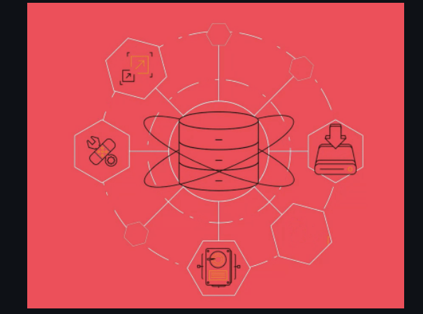
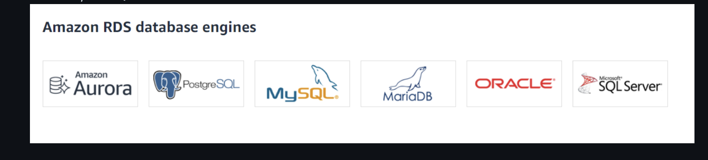
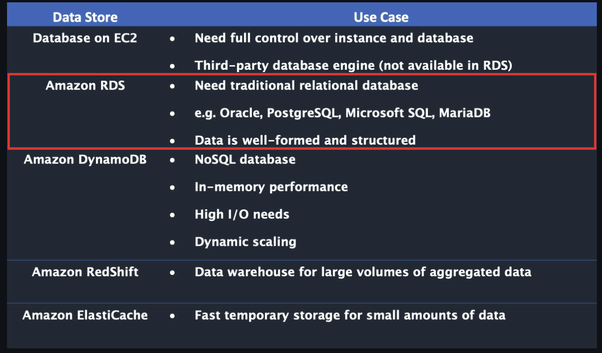
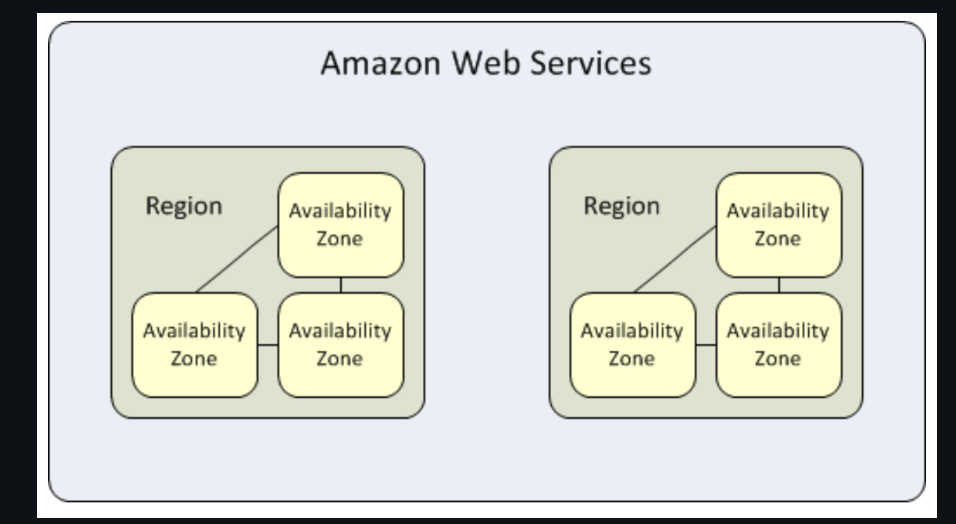
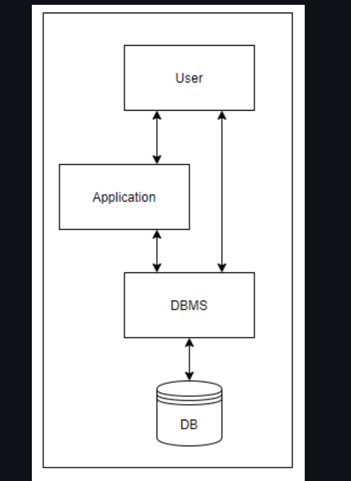

# Monday

## AWS (Amazon Web Services) 

### What is Cloud Computing?

Cloud computing is the on-demand delivery of compute power, database storage, applications and other IT resources through a cloud services platform via the Internet with pay-as-you-go pricing.

Cloud computing provides a simple way to access servers, storage, databases and a broad set of application services over the Internet.  

### 6 Advantages of Cloud Computing

1. Trade capital expense for variable expense.
2. Benefit from massive economies of scale.
3. Stop guessing about capacity.
4. Increase speed and agility.
5. Eliminate overhead cost of maintaining data centers
6. Go global in minutes.

### Trade capital expense for variable expense
Instead of having to invest heavily in data centers and servers before you know how you’re going to use them, you can pay only when you consume computing resources, and pay only for how much you consume.

### Benefit from massive economies of scale
By using cloud computing, you can achieve a lower variable cost than you can get on your own. Because usage from hundreds of thousands of customers is aggregated in the cloud, providers such as AWS can achieve higher economies of scale, which translates into lower pay as-you-go price.

### Stop guessing about capacity
Eliminate guessing on your infrastructure capacity needs. When you make a capacity decision prior to deploying an application, you often end up either sitting on expensive idle resources or dealing with limited capacity.

### Increase speed and agility
In a cloud computing environment, new IT resources are only a click away, which means that you reduce the time to make those resources available to your developers from weeks to just minutes.

### Eliminate overhead cost of maintaining data centers
Cloud computing lets you focus on your own customers, rather than on the heavy lifting of racking, stacking, and powering servers (infrastructure).

### Go global in minutes
Easily deploy your application in multiple regions around the world with just a few clicks. This means you can provide lower latency and a better experience for your customers at minimal cost.


## Paying for Cloud Services

AWS offers you a **pay-as-you-go** approach for pricing for over 160 cloud services.  With AWS you pay only for the individual services you need, for as long as you use them, and without requiring long-term contracts or complex licensing. 

* You can also use [AWS Billing and Cost Management](https://docs.aws.amazon.com/awsaccountbilling/latest/aboutv2/billing-what-is.html)

## 3 Models of Cloud Computing

### Infrastructure as a Service (IaaS)
Infrastructure as a Service (IaaS) is a self-service model for managing remote data center infrastructures.
AWS offers IaaS in the form of data centers.

### Platform as a Service (PaaS)
Platform as a Service (PaaS) allows organizations to build, run and manage applications without the IT infrastructure. This makes it easier and faster to develop, test and deploy applications. 

### Software as a Service (SaaS)
Software as a service (SaaS) replaces the traditional on-device software with software that is licensed on a subscription basis. It is centrally hosted in the cloud. A good example is Salesforce.com.


#### Other Major Cloud Providers
* [Microsoft Azure](https://azure.microsoft.com/en-us/)
* [Google Cloud Platform (GCP)](https://cloud.google.com/gcp/?utm_source=google&utm_medium=cpc&utm_campaign=na-US-all-en-dr-bkws-all-all-trial-e-dr-1009135&utm_content=text-ad-lpsitelinkCCexp2-any-DEV_c-CRE_113120492887-ADGP_Hybrid+%7C+AW+SEM+%7C+BKWS+%7C+US+%7C+en+%7C+EXA+~+Google+Cloud+Platform-KWID_43700009942847400-kwd-26415313501&utm_term=KW_google%20cloud%20platform-ST_google+cloud+platform&&gclid=Cj0KCQjwoJX8BRCZARIsAEWBFMIKqoP4b6G-3OlpQkCrVvMoAvss3kNL_2joyIs7N42TL-2WZRBCUaoaApspEALw_wcB)

#### 

[Create an AWS account](https://signin.aws.amazon.com/signin?redirect_uri=https%3A%2F%2Fconsole.aws.amazon.com%2Fconsole%2Fhome%3FhashArgs%3D%2523%26isauthcode%3Dtrue%26nc2%3Dh_ct%26src%3Dheader-signin%26state%3DhashArgsFromTB_us-east-2_6ab127f851343d99&client_id=arn%3Aaws%3Asignin%3A%3A%3Aconsole%2Fcanvas&forceMobileApp=0&code_challenge=sbE0GRA6ykegMHK6J031bx9vreZDd2PdMHRZGZyv6JU&code_challenge_method=SHA-256)

**I suggest setting up MFA - Multi factor authentication**


##  RDS Overview
The following overview will cover:  
* What is Amazon RDS?
* Why use RDS?
* Regions & Availability Zones
* Security
* How to interact with Amazon RDS
* Using AWS RDS vs. Installing a database on an AWS EC2 Instance

### What Is Amazon Relational Database Service (Amazon RDS)?
Amazon Relational Database Service (Amazon RDS) is a web service that makes it easier to set up, operate, and scale a relational database in the AWS Cloud. It provides cost-efficient, resizable capacity for an industry-standard relational database and manages common database administration tasks.
<br />
<br />

<br />

* RDS **automates** expensive and time consuming tasks such as managing backups, software patching, automatic failure detection, and recovery.  

* You can help control who can access your RDS databases by using **AWS Identity and Access Management (IAM)** to define users and permissions.  

* RDS is available on several **database instance types**.  **Instance types** comprise varying combinations of CPU, memory, storage, and networking capacity and give you the flexibility to choose the appropriate mix of resources for your database.
    * Examples of instance types include `T3`, `T2`, `M6g`, `M5`, etc...You can read more about instance types [here](https://aws.amazon.com/rds/instance-types/).  
<br />

* RDS is **free to try** and you will be charged based on how much computational power you use per month (pay-as-you-go).  

* RDS provides you with six familiar database engines to choose from, including Amazon Aurora, PostgreSQL, MySQL, MariaDB, Oracle Database, and SQL Server. 
   


### Why Use RDS?
It's important to distinguish AWS RDS from *other database solutions offered through AWS*.

* AWS offers 15 database engines including *relational, key-value, document, in-memory, graph, time series, and ledger databases*.  

* With **RDS**, you don’t need to worry about database management tasks such as server provisioning, patching, setup, configuration, backups, or recovery. The RDS manages this for you.  

* **RDS** is a **relational** database service, therefore it organizes data within tables in rows and columns.  Compare this to non-relational or NoSQL databases which use different mechanisms to store and retrieve data through key-value pairs, document models, etc.  
<br />


See the image below to see how AWS RDS differs from other databases available in AWS.


<br />
<br />

### Regions & Availability Zones
* An **AWS Region** is a highly available data center that houses Amazon cloud computing resources in different areas of the world (for example, North America, Europe, or Asia).  

* Each AWS Region contains multiple distinct locations called **Availability Zones**, or AZs.  

* Each Availability Zone is engineered to be isolated from failures in other Availability Zones. Each is engineered to provide inexpensive, low-latency network connectivity to other Availability Zones in the same AWS Region. 

* By launching instances in separate Availability Zones, you can protect your applications from the failure of a single location.  This makes AWS fault-tolerant.
    * **Fault-tolerance** defines the ability for a system to remain in operation even if some of the components used to build the system fail.
<br />

 

### Security
* A **security group** controls the access to a DB instance. It does so by allowing access to IP address ranges or Amazon EC2 instances that you specify.

* You can set security groups when configuring your RDS instance.  


### How to Interact with Amazon RDS
There are several ways that you can interact with Amazon RDS.

#### 1. AWS Management Console
You can manage your DB instances from the console with no programming required. To access the Amazon RDS console, sign in to the AWS Management Console and open the Amazon RDS console at <a href="https://signin.aws.amazon.com/signin?redirect_uri=https%3A%2F%2Fconsole.aws.amazon.com%2Frds%2F%3Fstate%3DhashArgs%2523%26isauthcode%3Dtrue&client_id=arn%3Aaws%3Aiam%3A%3A015428540659%3Auser%2Frds&forceMobileApp=0">https://console.aws.amazon.com/rds/</a>

#### 2. Command Line Interface
You can use the AWS Command Line Interface (AWS CLI) to access the Amazon RDS API interactively.  Install the AWS CLI [here](https://docs.aws.amazon.com/cli/latest/userguide/cli-chap-install.html).  To begin using the AWS CLI with RDS, view the [AWS CLI Command Reference](https://docs.aws.amazon.com/cli/latest/reference/rds/index.html).

#### 3. Programatically Accessing Amazon RDS
While developing an application, developers may use the *AWS Software Development Kits (SDKs)* and utilize the [RDS Application Programming Interface (API)](https://docs.aws.amazon.com/AmazonRDS/latest/UserGuide/ProgrammingGuide.html) to automate tasks for managing DB instances and other objects in Amazon RDS.

### Using AWS RDS vs. Installing a database on an AWS EC2 Instance
DB services (like RDS) are *managed* services, meaning that you have limited control over the actual database. (i.e you can't install particular software you may need).

* **EC2 (Elastic Cloud Compute)**, on the otherhand, gives you maximum control over the software stack, database, and operating system.
* **EC2** allows you compute capacity and `SUPER` priveleges, increasing flexibility.

* **RDS** is more cost-effective and is automated, but limits your control over the database.
* **RDS** takes care of your database from end-to-end by managing, maintaining, and securing it, eliminating overhead costs and the role of a DBA (Database Administrator).  


> For a full comparison of AWS RDS vs. EC2 see [this article](https://medium.com/awesome-cloud/aws-amazon-rds-vs-amazon-ec2-relational-databases-comparison-b28eb0802355#:~:text=Whereas%2C%20for%20more%20control%20and,from%20end%2Dto%2Dend.&text=maintaining%2C%20and%20securing.-,Whereas%2C%20for%20more%20control%20and%20flexibility%2C%20EC2%20will%20be,better%20for%20your%20relational%20database.).  
> Find the EC2 overview module [here](https://gitlab.com/revature_training/aws-core-team/-/tree/master/modules/ec2).  


### References
* [Databases on AWS](https://aws.amazon.com/products/databases/?nc=sn&loc=0)
* [RDS Instance Types](https://aws.amazon.com/rds/instance-types/)

<br>

## Intro to DBMS
DBMS stands for DataBase Management System. A database is a collection of data, and the management system is a set of programs to store and access that data in a quick and effective manner. Database systems are developed to handle large amounts of data. There are many features to modern database management systems and we will only be touching on a little of the subject matter. When we talk about persisting data in a database, what we technically mean is allowing a DBMS to persist that data in an instance of a database. 

 

Relational databases are often contrasted with another category of databases - non-relational databases. We won't go into the details of non-relational databases here, but you should be aware that there are major differences. Nonrelational databases do not store data within tables that relate to each other, and thus do not use SQL to interact with the databse.

RDBMS systems are one of the key components of any enterprise application or system. Why is this the case? Think about it - data by itself doesn’t mean a lot or even have intrinsic value. A lot of data thrown in a bucket would it mean be meaningless unless some kind of processing and analysis was done on it. Related data is what provides meaning and organizes the structure of data. For example, “an employee is in one or more departments”. We might have one table to store employees and another to store departments, and then define some relationship between them.

Normally, relational databases are used in an OLTP (OnLine Transaction Processing) environment, which means that the idea of having related data is preferable in a very transactional system, and that are normally row-based.

For non-transactional environments, the counter part is OLAP (OnLine Analytic Processing) systems, which are normally columnar-based, which is faster for reading but slower for manipulation.

[More info on DBMS](https://www.techtarget.com/searchdatamanagement/definition/database-management-system#:~:text=A%20database%20management%20system%20(DBMS,delete%20data%20in%20a%20database.)

<br>
<br>

# Tuesday
##### [PosgresSQL Documentation](https://www.w3resource.com/PostgreSQL/tutorial.php)


## SQL - [SQL Documentation](https://www.w3resource.com/sql/tutorials.php)
SQL, or Structured Query Language, is a scripting language used to manipulate relational databases, commonly referred to as SQL databases. In the strictest sense SQL instructs a relational database management system in a similar way to how Java instructs the compiler and JS instructs the interpreter.
  
*SQL is often referred to as "sequel". Be cool, say sequel.*
  
## SQL Flavors
SQL is a standard described originally by Sun Microsystems, which is now owned by Oracle. The main SQL standard is implemented slightly differently by a number of different groups including Oracle, and Microsoft to name a few. These flavors of SQL are each a superset of the SQL standard with added features and slight syntactical differences. Once we know one it isn't difficult to transition to another. The flavor we will be working with in this training is PostreSQL.

### SQL Sublanguages
The types of SQL commands used to query and manipulate data within a database can be categorized into 5 sub-languages (or dialects). We will be primarily interested in the first 3 seen below, DDL, DML, and DQL. 

1. **DDL Data Definition Language:** Statements used to create tables and databases as well as defined properties.
    * `CREATE`, `ALTER`, `DROP`, `TRUNCATE`
2. **DML (Data Manipulation Language):** Statements used to insert or remove data from tables.
    * `INSERT`, `UPDATE`, `DELETE`
3. **DQL (Data Query Language):** Statements used to query data from a table.
    * `SELECT`
4. **DCL (Data Control Language):** Statements used to control who can access data.
    * `GRANT`, `REVOKE`
5. **TCL (Transaction Control Language):** Statements used to commit and restore data through transaction.  Transactions group a set of tasks into a single execution unit.
    * `COMMIT`, `ROLLBACK`, `SAVEPOINT`

### Data Types

When defining the properties of an entity in the database (i.e. the columns), you must specify the data type to store. Common SQL datatypes include:

#### Numeric
- INT
- TINYINT
- BIGINT
- DECIMAL
- NUMERIC
- FLOAT
- REAL

#### Date/Time
- DATE
- TIMESTAMP
- DATETIME
- TIME
- YEAR

#### Character/String
- CHAR
- NCHAR
- VARCHAR
- NVARCHAR
- NTEXT

#### Binary
- BINARY
- VARBINARY
- IMAGE

#### Miscellaneous
- CLOB
- BLOB
- XML
- JSON

Each database vendor may support their own data types, or not support some of the ones listed above. Refer to the specific vendor documentation for more information.

### Conventions

SQL is a case-insensitive language, but the convention is to use UPPERCASE to refer to SQL keywords and lowercase for non-SQL specific entities (like table or column names). This helps distinguish between SQL keywords and other words. Also, for readability purposes we should split long commands or queries into multiple lines.

For example, this:

```sql
SELECT * FROM table1
LEFT JOIN table2 ON table1.a = table2.b
WHERE table1.x < 5
AND table2.y > 8
ORDER BY table1.a DESC
```

is much more readable than:

```sql
SELECT * FROM table1 LEFT JOIN table2 ON table1.a = table2.b WHERE table1.x < 5 AND table2.y > 8 ORDER BY table1.a DESC
```

## SQL Schema

### Helpful References

* [Oracle Docs - Constraints](https://docs.oracle.com/cd/B19306_01/server.102/b14200/clauses002.htm#:~:text=Use%20a%20constraint%20to%20define,declare%20them%20in%20two%20ways.)
* 

### Defining 'Schema'

A [database schema](https://en.wikipedia.org/wiki/Database_schema) refers to the formal **structure** of data defined in a relational database. This includes the various tables in the database as well as their columns, data types, and the relationship between tables. Schemas are enforced using **constraints** when defining tables, and we can visualize the schema of relational databases through entity-relationship diagrams, or **ERD**s.

*NOTE: In Oracle databases, schema can also refer to a logical data storage structure. Oracle systems create a separate "schema" for each database user. However, we will refer to the original definition above from now on when we mention schema. Don't let this confuse you.*

### Constraints

We can put integrity **constraints** on specific columns in our database when defining tables, which allow us to enforce the schema by ensuring consistency and integrity of the data in the table. The different constraints are listed below:

* PRIMARY KEY
* FOREIGN KEY
* NOT NULL
* UNIQUE
* CHECK
* DEFAULT
* AUTO INCREMENT

A **primary key** is a constraint that uniquely identifies a record in a table. Often, this constraint will be enforced on some sort of "ID" field, such as "employee_id". A primary key is inherently composed of two other constraints - unique and not null. Thus, a primary key *MUST* be provided when inserting a record into a table, unless the RDBMS system is generating it automatically behind the scenes.

A **foreign key** constraint signifies that a column represents a reference to the primary key of another table. This allows us to create relationships between tables. For example, if we are modeling cars and the owners of those cars, we might have a `Car` table with an `owner_id` foreign key that references the `user_id` field in the `People` table. We can then lookup the owner of any car by fetching the `owner_id` of the car and finding the matching `user_id` in the `People` table.

A **not null** constraint simply enforces that all records must have a field for the column on which this constraint is applied. For example, we know that every person has a social security number, so we might want to consider placing a not null constraint on that field in our users table (assuming we want to store the social security numbers). This prevents users of the database from leaving the table in an inconsistent or invalid state. The **unique** constraint works similarly - records cannot be inserted if another record already has the same value for the column on which this is declared.

The **check** constraint provides a way of performing validation on values before records are entered into the table. For example, we may want to ensure that a bank account can never have a negative balance, so we might set a check constraint (`CHECK (balance >= 0)`).

A **default** constraint allows setting default values on columns for records that are inserted into the table.

Finally **Auto-increment** allows a unique number to be generated automatically when a new record is inserted into a table. Very often the *primary key* of a table needs to be created automatically, and we define that field as AUTO INCREMENT field. Following is the syntax for creating an AUTO INCREMENT field.

```SQL
CREATE TABLE TableName (
Column1 DataType AUTO_INCREMENT PRIMARY KEY,
Column2 DataType, 
);
```

#### Candidate and Composite Keys

Usually a primary key consists of a single column; however, sometimes we may have a scenario in which there could be multiple columns that together create a primary key to uniquely identify rows. We call these **candidate keys**. Once we identify the actual combination of columns to use as the primary key, we call this a **composite key**. For example, if you are modeling your CD collection, you might have fields such as `track_no`, `album_id`, and `genre` in the `Track` table. The `track_no` itself cannot work as a primary key because many different albums can have a track #1, for example. So we would need to create a composite key here, consisting of the `track_no` and the `album_id` columns. Using both of these columns together we can find the specific track we are looking for.

### Multiplicity

As mentioned before, table relationships can be defined using foreign key constraints. There are several different kinds of relationships that exist between tables in relational databases:

* One to one
* One to Many / Many to One
* Many to Many

A one-to-one relationship means that each entity in the table only relates to a single entity in the other table. For example, if we are modeling a school, where each classroom has a single projector in it, we would want to make this relationship a one to one between the `Classroom` and the `Projector` tables. In our database, we can provide the classroom table a `projector_id` foreign key and provide the projector table a `classroom_id` foreign key. To enforce the one to one aspect, we should also apply a *unique* constraint on the foreign key columns. Otherwise, a user could add another projector record with the same `classroom_id` as an existing record, and then our one to one relationship would be broken.

A one to many (or vice versa, many to one) relationship is where one entity can belong to, own, or otherwise relate to multiple other entities. In our school modeling example, a Student could have many books, so this would be a one to many relationship. To create this in the database, we add the foreign key **only on the many side of the relationship** - so a book entity would have a field such as `student_id` as a foreign key to identify the owning student.

A many-to-many relationship implies a one-to-many relationship in both directions on the entities. For example, a Teacher can have many Students, but a Student could have many Teachers as well. In this case, **we cannot provide a direct link between the tables in the database - instead, we need to create what is called a *junction table* or *bridge table* to relate the two tables**. So, in our student-teacher example, we could create a `Class` table which contains two foreign keys - one that refers to the Teacher table's primary key and one that refers to the Student table's primary key. This creates a list of unique Teacher-Student mappings that can be used to look up which students a particular teacher teaches, or which teachers a particular student has. An example is shown below.

#### Class Table

| ClassId | TeacherId | StudentId |
| -------- | ---------- | ---------- |
| 1        | 1          | 1          |
| 1        | 1          | 2          |
| 2        | 1          | 3          |
| 3        | 2          | 1          |
| 3        | 2          | 3          |

We can see above that Teacher 1 teaches both Student 1 and 2 in the same class. Teacher 2 teaches Student 1 and 3 in a different class. Teacher 1 also has another class where he just teaches Student 3.

### Referential Integrity

When we create table relationships as demonstrated above, it is important that our data remains in a consistent state throughout the database. For example, we never want a record on our class table to be pointing to a record in either the Teacher or the Student table that does not exist. We call enforcing this property as maintaining **referential integrity**. When we break referential integrity, we will find **orphan records** in the database - these are records whose foreign keys do not point to an existing record in the other table. One way of preventing this from occuring is by using a setting called **CASCADE DELETE** - when we enable this, deleting a record in the table will also cascade that operation and delete any records in tables that reference the that record via foreign keys.

### Normalization

[**Normalization**](https://en.wikipedia.org/wiki/Database_normalization) refers to an optimization process of structuring a relational database in a way that *reduces redundancy* of data and improves data integrity and consistency. There are many different normal forms, which relate to the degree to which a database has been normalized. We will look at the first three normal forms, each of which build upon the previous:

* 1NF - must have a primary key, no repeating groups, and atomic columns
* 2NF - must already be in 1NF, plus have no partial dependencies
* 3NF - must already be in 2NF, plus have no transitive dependencies

The first normal form enforces that a table **must**:
* Have a primary key
* Each column should be as granular as possible (e.g. "Name" column should be broken up into: "First Name", "Last Name", "Middle Name", etc..)

To be in second normal form, a table must **also**:
* Cannot have columns that are dependent on only one part of the key
* If there are no composite primary keys, you are automatically in 2NF

Finally, to get to third normal form, a table must **also**:
* Not have transitive dependencies
* This means that if column C relates to column B which relates to column A which is the primary key, this is not in 3NF because C is related to the primary key but indirectly (it is a transitive dependency)

To advance into higher normal forms, we typically "break up" tables into multiple tables and relate them to each other via foreign keys.

A good way of remembering these normal forms in order is to remember the legal proceeding of swearing to tell the truth, the whole truth, and nothing but the truth. In relational databases, we must have **the key (1NF), the whole key (2NF), and nothing but the key (3NF)** so help me Codd.

One way to eschew all of this for the purposes of this training class is to simply always use a single column primary key whose sole purpose is to uniquely identify any row in the table. Doing this will cover all of the primary key considerations from 1NF to 3NF. The only other thing we would be concerned with for this training would be the atomicity of columns, that is columns should be as granular and specific as possible.

### Transactions

Any amount of DML statements before a COMMIT statement is considered a **transaction**. After the COMMIT is done, the transaction should follow certain properties. Transactions are considered to be logical units of work - for example, transferring money from Person A's bank account to Person B's account. You should think about how to logically group your DML operations into transactions when writing code.

## ACID Properties

A Transaction represents a single unit of work performed in sequence against the database. In other words, a transaction is a collection of read/write operations which succeeds only if all contained operations succeed. A transaction has 4 properties termed as [ACID](https://en.wikipedia.org/wiki/ACID) Properties:

* **A**tomicity
* **C**onsistency
* **I**solation
* **D**urability

### Atomicity

Transactions are often composed of multiple statements. Atomicity guarantees that each transaction is treated as a single "unit", which either succeeds completely, or fails completely: if any of the statements constituting a transaction fails to complete, the entire transaction fails and the database is left unchanged.

### Consistency

Consistency means that constraints are enforced for every committed transaction. That indicates that all Keys, Data types, Checks, and Triggers are successful and no constraint violation is triggered. Any transaction should bring the database from a valid state to another valid state.

### Isolation

If two transactions are executing concurrently and working on the same data, then one transaction should not disturb the other transaction. Isolation guarantees that concurrently running transactions should not affect each other.

### Durability 

Durability means that once a transaction is complete, it guarantees that all of the changes are recorded in the database. If our system is suddenly affected by a system crash or a power outage, then all unfinished committed transactions may be replayed.


### Isolation Levels

[Isolation](https://en.wikipedia.org/wiki/Isolation_(database_systems)) levels are applied in RDBMS to provide consistency and avoid certain read phenomena. The following isolation levels are presented from most to least isolated:

* Serializable
  * Allowed in Oracle
  * Read/Write locks
  * Applies range locks even in the WHERE clauses of a select statement
  * Phantom reads can't happen because of this
  * Table that is being read can't be modified until the reading is done (no INSERTS, no UPDATES, no DELETES)
* Repeatable Reads
  * Not used often
  * Read/Write locks
  * Doesn't provide range locks, that means phantom reads can happen
  * Doesn't lock the whole SELECT statement, nor INSERTS, nor UPDATES, nor DELETS
* Read Committed
  * Oracle default
  * Write only locks
  * Only data that is committed will be seen by other transactions
  * Dirty reads can't happen, but Phantom reads can
  * This is why it is recommended to not perform very long transactions
* Read Uncommitted
  * A disaster
  * Dirty reads are normal, any transaction can see any uncommitted data
  * Very inconsistent

### Read Phenomena

* Dirty Read: reading data that is uncommitted
* Non-repeatable read: when a row is read twice in a transaction and the values are different
* Phantom Read: reading data that is being added or modified by a running transaction


### TCL 
Transaction Control Language statements are utilized to manage transactions within a relational database.

* COMMIT, any DML operations that were executed before the statements will be persisted permanently.
* ROLLBACK, any DML operations between two COMMIT statements will be completely erased (something like Ctrl + Z that will stop only when it reaches last time you opened the specific file). Committed transactions cannot be rollbacked.
* SAVEPOINT, utilized to ROLLBACK to a specific point in time.

The general flow of using TCL could be as follows:

```sql
SAVEPOINT A
[Many DML Operations]
# if something goes wrong
ROLLBACK TO A
# if nothing went wrong
COMMIT
```

<br>

# Wednesday 

## Indexes

To explain the concept of [**indexes**](https://en.wikipedia.org/wiki/Database_index), think of the purpose of indexes in a book - you use them to speed up the process of locating some specific piece of information. You wouldn't want to skim an entire book to find where one word was mentioned; similarly, indexes allow databases to speed up the process of retrieving data.

When an index is created on a database column, a separate data structure is created in the database (typically some sort of balanced tree), which stores references that point to the actual records in the table. This data structure can be searched much more quickly than searching through the entire table itself. Significant performance benefits can be achieved by implementing indexes on commonly queried columns. For this reason, primary keys are automatically indexed by the RDBMS system.

### Types of Indexes

Indexes can be categorized into two types: clustered and non-clustered. Clustered indexes alter the order in which the records are physically stored on disk. Thus only one clustered index can be created on a given table. Non-clustered indexes specify a logical ordering of rows but do not affect the physical ordering, so there may be more than one non-clustered index in a table.

Additionally, there are further types of indexes:

* Bitmap
* Dense
* Sparse
* Reverse
* Primary
* Secondary

In-depth knowledge of indexes is not necessary for our training purposes, however.

### Creating Indexes

The syntax to create an index on a table's column is:

```
CREATE INDEX index_name ON table_name (col1, col2, ...)
```

### Deleting Indexes

```
ALTER TABLE table_name DROP INDEX index_name
```

#### Best Practices

You should consider adding an index to a column **when you anticipate or already know that the column will often be used** when searching the table for records. Often you will not know which columns should be indexed until you have gathered some data about queries run on the system in production.

## Views

[Views](https://en.wikipedia.org/wiki/View_(SQL)) are virtual tables - they are constructed from DQL queries and provide a window or "view" into the table. Views can be used to provide access to some portion of the data in a table but not all, which might be useful if the data is sensitive and needs to be kept private. Views are also used to abstract or hide complexity in the database - a view could be constructed with joins over multiple tables so that end users can query from denormalized tables easily. Users can query views just as if they were normal tables. Changes to the underlying table will be reflected in the view whenever it is queried next.

### Materialized Views

Materialized views were introduced by Oracle and give a static snapshot of the data at a given point in time.

### Creating Views

Create a view with the following syntax:

```
CREATE VIEW [viewname] AS [any DQL statement]
```

For example,

```
CREATE VIEW myview AS SELECT col1, col2 FROM mytable WHERE mycolumn > 12
```

Now, we can query from the view just as we would from a table:

```
SELECT * FROM myview WHERE mycolumn > 20
```

[More info](https://www.w3resource.com/PostgreSQL/postgresql-views.php)

## Joins 
[More info on Joins](https://www.w3resource.com/PostgreSQL/postgresql-join.php)


Used to combine two or more tables, joins are a database technique used in SELECT statements. Joins are normally performed comparing primary keys to foreign keys, however, they can be performed with any type of column, as long as the types match. Joins are a way of *denormalizing* a set of tables in order to aggregate or process some query.

They can be performed in many ways:
* INNER JOIN.
  * The most commonly used type of join, returns rows only if the columns specified in the join clause match.
* OUTER JOIN.
  * The OUTER keyword can be used with LEFT, RIGHT or FULL keywords to obtain rows which some of the join columns are NULL.
  * However, in Oracle, this word is optional. LEFT, RIGHT or FULL will be automatically OUTER.
* LEFT [OUTER] JOIN.
  * Returns the matching rows plus the ones that where null in the first table.
* RIGHT [OUTER] JOIN.
  * Returns the matching rows plus the ones that where null on the second table.
* FULL [OUTER] JOIN.
  * Returns all rows from both tables specified including the ones which had null values on either side.
* CROSS JOIN.
  * Returns the cartesian product two or more tables.
* SELF JOIN.
  * An INNER JOIN performed matching two columns existing in the same table.
  * They represent hierarchies.
* NATURAL JOIN
  * Used as a shortcut so that the join predicate is not needed to be specified
  * The tables are joined on matching column names

As you can see, all JOINS are INNER unless otherwise specified with keywords.

To write a join:
```sql
SELECT A.FIRSTNAME, C.NAME FROM STUDENT S INNER JOIN COURSE C  ON S.COURSEID = C.ID;
SELECT A.FIRSTNAME, C.NAME FROM STUDENT S, COURSE C  WHERE S.COURSEID = C.ID;
SELECT A.FIRSTNAME, C.NAME FROM STUDENT S, COURSE C  WHERE S.COURSEID = C.ID(+);
```

To optimize joins, put the tables to join from more data to less data, and then perform the joins in order.

## Set Operators

Set operators are different from joins. Instead of combining columns of two tables, set operators combine the rows of different result sets. Essentially, set operators perform some kind of (set) operation on two different queries.

Some set operators are:

* UNION [ALL]
  * UNION does not keep duplicates, but UNION ALL will
* INTERSECT
  * Only returns records in common between the queries
* MINUS
  * Removes from the first result set any rows that appear in the second result set and returns what remains
* EXCEPT
  * Same as MINUS, but for SQLServer instead of Oracle

# Thursday

## Introduction to Maven

[Maven](https://maven.apache.org/index.html) is a tool that can be used for building and managing any Java-based project.

Maven helps in the following ways:
* Simplifies the build process
* Adding jars and dependencies
* Documenting project information with change logs and reports
* Integration with source control systems (Git)

Features of Maven that we will go over:
* Project Object Model (POM)
* Maven lifecycles
* Maven repositories
* Maven project coordinates
