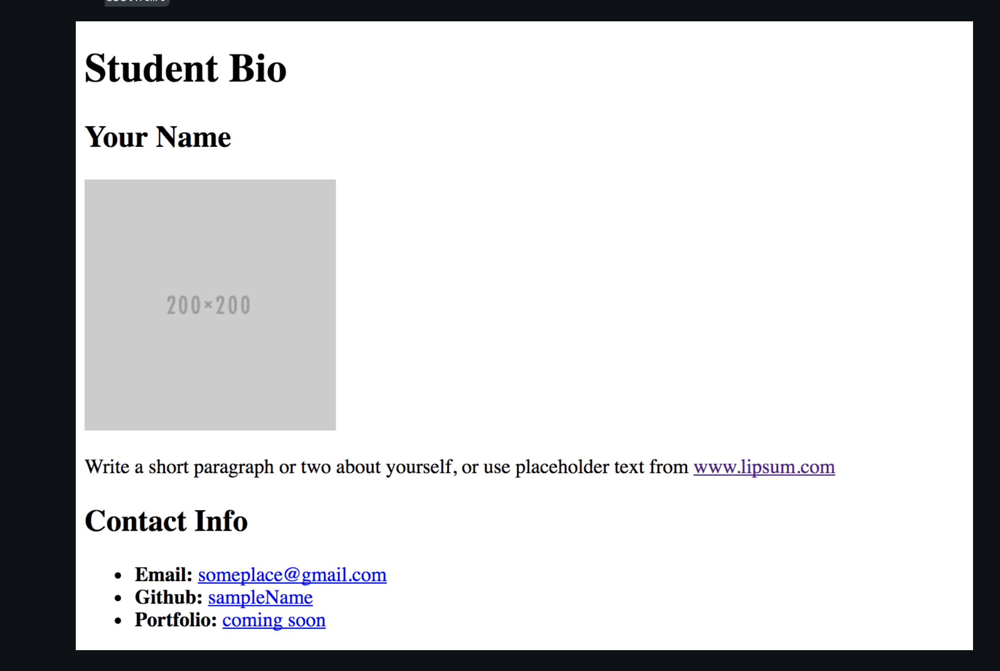
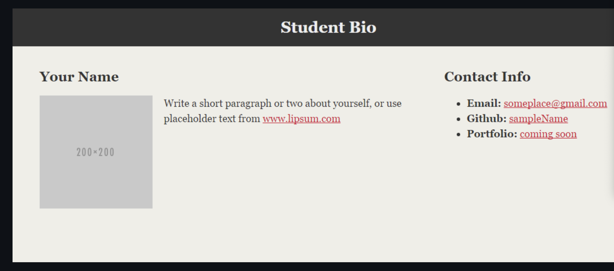

# Instructions

* 1. Create a basic HTML page with your own information that looks similar to the design shown on screen.
Name it `html-bio-with-css.html`

  

* 2. Now follow the instructions to style your bio page so that it looks like the following image:
<br >

  


* Within the same folder where `html-bio-with-css.html` is located, make a folder called `css`.
* Make a file called `style.css` inside of the `css` folder.
* Reference the `style.css` in your `html-bio-with-css.html` file. You do this by placing `<link rel="stylesheet" type="text/css" href="css/style.css">` inside the `<head>` tag.
* Style the example *exactly* as you see above in [demo.png](./demo2.png).
  * Add a `class` called "container" on the `div` tag. For example: `<div class="container">`.
  * Add an `id` called "main-bio" for the first `section` tag.
  * Add an `id` called "contact-info" for the second `section` tag.
  * Add an `id` called "bio-image" for the bio image.
* Style specs:

  * `body`
    * The background color is `#efeee7`.
    * The font used is `Georgia,"Times New Roman",Times,serif;`.
    * The font color is `#333333`.
    * Be sure to zero out the body margins and padding so the page is flush to the top of the page:
      ```css
      body {
        margin: 0;
        padding: 0;
      }
      ```
  * `header`
    * The background color is `#333333`.
  * `h1`
    * The font color is `#eee`.
    * The font size is `28px`.
    * Look at the example in the demo.png image, and eyeball the padding and/or margins and positioning of the text.
  * `h2`
    * The font size is `24px`
  * Make the container have a width of 1024 pixels, and center it. You do this using `margin: 0 auto;`.
  * Make `#main-bio`, `#contact-info`, `#bio-image` all `float: left`.
  * Make the `#bio-image` have a width of 200 pixels.
  * Be sure to include `alt` text in all images
  * `#main-bio` should have a width of `70%`.
    * Add margins to the image so there is distance between it and the bio text.
  * `#contact-info` should have a width of `30%`.
  * Adjust the line height so it is 1.5 times the size of the font.
  * Make the link color `#d21034`.

* If you forgot how to write the CSS properties, you can reference all CSS properties here <https://developer.mozilla.org/en-US/docs/Web/CSS/Reference>

* Bonus:

  * Stage, commit, and push this new file to a personal Github repository.
