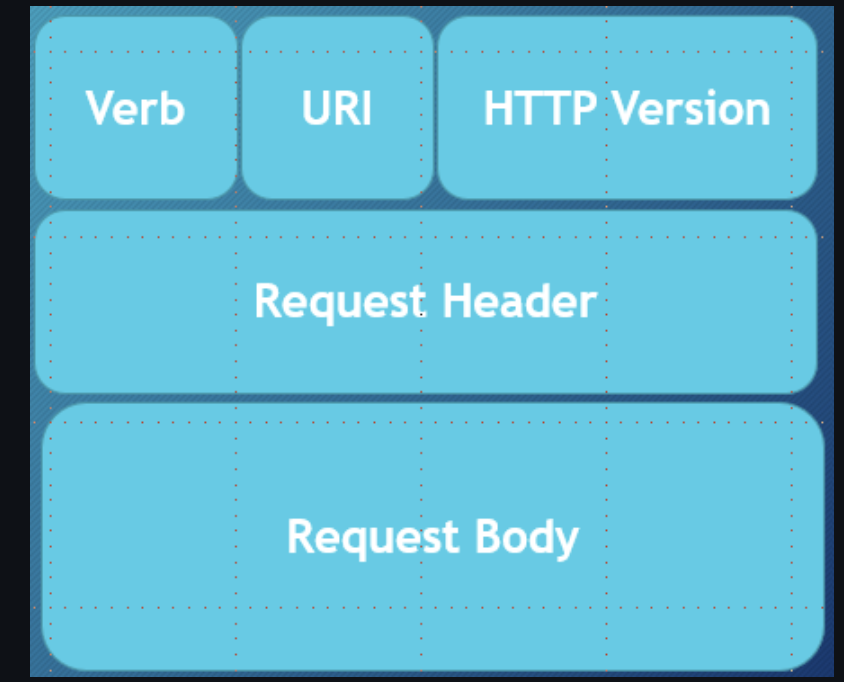
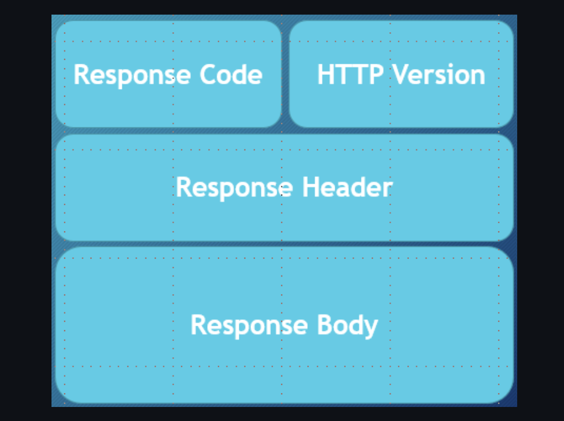
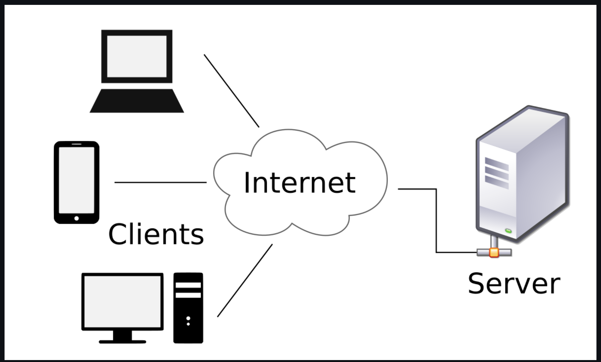
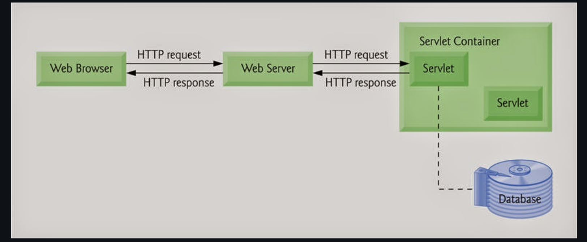
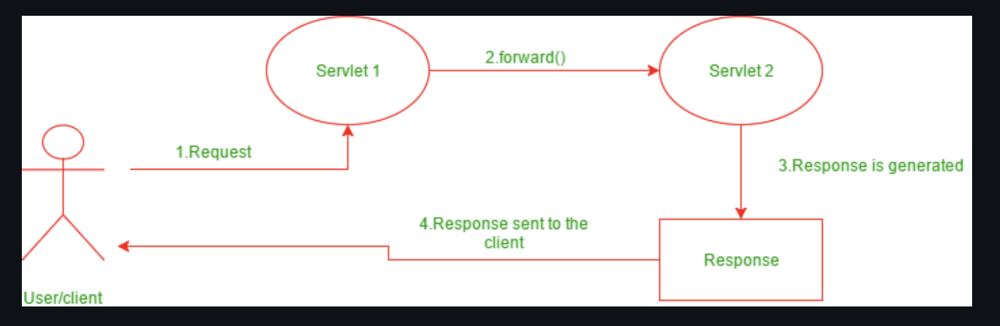
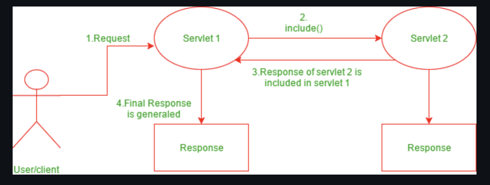

# Monday - HAPPY 4th of JULY !

<br>

# Tuesday - Intro to 'Front End'

## HTML (Hypertext Markup Language)

### Introduction to HTML

* [HTML](https://en.wikipedia.org/wiki/HTML) stands for Hypertext Markup Language - it is a markup language for creating web pages and applications. 
* HTML contains a particular syntax - namely **elements** and **attributes** - that web browsers parse in order to render the content of the webpage. 
* With HTML, the structure and content of a webpage is defined. Styling and dynamic behavior are introduced with CSS and JavaScript, respectively.

#### HTML5

HTML5 introduced a new **DOCTYPE** declaration `<!DOCTYPE html>` and the character encoding (charset) declaration `<meta charset="UTF-8">`.  The `<DOCTYPE>` declaration is used to inform the browser about the version of HTML used in the document. It is known as the Document Type Declaration (DTD). It just instructs the browser about the document type. A **character encoding** is an approach of converting bytes into characters. For validating the HTML document, a program must choose a character encoding.

HTML5 also introduced features to allow us to embed audio and video files on the web page and provides the support to run JavaScript in the background.

Take a look at the structure of the HTML5 file given below:

```html
<!DOCTYPE html>
<html>
  <head>
    <meta charset="UTF-8">
    <title>Title of the document</title>
  </head>

  <body>
    Content of the document......
  </body>
</html>
```

> **NOTE:** HTML5 uses UTF-8 as a default character encoding.

> `<!DOCTYPE html>` should be in the beginning of the document before any tags.


### Helpful Resources

* [Mozilla](https://mdn.dev)

### Starting HTML Documents

Every HTML document (ending with `.html` extension) should begin with a special tag known as the DOCTYPE declaration - this lets browsers know what kind of document it is using (HTML, in our case) as well as which version of the markup language is being used. For HTML5, the newest version and the one which we'll be using, the DOCTYPE syntax is:

```html
<!DOCTYPE html>
```

The doctype declaration tag does not have a closing tag and it is not self-closing either.

Next, the tag which begins the root of our HTML document is the `<html>` tag. Everything about our webpage will be nested within this tag.

Within the `html` element we have two important tags - the `<head>` and the `<body>` tags. The `head` element will contain all the metadata associated with this page, including the title, character encodingg, and references to external stylesheets. The `body` element contains the actual content of our page that will be rendered on the screen by the browser.

### Hello World Example

Let's write a simple webpage that will show off our knowledge of HTML thus far. Open up a new file in a simple text editor and save the file as `hello-world.html`. Then write the following HTML markup and save it:

```html
<!DOCTYPE html>
<html>
  <head>
    <title>Hello World!</title>
    <meta charset="utf-8">
  </head>
  <body>
    <div>
      <!-- THIS IS A COMMENT! -->
      <p>This is my first paragraph written in HTML</p>
    </div>
  </body>
</html>
```

The only tag you may be unfamiliar with is the `meta` tag above - this defines the character encoding that the file will be using. Also, the `<!-- ... -->` syntax denotes a comment.

If you now open your `hello-world.html` file in your browser of choice, you'll see your webpage rendered. It may look ugly now, but we'll address that when we talk about CSS.

## HTML Tags

### Common HTML Tags

There are a vast number of HTML tags you could use on your webpage, but below are listed the most common:

* `<div>` - defines a "division of the page"
* `<p>` - defines a paragraph
* `<span>` - an inline tag for grouping text or elements
* `<b>` - bold text
* `<i>` - italicized text
* `<h1>`, `<h2>`, ... `<h6>` - these are headings, h1 is largest and h6 is smallest
* `<br>` - line break
* `<table>` - defines a table
* ``
* `<ol>` - an ordered list
* `<ul>` - an unordered list
* `<a href="">` - makes a hyperlink

####  Hyperlinks

To make a hyperlink in a webpage, use the `<a>` tag:

```html
<p> Here is a <a href="www.google.com">link to Google!</a></p>
```

#### Tables

To create a table, use the following markup. `<tr>` defines a table row, `<td>` defines a table cell, and `<th>` is used for table headers.

```html
<table>
  <thead>
    <tr>
      <th>Id</th>
      <th>Name</th>
    </tr>
  </thead>
  <tbody>
    <tr>
      <td>1</td>
      <td>Alice</td>
    </tr>
    <tr>
      <td>2</td>
      <td>Bob</td>
    </tr>
    <tr>
      <td>3</td>
      <td>Charlie</td>
    </tr>
  </tbody>
</table>
```

#### Lists

There are two options for making lists in HTML - ordered or unordered lists. Ordered lists are defined with `<ol>`, unordered lists are defined with `<ul>`, and the list items within either are denoted with `<li>`:

```html
<ol> <!-- ordered lists render as 1, 2, 3, etc.. -->
  <li>First item</li>
  <li>Second item</li>
  <li>Third item</li>
</ol>
<ul> <!-- list items in here will just be bullet points -->
  <li>First item</li>
  <li>Second item</li>
  <li>Third item</li>
</ul>
```
### Elements

HTML is composed of many different **elements** - these provide the structure of the document. Elements are defined within HTML files using **tags** - for example, one very common tag is the `<div>` tag. The tag is enclosed within angle brackets. Most elements have a closing tag which define the end of the element, using the backslack notation - for example, a closing "div" tag would be `</div>`. HTML elements may be *nested* within other elements, like so:

```html
<div> text inside the div but outside the paragraph
  <p> this text is inside the paragraph </p>
</div>
```

In order for HTML to be **valid**, tags must be properly nested - an outer tag cannot be closed before an inner one. For example, the following markup would not be considered valid:

```html
<div> invalid!
  <p> cannot close the div here => </div>
</p>
```

Not all elements have closing tags, some are self-closing. For example, the `` tag, which defines an image.

###  Attributes

HTML elements can also have **attributes** defined within the tag - these are key/value pairs that give metadata about the tag that are important for the browser to know. For example, image elements must have a URL which the browser can call to retrieve the image file to display on the page - we use the `src` attribute to do this: ``. As you may have guessed, the `alt` attribute specifies an alternative text to show when the image cannot be displayed.

#### Global Attributes

**Global** attributes are those that can be applied to any element on the page. Some important global attributes are:

* class
* id
* hidden
* lang
* style
* tabindex
* title

There are also many attributes that should be applied to only certain elements, including the `src` and `alt` attributes shown above. We'll discuss more about these when relevant.

### HTML Forms

An  **HTML form**  is  _a section of a document_ that contains controls such as text fields, password fields, checkboxes, radio buttons, submit button, menus, etc. Using these elements the page can collect information from a user which is typically submitted to a web server.
To create a form, you would use the `<form>` tag.

 *Why use an HTML Form?*
* We use forms to collect some information/data form the user.
    * For example: If a user wants to purchase some items on the internet, he or she must fill out the form which will collect information such as the shipping address and payment details so that the item can be sent to the given address.

#### Input Element in HTML Forms 

An HTML form collects information from **<input>** elements. You will specify an addition **type** attribute to indicate which field to display. Various fields can be created such as a text field, checkbox, password field, or radio button.

#### Text Field 

A text field is a one-line input field that allows the user to input a line of text. Text Fields are created by specifying the type attribute value as "text".


The below example will display a text field with the label _Email Id:_

**Example**
```html
<form> 
    <label for="email-input">Email Id:</label><br> 
    <input type="text" name="email-input" /> 
</form> 
```


#### Password Field

Password fields are a type of text field in which the text entered is masked using asterisk or dots. This prevents others form viewing the screen to see what is typed in. Also, its created by specifying the type attribute value as "password".

**Example**
```html
    <form> 
        <label for="user-password">Password:</label><br/> 
        <input type="password" name="user-password"/> 
    </form> 
```

>  **NOTE**:
Although a password field is masked, it is NOT encrypted. You will have to use other measures such as HTTPS to encrypt data once the HTML form is submitted. 

#### Radio Buttons

Radio Buttons are used to let the user select exactly one value from a list of predefined options. It is created by specifying the type attribute value as "radio".

**Example**
```html
    <form> 
        SELECT GENDER 
        <br/> 
        <input type="radio" name="gender" id="male"> 
        <label for="male">Male</label><br> 
        <input type="radio" name="gender" id="female"> 
        <label for="female">Female</label> 
    </form> 
```

> **NOTE**: 
A form may have multiple sets of radio buttons. In order to make sure the user only selects one option from a given set, each radio <input> element must have matching `name` attributes.
In the example above, both buttons have a `name` attribute value as **gender**.

#### Checkboxes

Checkboxes are used to let the user select one or more values from a pre-defined set of options. The type attribute value for checkboxes input control is "checkbox".

**Example**
```html
    <form> 
        <b>SELECT SUBJECTS</b> 
        <br> 
        <input type="checkbox" name="subject" id="math" /> 
        <label for="math">Math</label> 
        <input type="checkbox" name="subject" id="science" /> 
        <label for="sceince">Science</label> 
        <input type="checkbox" name="subject" id="english" /> 
        <label for="english">English</label> 
    </form> 
```

> **NOTE**: 
Just like radio buttons, a form may have multiple sets of checkboxes. In order to make sure the user selects options related to a given set, each checkbox <input> element must have matching `name` attributes.
In the example above, each checkbox has a `name` attribute value as **subject**.

## File select boxes 

File select boxes are used to allow the user to select a local file on their computer and send it as an attachment to the webserver. It is similar to a text box with a button that allows the user to browse for a file. Instead of browsing for the file, the path and the name of the file can also be written. They are created by specifying a type attribute value as "file".


**Example**
```html
    <form> 
        <label for="fileselect">Upload:</label> 
        <input type="file" /> 
    </form> 
```

## Text area

A text area is a multi-line text input control which allows users to provide a paragraph or multiple lines of text. It is created by using the "textarea" element. 

This is one of the few input controls that DO NOT use the `<input>` element.

You can control the size of a text area by adding attributes "rows" and "cols" to specify the number of rows and columns of text it supports. Most often text area elements are resizable, but the default size is managed by those two attributes. 


**Example**
```html
    <form> 
        <label for="Description">Description:</label> 
        <textarea rows="5" cols="50" name="Description"
                            id="Description"></textarea> 
    </form> 
```

## Select Boxes (Drop-downs) 

Select boxes are used to allow users to select one or more options from a drop-down list. 
Select boxes are created by using two elements: `<select>` and `<option>`. The `<select>` element defines a drop-down while list items are defined within the select element using `<option>` elements. 


**Example**
```html
   <form> 
        <label for="country">Country:</label> 
        <select name="country" id="country"> 
            <option value="United States">United States</option> 
            <option value="Canada">Canada</option> 
            <option value="Mexico">Mexico</option> 
        </select> 
    </form> 
```


## Reset And Submit Buttons 


The **submit** button allows the user to send the form data to the web server. You can define a submit button by specifying the type attribute as "submit".

The **reset** button is used to reset the form data and will display any default values. You can define a reset button by specifying the type attribute as "reset".

**Example**
```html
    <form action="test.php" method="post" id="users"> 
        <label for="username">Username:</label> 
        <input type="text" name="username" id="Username" /> 
        <input type="submit" value="Submit" /> 
        <input type="reset" value="Reset" /> 
    </form> 
```


### Attributes Used in HTML Forms

There are several attributes that you can use on the `<form>` tag and on `<input>` elements. 
We will cover:

* action
* target
* name
* method
* value
* placeholder
* required

Take a look at the following example and find the different attributes:

```html
<!DOCTYPE html> 
<html> 
<body> 
  
<form action="/test.php" target="_blank" method="GET"> 
  Username:<br /> 
  <input type ="text" name="username" placeholder="Username" required/> 
  <br /> 
  Password:<br /> 
  <input type ="password" name="password" /> 
  <br /><br /> 
  <input type ="submit" value ="Submit" /> 
</form>  
  
</body> 
</html> 
```

#### The Action Attribute

The action attribute indicates where the form data will be processed. Typically the value is a URL of a server. 
Generally, the form data is sent to a webpage on the webserver after the user clicks on the submit button.

>In the above code, after clicking on the *submit* button, the form data would be sent to a page called *test.php*.


#### The Target Attribute

The Target attribute is used to specify whether the submitted result will open in the current window, a new tab or on a new frame. 
The default value used is "self" which results in the form submission in the same window. 
To make the result display in a new browser tab, the value should be set to "blank".

> In the above code, after clicking on the *submit* button, the result will open in a new browser tab. Most often this attribute is not present and the default value of "self" is used.

#### Name Attribute 

The name attribute should be provided for each input element. It is not required, but the value provides a label for the data once the form is submitted. 
If the name attribute is not specified in an input field then the data of that field will not be sent.

> In the above code, after clicking the *submit* button, the form data will be sent to a page called */test.php*. 
> The data sent will include the *username* and *password* fields.

#### The Method Attribute

The method attribute is used to specify the HTTP method used to send data while submitting the form.
There are only two options available: GET and POST.

**GET** - When using the GET method, after the submission of the form, the form values will be visible in the address bar of the browser.

**POST** – When using the POST method, after the submission of the form, the form values will NOT be visible in the address bar of the browser.

#### The value Attribute

The value attribute specifies an initial value for an input field. It also serves as the attribute to use when providing a button label for submit and reset input elements. 

> In the above example, there are no default values. 

#### The placeholder Attribute

The placeholder attribute specifies a hint that describes the expected value of the input field (a sample value or a short description of the expected format).
The short hint is displayed in the input field before the user enters a value.
The placeholder attribute works with the following input types: text, search, url, tel, email, and password.

> In the above example, the text field has a placeholder of "Username".

#### The required Attribute

The required attribute indicates an input field that must be filled out before submitting the form. In most modern browsers, it will prevent the user from submitting the form until an acceptable value is entered.
The required attribute works with the following input types: text, search, url, tel, email, password, date pickers, number, checkbox, radio, and file.

> In the above example, only the text field is required.  
> **NOTE**: The required attribute doesn't have a value portion. You only need to specify the word 'required'. 

#### The min and max Attributes

The min and max attributes specify the minimum and maximum values for an input field.
The min and max attributes work with the following input types: number, range, date, datetime-local, month, time and week.

> **Tip**: Use the max and min attributes together to create a range of legal values. (For example: Set a maximum date or a minimum date)

*Example*
```html
<form>
  <label for="datemax">Enter a date before 1980-01-01:</label>
  <input type="date" id="datemax" name="datemax" max="1979-12-31"><br><br>

  <label for="datemin">Enter a date after 2000-01-01:</label>
  <input type="date" id="datemin" name="datemin" min="2000-01-02"><br><br>

  <label for="quantity">Quantity (between 1 and 5):</label>
  <input type="number" id="quantity" name="quantity" min="1" max="5">
</form>>
```
## The Styling of Our HTML Is Done With [CSS](https://github.com/220613-Reston-Java-Angular-AWS/Curriculum-Notes/blob/newMain/Week-4/Overview_of_CSS.md)

<br>
<br>


# Wednesday 

## Intro to Web Services

### What is a Web Service?
A web service is a generic term for an interoperable machine-to-machine software function that is hosted from a network addressable location.  
 - **interoperable** - different languages, hardware, environments, able to operate together thanks to some clearly defined communication protocol
 - **network addressable** - remote, available over a network.
  
A web service has an interface, which hides the implementation details so that it can be used independently of the hardware or software platform on which it is implemented, and independently of the programming language in which it is written.  
  
The idea is that a wide range of compatible machines can remotely access some functionality and/or resources by defining language and hardware agnostic protocols. 

### Advantages of Web Services
 - Expand functionality of the way we use the web
 - Expose functionality for accessability and reuse
 - Standardization & interoperability
 - Loose coupling
  
Typically web services are divided into one of two flavors:
 - SOAP
 - REST

### SOAP
SOAP or Simple Object Access Protocol, is a rigidly defined and robust protocol maintained by the W3C. SOAP services respond to requests in the form of XML documents, called messages, and though a SOAP service can receive any kind of request, if it's an HTTP request then it must be in the form of an HTTP post request. We won't be getting too deep into SOAP in this cirriculum.

## REST
REST or REpresentational State Transfer, is an architectural style for web services described by Roy Fielding in a famous 2000 paper on web architecture.
 - Representational - resources (objects) are reporesnted as JSON or XML for transfer.
 - State - referring to a resource as it exists in that moment, a **resource representation**.
 - Transfer - the resource representation is transmitted.

A resource in REST is a unit of identifiable information. Basically, a resource is an analog of an object in OOP. Note that as a resource changes over time it is not a new resource. The same resource is in a different state. Resources are identified by a URI (Universal Resource Identifier). A URL (web addresses we are all familiar with) is a locator, and a specific type of URI which is fully qualified.  
  
There's a lot more to REST which will be covered in greater detail later in this cirriculum. For now we just want a basic understanding of what REST is and to go over the naming convention for resources.  

1. Use nouns wherever possible to name a resource, like 'user', 'account', or 'machine'.
2. Typically your singular resources will be part of a larger collection, so pluralize the noun to name a container which contains all of the singles.
3. Then use path parameters to uniquely identify individual resources. Ex: /users/{user-id}
4. Resources may contain sub-collections of resources. Ex: /users/{user-id}/accounts/{account-id}
5. Represent your resources in a hierarchy that can be described by URI path
6. Use query parameters to filter resources. Ex: /users/{userId}/projects?lang=java&week=2
  
Other considerations:
 - Consistency
 - Tend toward kebab-style
 - Avoid trailing /
 - Avoid including file extensions
 - Avoid using CRUD verbs
 - Avoid using verbs at all except in the case where the resource is an executable function
  
  #### [Dive Deeper into REST](https://github.com/220613-Reston-Java-Angular-AWS/Curriculum-Notes/blob/newMain/Week-4/REST.md)
  #### [Learn More About the *Richardson Maturity Model*](https://github.com/220613-Reston-Java-Angular-AWS/Curriculum-Notes/blob/newMain/Week-4/Richardson_Maturity_Model.md)

<BR><BR>See Also:
 - [Advantages of Web Services -IBM](https://www.ibm.com/docs/en/ztpf/1.1.0.15?topic=services-advantages-web)
 - [Benefits of Web Services -Oracle](https://docs.oracle.com/cd/B14099_19/web.1012/b14027/intro.htm#i1018810)
 - [History of the Web](https://home.cern/science/computing/birth-web/short-history-web)
 - [Representational State Transfer (REST) -Roy Fielding](https://www.ics.uci.edu/~fielding/pubs/dissertation/rest_arch_style.htm)
 - [What is Rest?](https://restfulapi.net/)
 - [Rest Resource Naming Guide](https://restfulapi.net/resource-naming/)

## Intro to HTTP

HTTP, or HyperText Transfer Protocol, is the protocol we use to browse the web. HTTP is a client-server protocol where the client must initiate communication. Every HTTP communication is made up of a client request, and a server response. HTTP is stateless, which means the server should be able to handle each request separately and only with the information provided in the request. The server should not have to maintain any state in order for any individual request to be processed.  
  
### HTTP Messages
  
#### HTTP Request
Each HTTP request is composed of:
 - HTTP Verb - the HTTP method to execute
 - URI - indicates the endpoint used to access the resource
 - HTTP Version - in order to be certain of communication protocol
 - Request Header - Metadata (info) about the request represented as key-value pairs
 - Request Body - message content (resource representation in REST)


  
  
####  HTTP Response  
Each HTTP response is composed of:
 - HTTP Response Code - code indicating the status of the request
 - HTTP Version - in order to be certain of communication protocol
 - Response Header - Metadata (info) about the response represented as key-value pairs
 - Response Body - message content (resource representation in REST)


  
  
## HTTP Verbs
Each HTTP request includes a verb, which describes the type of request and how it should be processed. Requests have certain characteristics. Each may or may not be:
 - Idempotent - if the same operation is repeated, the same output is produced
 - Safe - read-only, will not alter the server/resource state
 - Cacheable - response to this request can be cached
 - HTML form allowed - only some verbs are allowed as a method attribute in an HTML form
 - Has request body - the request can contain content in the request body
 - Has response body - a successful response should contain content in the response body
  
  
  
### **GET**
Used to retrieve data.
 - Idempotent
 - Safe
 - Cacheable
 - Form allowed
 - No request body
 - Has response body
  
  
  
### HEAD
Basically identical to GET, except the response should not include a body. Info from server will be in response header. Can also be used to test an endpoint before requesting a large payload.
 - Idempotent
 - Safe
 - Cacheable
 - Not form allowed
 - No request body
 - No response body
  
  
  
### **POST**
Sends data to he server. Commonly used for creation of and updating resources. Response body generally contains the updated resource representation.
 - Not idempotent
 - Not safe
 - Typically not cacheable
 - Form allowed
 - Has request body
 - Has response body
  
  
  
### **PUT**
Sends data to server. Commonly used to replace current resource representation with the content contained in this request.
 - Idempotent
 - Not safe
 - Not cacheable
 - Not form allowed
 - Has request body
 - No response body
  
  
  
### **PATCH**
Sends data to the server. Similar to PUT but may not contain complete resource representation. May only include information needed to update some part of the current resource state.
 - Idempotent
 - Not safe
 - Not cacheable
 - Not form allowed
 - Has request body
 - Has response body
  
  
  
### **DELETE**
Used to delete a resource. 
 - Idempotent
 - Not safe
 - Not cacheable
 - Not form allowed
 - May have request body
 - May have response body
  
  
  
### CONNECT
Initiates a "tunnel" - bi-directional communication with the resource.
 - Not idempotent
 - Not safe
 - Not cacheable
 - Not form allowed
 - No request body
 - Has response body
  
  
  
### OPTIONS
Get options for communication with a specific resource.
 - Idempotent
 - Safe
 - Not cacheable
 - Not form allowed
 - No request body
 - Has response body
  
  
  
### TRACE
Loop-back test between client and resource. Useful tool for debugging.
 - Idempotent
 - Safe
 - Not cacheable
 - Not form allowed
 - No request body
 - Has response body
  
  
## HTTP Status Codes
As part of every response, the server gives a status code that describes the status of the request.  
  
### 100 - Informational
 - 100 - Continue
 - 102 - Processing

### 200 - Success
 - 200 - OK
 - 202 - Accepted
 - 203 - Created  
  
### 300 - Redirect
 - 301 - Moved Permenantly
 - 303 - See Other
 - 304 - Not Modified  
  
### 400 - Client Error
 - 401 - Unauthorized
 - 403 - Forbidden
 - 404 - Not Found  
  
### 500 - Server Error
 - 500 - Internal Server Error
 - 502 - Bad Gateway
 - 503 - Service Unavailable 
 
<br>

# Thursday 
## Client / Server Architecture

A client-server architecture is a networking model in which the server provides services to clients to perform user-based tasks. A client and a server are two pieces of software that might be on the same computer, or two different computers that might be separated by miles but connected by the Internet.

**Server** - A server is software designed to process requests and deliver responses to another computer over the internet.

**Client** - A client is a program that runs on a local machine requesting service from the server.

<div align="center">  </div>

A Client and a Server establish a connection according to a set of rules called a protocol. There are quite a few protocols for different purposes, but one of the most popular is the **HTTP protocol**. Once the connection is established, the Client sends **HTTP Requests** to the server in the form of XML or JSON, which both entities (Client and Server) understand. After parsing the request, the Server responds with appropriate data by sending back an **HTTP Response**.


### Types of Client-Server Architecture

**2 tier architecture** - The user interface stored at the client machine and the database stored on the server. If Business Logic & Data Logic collected at a client-side, then it is known as a *fat client thin server architecture*. If Business Logic & Data Logic handled on the server, then it is known as a *thin client fat server architecture*. 2 tier architecture has some limitations in performance, security, and portability.

**3 tier architecture** - Three-tier architecture has a middleware between the user interface and database. The 3 tiers are named the presentation tier, application tier, and data tier. The presentation tier is the front end layer and consists of the user interface. The application tier contains the functional business logic which drives an application’s core capabilities. The data tier consists of a database system and the data access layer.

**n-tier architecture** - In n-tier architecture, there are multiple Business Logic & Data Logic layers. It increases the flexibility and reusability of applications but can be difficult to implement.

## Servlets

### Servlet API

The [Servlet API](https://docs.oracle.com/javaee/6/api/javax/servlet/package-tree.html) provides interfaces and classes that are required to build servlets. These interfaces and classes represented in  two packages:

1. **`java.servlet`** package -  used by the servlet or web container.
2. **`javax.servlet.http`** package - used for handling http requests.

### Servlet Class Hierarchy:

The Servlet interface is the root interface of the servlet class hierarchy. The GenericServlet class implements Servlet, ServletConfig, and Serializable interfaces. The HttpServlet class extends the GenericServlet class and implements the Serializable interface. It provides HTTP methods such as doGet, doPost, doHead, doTrace, etc.

Java Servlet Class Hiearchy:
```

   Servlet    ServletConfig       Serializable                    {Built-in Interfaces}
     |             |                   |
     -----------------------------------
                    |
                    V
              GenericServlet                                       {Built-in Class}
                    |
                    V
               HttpServlet                                         {Built-in Class}
                    |
                    V
             UserDefinedServlet                                     {User defined servlet Class}        

```

The user defined servlet class is created by implementing the *Servlet* interface, usually by extending the *GenericServlet* class or (more commonly) the *HttpServlet* class.

In order to initialize a Servlet, a server application loads the user-defined servlet class and creates an instance. Then it calls the Servlet’s `init (ServletConfig config)` method. Since the `init()` method is run once, it stores the initial parameters or configuration information in the *ServletConfig*  object. This information can be retrieved later by calling the Servlet’s `getServletConfig()` method. This is implemented in the *GenericServlet* class definition. The *ServletConfig* object contains Servlet parameters and a reference to the Servlet’s *ServletContext*. The **ServletContext** is an interface which helps to communicate with other servlets. Then, the `service (ServletRequest request, ServletResponse response)` method is called for every request to the Servlet. When the Servlet needs to be unloaded the `destroy()` method is called. 
 


A website can consist of both static and dynamic webpages. A static webpage is a pre-built HTML page with the content explicitly written into the code, and stored in the webserver. Static web pages display the same content each time we visit. A dynamic webpage loads dynamic content *such as stock prices, weather information, news, and sports updates* at different points of time.  In Java, there exists a way to generate static webpages with dynamic data, and that's with **Java Servlets**.

A **Servlet** is a Java class that takes incoming requests, processes them, and generates a response to send back to the user. For example, an `HttpServlet` takes an HTTP request, processes its headers and content, and uses that information to write HTML, CSS, and JavaScript code into an HTTP response that can be sent back to the user's browser. The **Servlet container** is the component of an **application server** that interacts with Java servlets and is responsible for managing the execution of servlets and JSP pages for Java applications.

```
User  -->  HTTP Request  -->   Application Server  -->  Servlet Container  
                                                               |
                                                               V   
User  <--  HTTP Response  <--  Application Server    <--   Servlet(s)  
``` 

### How do servlets work?

When a client sends a request to the application server, the application server receives and passes the request to the appropriate servlet. The servlet processes the request, generates the response, and sends the response back to the application server.  The application server sends the response back to the client. Most servlets are HTTPServlets, which receive HTTP requests and generate HTTP Responses out of HTML, CSS, and JavaScript code. 




#### Life Cycle of a Servlet


A **servlet container** manages the life cycle of a servlet. [Servlet](https://docs.oracle.com/javaee/1.4/api/javax/servlet/Servlet.html) is an interface defined in **`javax.servlet`** package. A servlet container uses the Servlet interface to understand a specific Servlet object and manage it.

There are three life cycle methods of a Servlet :
* `init()`
* `service()`
* `destroy()`


The steps involved in the servlet life cycle are listed below:

**Step-1 : Loading of Servlet**  

When the application server (e.g. Apache Tomcat) starts up, the servlet container deploys and loads all the servlet classes.

**Step-2 : Creating an instance of Servlet** 

Once all the Servlet classes are loaded, the servlet container creates only one instance for each servlet class. All requests to the servlet are executed on that same servlet instance. Some application servers can create multiple instances of a servlet to handle a high volume of incoming requests, but that is not the default behavior.

**Step-3 : Invoke `init()` method once**

Once all the servlet classes are instantiated, the init() method is invoked for each instantiated servlet. The `init()` method is used to initialize the servlet. The `init()` method is called only once. 


**The `init()` method signature:** 
```java
public void init() throws ServletException {
}
```

**Step-4 : Invoke `service()` method repeatedly for each client request** 

The servlet container calls the service method each time a request for the servlet is received. The service() method determines the type of Http request (GET, POST, PUT, DELETE, etc.) also calls `doGet()`, `doPost()`, `doPut()`, `doDelete()`, etc. methods as appropriate. 

**The `service()` method signature:** 
```java
public void service(ServletRequest req, ServletResponse resp) throws ServletException, IOException { 
}
```

**Step-5 : Invoke destroy() method once**

The `destroy()` method is called only once at the end of the a servlets life. The servlet container calls this method before removing the servlet instance from the service.

**The `destroy()` method signature:** 
```java
public void destroy() {
}
```


**Life Cycle of a Servlet:**




### References

* [Java Servlet Technology Overview](https://www.oracle.com/java/technologies/servlet-technology.html)
* [Introduction to Servlets](https://www.edureka.co/blog/java-servlets) - [Video Tutorial](https://youtu.be/ewiOaDitBBw)
* [Servlet Documentation - Oracle](https://javaee.github.io/servlet-spec/downloads/servlet-3.1/Final/servlet-3_1-final.pdf)
                                                         
                                                         
## Servlet Config

### Deployment descriptor

Java web applications use a **deployment descriptor file** to define the URLs that map to servlets, and to determine which URLs require authentication and additional information.

A deployment descriptor file specifies the classes, resources, and configuration of the application and how the web server uses them to serve HTTP requests. 

The deployment descriptor is a file named **web.xml**. It resides within the apps WAR beneath the WEB-INF/ directory.The root element of the web.xml file is `<web-app>`.

The **web.xml** file defines mappings between URL paths and the servlets that will handle requests with those paths. The application server uses this configuration to find the servlet that handles a given request, and calls the servlet method that corresponds to the HTTP request method used. 

To map a URL to a servlet, you declare the servlet with the `<servlet>` element, then define a mapping from a URL path to a servlet declaration with the `<servlet-mapping>` element.

To configure a servlet in the Deployment Descriptor (web.xml) file,
1. Configure the servlet using the `<servlet>` element. 
2. Map the servlet to a URL or URL pattern using the `<servlet-mapping>` element.


The `<servlet>` element is used to declare the servlet name, the fully-qualified class name of the servlet, and any initialization parameters. The name for every servlet must be unique across the deployment descriptor.

The `<servlet-mapping>` element is used to specify a URL pattern, and the name of the servlet which handles requests whose URL matches the given pattern. The URL pattern uses an asterisk (*) at the beginning or end of the pattern to indicate zero or more of any character. 


**Example:** A simple *web.xml* file which has `<servlet>` and `<servlet-mapping>` for *servlet1*. 
```xml
<web-app xmlns="http://xmlns.jcp.org/xml/ns/javaee"
         xmlns:xsi="http://www.w3.org/2001/XMLSchema-instance"
         xsi:schemaLocation="http://xmlns.jcp.org/xml/ns/javaee
         http://xmlns.jcp.org/xml/ns/javaee/web-app_3_1.xsd"
         version="3.1">
    <servlet>
        <servlet-name>servlet1</servlet-name>
        <servlet-class>com.revature.MyFirstServlet</servlet-class>
    </servlet>
    <servlet-mapping>
        <servlet-name>servlet1</servlet-name>
        <url-pattern>/*</url-pattern>
    </servlet-mapping>
</web-app>
```


### ServletConfig 
  
ServletConfig is an object created by the Servlet Container, used to pass initial parameters or configuration information to a particular servlet during initialization.  The `<servlet>` XML element in the deployment descriptor (web.xml) has a subelement called `<init-param> ` used to pass parameters to a servlet from the web.xml file. The ServletConfig object is returned by the `getServletConfig()` method of HttpServlet, and so the XML properties added to ServletConfig are only shared with the single servlet indicated.


### ServletContext
  
ServletContext is the object created by the Servlet Container to share initial parameters or configuration information to *all* servlets and other components. The `<context-param>` element used to declare the parameters of ServletContext. It present outside the `<servlet>` element and inside the `<web-app>` element. This object is returned by the `getServletContext()` method of HttpServlet.

The `<param-name>` and `<param-value>` used to declare the parameter name and its value. 


**ServletConfig vs ServletContext**


### Example

Here '**message**' parameter can be accessed only by *servlet1*. The '**username**' and '**password**' parameters can be accessed by both *servlet1* and *servlet2*.

```xml
<web-app xmlns="http://xmlns.jcp.org/xml/ns/javaee"
         xmlns:xsi="http://www.w3.org/2001/XMLSchema-instance"
         xsi:schemaLocation="http://xmlns.jcp.org/xml/ns/javaee
         http://xmlns.jcp.org/xml/ns/javaee/web-app_3_1.xsd"
         version="3.1">

	<servlet>
		<servlet-name>servlet1</servlet-name>
		<servlet-class>com.revature.MyFirstServlet</servlet-class>
		<init-param>
			<param-name>message</param-name>
			<param-value>Hello World</param-value>
		</init-param>
	</servlet>
	<servlet-mapping>
			<servlet-name>servlet1</servlet-name>
			<url-pattern>/FirstServlet</url-pattern>
	</servlet-mapping>

	<servlet>
			<servlet-name>servlet2</servlet-name>
			<servlet-class>com.revature.MySecondServlet</servlet-class>
	</servlet>
	<servlet-mapping>
			<servlet-name>servlet2</servlet-name>
			<url-pattern>/secondServlet</url-pattern>
	</servlet-mapping>

	<context-param>  
		<param-name>username</param-name>  
		<param-value>system</param-value>  
	</context-param>  
	  
	<context-param>  
		<param-name>password</param-name>  
		<param-value>pass123</param-value>  
	</context-param>  

</web-app>
```
<br>
# Friday

## Request Dispatcher

The Request Dispatcher interface defines an object that passes along the client's request to any other resources (servlet, JSP file, or HTML file) on the server. 

The servlet container creates the RequestDispatcher object. The `getRequestDispatcher(String)` method of the **ServletRequest** interface returns the Request Dispatcher object.

[RequestDispatcher interface](https://docs.oracle.com/javaee/7/api/javax/servlet/RequestDispatcher.html) defined in the *javax.servlet* package provides two methods:

### 1. forward(ServletRequest request, ServletResponse response)

<code>forward()</code> passes a request from one servlet to another resource on the server. The contents of the request and response are preserved and forwarded to the next resource which will process the data and return the response to the client.




**Example for forward() method:**
``` java
//"request" is a HttpServletRequest Object and "Welcome.html" is a resoure name
RequestDispatcher rd = request.getRequestDispatcher("Welcome.html");

//forward the request and response to "Welcome.html" page
rd.forward(request,response);
```


### 2. include(ServletRequest request, ServletResponse response)

<code>include()</code> does not entirely transfer control over the request and reponse object to the next resource.  Instead, this method *includes* the content of the original resource in the reponse returned to the client. 
If you <code>include()</code> a servlet or JSP document, the included resource may not change the response code or HTTP headers.





**Example for include() method:**
```java
//"request" is a HttpServletRequest Object and "hello.html" is a resoure name
RequestDispatcher rd = request.getRequestDispatcher("hello.html");

//includes the response of "hello.html" page in current servlet response
rd.include(request,response);
```

### References

* [RequestDispatcher Documentation](https://docs.oracle.com/javaee/7/api/javax/servlet/RequestDispatcher.html)


## Writing plain text to the response Object

The Servlet API provides *HttpServletResponse* interface which extends the *ServletResponse* interface to assist in sending a response to the client.

The Servlet Container informs the client browser about the type of data in the response before sending it. The Servlet container uses the` setContentType()` method to set the type of data in the response object. The response data can be in simple plain text format, HTML format, XML format, an image format, etc. 

The `setContentType(String type)` method **sets the content type** of the response being sent to the client before sending the response. The`response.getWriter()` method returns a **PrintWriter** object, which sends character text to the client. 

**Example:**

```java
public class HelloWorld extends HttpServlet { 

    public void doGet(HttpServletRequest req,HttpServletResponse res) throws ServletException,IOException
       {
    	// set the content type as plain text
    	res.setContentType("text/plain");
            
        PrintWriter out = response.getWriter();
        out.println("Hello World");  // writes a plain text to the response object
     }
}
```


In the above code, the MIME type "*text/plain*" can be broken down as follows: "text" is known as the **type** and "plain" is known as a **subtype**. A type contains many subtypes. Some of the types used in the `setContentType()` method are "*text/html*"  used for writing HTML content to the response object, "*text/css*" for writing CSS content to the response object, etc.


## SendRedirect in servlets

**sendRedirect(String URL)** - This method defined in  **HttpServletResponse** interface and used to redirect a response to another resource. It uses the URL to make another request. Therefore, it works at the client-side also can work inside and outside the server.

The `RequestDispatcher.forward()` method is used to pass the same request to a new destination resource, but the `Response.sendRedirect()` method is used to send an entirely new request for the destination resource. Any request attributes or parameters from the original request are lost.


**Example for sendRedirect():**
```java 
//"response" is a HttpServletRequest Object redirected to the google server.
response.sendRedirect("http://www.google.com");  
```

### Resources

* [ServletResponse Oracle Documentation](https://docs.oracle.com/javaee/7/api/javax/servlet/ServletResponse.html)
* [PrintWriter Oracle Documentation](https://docs.oracle.com/javase/7/docs/api/java/io/PrintWriter.html)
* [HttpResponse Object Examples](http://tutorials.jenkov.com/java-servlets/httpresponse.html)


## Exception and Error Handling

The Servlet API allows us to handle exceptions and errors caused during the execution of a servlet and still send a useful response to the user. The **deployment descriptor** file just needs to be configured to handle the exceptions/errors thrown by a servlet. 

The **`<error-page>`** element used to specify the invocation of servlets in response to certain **exceptions** or **HTTP status codes**. The following elements are used within an `<error-page>` element to handle error or exception:

* `<error-code>` - used to specify a valid HTTP error code. *For example, 404, 403, 500, etc.*
* `<exception-type>` - used to specify a fully-qualified class name of a Java exception type. *For example, `javax.servlet.ServletException,java.io.IOException`, `java.lang.RuntimeException`, etc.*
* `<location>` - used to specify the location of the resource which is displayed to the user in case of an error. *This might be a servlet, an HTML page, a JSP page, or something else.*

**Request Attributes for Errors/Exceptions:**

Before the servlet container invokes the servlet to handle the exception, it sets some attributes in the request to get useful information about the exception. Some of these are:

* javax.servlet.error.status_code
* javax.servlet.error.servlet_name 
* javax.servlet.error.exception 
* javax.servlet.error.request_uri
* javax.servlet.error.exception_type
* javax.servlet.error.message

Note that while these appear to be fully-qualified class names, they are neither packages, classes, nor variables. They are the names of attributes, and are treated as Strings.

### Example 

The web.xml file for mapping an exception to a servlet.

```xml
<error-page>
      <exception-type>java.lang.ArithmeticException</exception-type>
     <location>/errorHandler</location>
</error-page>
```
The Servlet class which throws an exception: 
```java
@WebServlet(name = "testServlet", urlPatterns = {"/test"}, loadOnStartup = 1)
public class TestServlet extends HttpServlet {
  
    protected void doGet (HttpServletRequest request, HttpServletResponse resp)throws ServletException, IOException {

        int i = 1 / 0;
    }
}
```
Here, we use [@WebServlet](https://docs.oracle.com/javaee/7/api/javax/servlet/annotation/WebServlet.html) annotation to declare a servlet.

The servlet class that handles the error caused by the above servlet:

```java
@WebServlet(name = "errorHandlerServlet", urlPatterns = {"/errorHandler"}, loadOnStartup = 1)
public class ErrorHandlerServlet extends HttpServlet {

    @Override
    protected void doGet (HttpServletRequest request, HttpServletResponse response) throws ServletException, IOException {


        PrintWriter out = response.getWriter();

        Exception exception = (Exception) req.getAttribute("javax.servlet.error.exception");

        Class exceptionClass = (Class) req.getAttribute("javax.servlet.error.exception_type");
      
        Integer status_code = (Integer) req.getAttribute("javax.servlet.error.status_code");       

        String errorMessage = (String) req.getAttribute("javax.servlet.error.message");
       
        String requestUri = (String) req.getAttribute("javax.servlet.error.request_uri"

        String servletName = (String) req.getAttribute("javax.servlet.error.servlet_name");
       
	out.println("Exception: " + exception);
	out.println("Exception Type: " + exceptionClass);
	out.println("HttpError Status code: " + status_code);
	out.println("ErrorMessage: " + errorMessage);
	out.println("Request URI: " + requestUri);
	out.println("Servlet Name: " + servletName);
    }

}
```

### References

* [Further Reading on Servlet Exception Handling](https://www.tutorialspoint.com/servlets/servlets-exception-handling.htm#:~:text=If%20the%20web%20application%20throws,explain%20you%20the%20basic%20concept.) 

## Session Management in servlets

The HTTP protocol is a **stateless protocol**, which means no client information stored in the server. The server considers every request form the same client as a new, independent request. 
However, this means that a server cannot keep a user "logged in" naturally. 

Instead, the client will have to re-identify itself with each request it sends. One workaround is to have the server create a **session** for each client request, which the client can re-associate itself with in each request by sending the **session ID**.


**For example**, When a user logs in to a website, a token proving a successful login will be associated with their session, and the session ID will be returned to the client. Whatever web page user visits after logging in, their browser will send that session ID with each request, and the server can check that session to validate that the user was successfully authenticated.

Session tracking is a mechanism that **servlets use to maintain state** about a series of requests from the same user across a period of time.

A session stores the **unique identification information about the client** that we can get for all requests that client makes. There are four different techniques used by the Servlet application for session management. 

**CLICK THE LINKS TO ACCESS THESE NOTES IN OUR REPO**
  * [Cookies](https://github.com/220613-Reston-Java-Angular-AWS/Curriculum-Notes/blob/newMain/Week-4/Cookies.md)
  * [Hidden form fields](https://github.com/220613-Reston-Java-Angular-AWS/Curriculum-Notes/blob/newMain/Week-4/Hidden-Form-Fields.md)
  * [URL Rewriting](https://github.com/220613-Reston-Java-Angular-AWS/Curriculum-Notes/blob/newMain/Week-4/URL-Rewriting.md)
  * [The HttpSession API](https://github.com/220613-Reston-Java-Angular-AWS/Curriculum-Notes/blob/newMain/Week-4/HttpSessionAPI.md)
  
  
### References

* [Session Management Further Reading](https://www.geeksforgeeks.org/session-management-in-http/)
