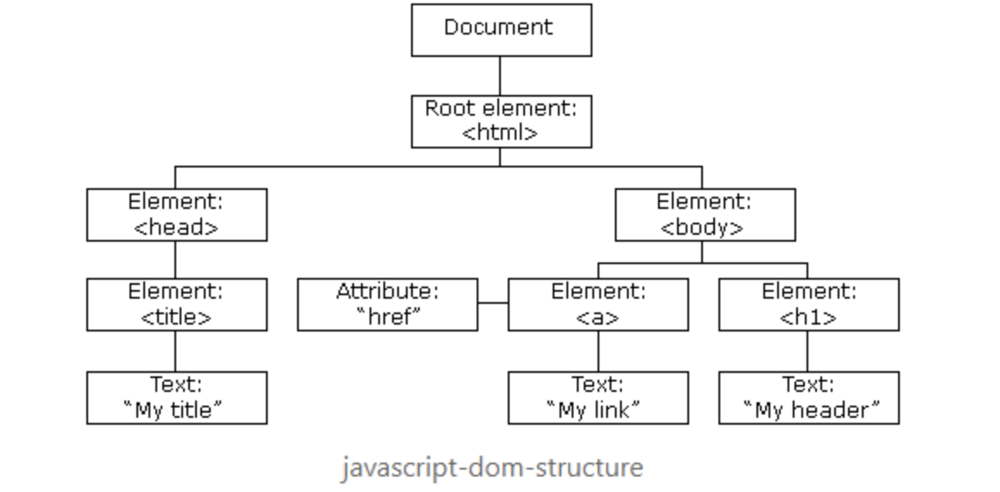

## Happy Monday! Hoping Your Weekend Was RESTful! 

### Pre-Lecture Readings
* [JavaScript Introduction](https://javascript.info/getting-started)
* [JavaScript Fundamentals](https://javascript.info/first-steps)
* [JavaScript Objects](https://javascript.info/object)
* [JavaScript Data types](https://javascript.info/data-types)
* [Debugging in Chrome](https://javascript.info/debugging-chrome)

# Monday 

## Intro to JavaScript

**JavaScript** is the most commonly used **client-side** scripting language. It is a **high-level, multi-paradigm, interpreted** programming language used to create dynamic webpages. When the browser loads a webpage, the browser interprets javascript code in it and executes it.

When we say JavaScript is a client-side language, we mean that it runs in the user's web browser and not on a server. However, although JavaScript originated as a scripting language that runs in the browser, the Node.js runtime environment does allow JavaScript code to be run on servers as the backend program for an application.

When we say JavaScript is a high level language, we mean that it abstracts away many implementation details that relate to computer hardware - like allocating memory or garbage collection of objects. When we say it is multi-paradigm, that means it supports many programming paradigms like procedural, object-oriented, and functional programming.

ECMAScript is the official name for JavaScript. It is used for language specification. The versions of a Javascript are defined by ECMAScript (ES). The versions of JavaScript are ES5, ES6, ES7, and so on.

In HTML, JavaScript code is written inside the `<script> `and `</script>` tags. You can place any number of scripts in an HTML document. Scripts can be placed in the `<body>`, or in the `<head>` section of an HTML page, or in both.

```
<script>
 JavaScript code
</script>
```

**Internal JavaScript** - When the javascript code placed anywhere within the HTML page using `<script> `tags, then it called  Internal JavaScript.

**External Javascript** -  When the same JavaScript code used for many webpages then we place the JavaScript code in a separate file. When JavaScript code placed in a separate file from the HTML code is called External JavaScript. These files are saved with the ". js" extension and imported into the HTML page using the `src` attribute. The src attribute specifies the URL/path of an external JavaScript file. (Eg: `<script src="./script.js"></script>`)

## Syntax

JavaScript is case sensitive. Every statement in JavaScript is separated using a semicolon (;). JavaScript ignores multiple spaces and tabs.

**JavaScript Comments**: JavaScript support single-line as well as multi-line comments.  Single line comment starts with `//` and multi-line comments are wrapped between `/*` and `*/`.

**JavaScript Literals**: Literals are the fixed values, it can be numbers, strings, boolean values, etc. The number type stores integer, float, and hexadecimal value. Strings are text, enclosed within single or double quotes (' or "). If the number is enclosed with single or double quotes, then it is considered as a string.

**JavaScript Keywords**: Keywords are tokens that have special meaning in JavaScript. The keywords supported by JavaScript are break, case, catch, continue, do, else, finally, for, function, if, in, new, return, switch, this, throw, try, typeof, var, void, while, etc.

## JavaScript Variables

Variables are used to store data values. It uses the `var` keyword to declare variables. An equal sign (=) is used to assign values to variables.
Variable names are identifiers that should not be a JavaScript keyword. It starts only with the alphabet, underscores (_) or dollar ($). It cannot start with a number and also there shouldn't be spaces in-between.

*Example:*
```html
<script>
    var x, y ; //declaring the variable
    x = 6; y = 6; // assigning values
    var name = 'John';
</script>
```

## Operators

Javascript Operators performs some operation on single or multiple operands  and produces a result. The categories of operators and the operators  used in JavaScript are listed below:

* Arithmetic operators -  `+, -, *, /, %, ++, --`
* Comparison Operators - `==, ===, !=, >, <, >=, <=`
* Logical Operators  - `&&, ||, !`
* Assignment Operators - ` =, +=, -=, *=, /=, %= `
* Ternary Operator -  `<condition> ? <value1> : <value2>;`

### Control Flow

JavaScript uses the following control flow statements:
* `if/else if/else`
* `for`
* `for-in`
* `for-of`
* `while`
* `do-while`

The important difference between `for-in` and `for-of` is that the first allows iteration over the **keys** of any object, while `for-of` allows iteration over an array or array-like object. The syntax is demonstrated below.

```javascript
let person = {
  name: 'Bob',
  age: 25
};

for (let prop in person) {
  console.log(person[prop]); // prints 'Bob' and then 25
}

let people = [
{
  name: 'Alice',
  age: 30
},
{
  name: 'Charlie',
  age: 29
}
]

for (let pers of people) {
  console.log(pers.name); // prints 'Alice' then 'Charlie'
}
```

### Compared to Other Languages (Java/C#)
When comparing to other languages, it's interesting to note that JavaScript was originally developed to be a scripting language with similar syntax to Java. While this means that some of the syntax bears a resemblence to the C-derived languages of Java and C#, JavaScript is very different from them in more meaningful ways.

* As a dynamically-typed language, JavaScript does not declare types and a variable you had previously stored a string in might hold a number. This also means that that there is no static type checking available, leading to potential issues where a function can return a value of multiple types. In Java or C#, this is far less likely as you usually declare a specific type for each variable, and static type checking is a feature leading to less confusion in utilizing an API.
* JavaScript is single-threaded and runs off of an event-loop. Java and C# support multi-threading.
* JavaScript can run on a server or on a browser. Java and C# would have to be compiled to WebAssembly in order to run on modern-day browsers.
* JavaScript is a multi-paradigm language, meaning we can solve our problems in a variety of ways, functionally, object-oriented, or event-driven. With Java and C#, while many of those paradigms have support in the language, Object-oriented solutions are preferred. In JavaScript, functions are first-class variables, meaning that they are treated like any other variable and can be passed as arguments to other functions.
* JavaScript utilizes prototype-based objects. Java and C# utilize class-based objects. In ES6, JavaScript introduced class-based syntax which allows us to interface with our prototypes in a similar manner to Java and C#. However, OOP in JavaScript is accomplished very differently than in these other languages. For example:
  1. An "overridden" method is merely shadowed on the prototype and is therefore still accessible.
  2. JavaScript has no concept of overloading.
  3. Encapsulation is possible in JavaScript but there are no access modifiers and is not as simple as in other languages.

**Click any of the links to be taken to the notes for this topic in our Repo. All are important to understand the fundementals of Java Script**

   * ### [Datatypes](https://github.com/220613-Reston-Java-Angular-AWS/Curriculum-Notes/blob/newMain/Week-5/Data-types.md)
   * ### [JavaScript Functions / Closures](https://github.com/220613-Reston-Java-Angular-AWS/Curriculum-Notes/blob/newMain/Week-5/JavaScript-Functions.md)
   * ### [Type Coersion](https://github.com/220613-Reston-Java-Angular-AWS/Curriculum-Notes/blob/newMain/Week-5/Type-Coercion.md)
   * ### [Variable Scopes](https://github.com/220613-Reston-Java-Angular-AWS/Curriculum-Notes/blob/newMain/Week-5/Variable_Scope.md)
   * ### [strict mode](https://github.com/220613-Reston-Java-Angular-AWS/Curriculum-Notes/blob/newMain/Week-5/strict-mode.md)
   * ### ["this" keyword](https://github.com/220613-Reston-Java-Angular-AWS/Curriculum-Notes/blob/newMain/Week-5/this-keyword.md)
   * ### [OOP in JavaScript](https://github.com/220613-Reston-Java-Angular-AWS/Curriculum-Notes/blob/newMain/Week-5/OOP-in-JavaScript.md)
   * ### [JSON](https://github.com/220613-Reston-Java-Angular-AWS/Curriculum-Notes/blob/newMain/Week-5/JSON.md)
   * ### [Arrays](https://github.com/220613-Reston-Java-Angular-AWS/Curriculum-Notes/blob/newMain/Week-5/Arrays.md)
   * ### [Timing Events](https://github.com/220613-Reston-Java-Angular-AWS/Curriculum-Notes/blob/newMain/Week-5/Timing_Events.md)
   * ### [Errors](https://github.com/220613-Reston-Java-Angular-AWS/Curriculum-Notes/blob/newMain/Week-5/Errors.md)
   
   
   
### References
* [MDN Documentation](https://developer.mozilla.org/en-US/docs/Web/JavaScript/Reference)
* [Javascript.info](https://javascript.info)
* [Dev Docs](https://devdocs.io/javascript)
* [Eloquent JavaScript](https://eloquentjavascript.net/index.html)

<br>

# Tuesday 

## Document Object Model (DOM)

The Document Object Model (DOM) is a programming API for HTML and XML documents. It enables Javascript to access and manipulate the elements and styles of a website. The browser creates a tree-like hierarchical representation of the HTML document, that tree-like structure is known as **DOM Structure** or a **DOM tree**.



Each HTML element in the DOM tree is an object. The positions of the elements in the DOM tree are nodes.The tags are element nodes. Attributes in the elements are attribute nodes. The text inside elements is a text node. It may not have children and is always a leaf of the tree. The root of the DOM tree is a `<html>` element,
which is known as a **document object**.


**Example:**

Below, we have a simple HTML Document:

```html
<!DOCTYPE HTML>
<html>
    <head>
      <title>Title goes here</title>
    </head>
    <body>
          <p> DOM Structure </p>
    </body>
</html>
```

The DOM structure for the above HTML document looks like:

```
HTML (root)
|  
|---HEAD
|     |
|     |----TITLE
|            |
|            |-----#text - "Title goes here"
|       
|---BODY
     |
     |----P
          |
          |----- #text - "DOM Structure"
            
```


**Click the links below to be taken to the notes for each topic in our Repo**


   * ### [Querying the DOM](https://github.com/220613-Reston-Java-Angular-AWS/Curriculum-Notes/blob/newMain/Week-5/Querying_the_DOM.md)
   * ### [Traversing the DOM](https://github.com/220613-Reston-Java-Angular-AWS/Curriculum-Notes/blob/newMain/Week-5/Traversing-the-DOM.md)
   * ### [DOM Manipulation](https://github.com/220613-Reston-Java-Angular-AWS/Curriculum-Notes/blob/newMain/Week-5/DOM-Manipulation.md)
   * ### [Events and Listeners](https://github.com/220613-Reston-Java-Angular-AWS/Curriculum-Notes/blob/newMain/Week-5/JavaScript-Events%26Listeners.md)
   * ### [Bubbling/Capturing](https://github.com/220613-Reston-Java-Angular-AWS/Curriculum-Notes/blob/newMain/Week-5/Event-Bubbling%26Capturing.md)
   * ### [Event Object](https://github.com/220613-Reston-Java-Angular-AWS/Curriculum-Notes/blob/newMain/Week-5/Event-Object.md)
   * ### [AJAX](https://github.com/220613-Reston-Java-Angular-AWS/Curriculum-Notes/blob/newMain/Week-5/AJAX.md)
   
 ### Extra Reading
* [DOM basics](https://javascript.info/document)
* [Events](https://javascript.info/events)
* [UI Events](https://javascript.info/event-details)


# Wednesday

### More Pracetice
* [XmlHttpRequest tutorial - AJAX](https://javascript.info/xmlhttprequest)
* [Fetch](https://javascript.info/fetch)

## Fetch API

Instead of using XMLHttpRequest enabled Ajax, we can use Fetch API, which is modern and versatile. The Fetch API provides a `fetch()` method defined on the `window` object. This method used to send requests and returns a `Promise` that retrieved from the response. A **Promise** object represents a value that may not be available now but, will be resolved in the future. It allows us to write asynchronous code.

The syntax for fetch() method: `let promise = fetch(url, [options])`

The browser requests the server and returns a promise as a response.  When the request unable to make HTTP-request due to network problems or response has failure HTTP-status code is  404 or 500, then the Fetch API rejects the Promise object. When we get a response successfully form the server, the promise object returned in the **Response Body**.


The methods to access the response body in various formats:

* `response.text()` – read the response and return as text. 
* `response.json()` – parse the response as JSON.
* `response.formData()` – return the response as FormData object .
* `response.blob()` – return the response as Blob (binary data with type).
* `response.arrayBuffer()` – return the response as ArrayBuffer(low-level representation of binary data). 


We also use the `async` and `await` keyword with the `fetch()` method.
The `async` keyword is added to functions to tell them to return a promise rather than directly returning the value.
The `await` keyword only works inside async functions, used to pause the code on that line until promise gets complete.


*Example:*
```javascript
async function asyncFunc() {
  let response = await fetch(protectedUrl);
  let text = await response.text(); // response body consumed
  document.write(text);
}

asyncFunc();
```
**Response headers** - The response headers are available in a Map-like headers object in `response.headers`. To get individual headers by name or iterate over them.

*Example:*
```javascript
async function asyncFunc() {
  let response = await fetch(githubUrl);

  // get one header
  alert(response.headers.get('Content-Type')); // application/json; charset=utf-8

  // iterate over all headers
  for (let [key, value] of response.headers) {
    alert(`${key} = ${value}`);
  }
}

asyncFunc();
```

**Request headers** - To set a request header inside the `fetch` method, we can use the `headers ` attribute.

*Example:*
```javascript
let response = fetch(protectedUrl, {
  headers: {
    Authentication: 'secret'
  }
});
```

**POST Request:**

To make a POST request, we need to mention the HTTP method (`method`)and request the body (`body`) inside the fetch method. The request body can be string, FormData object, or blob. If the request `body` is a string, then `Content-Type` header is set to `text/plain;charset=UTF-8`. If the request `body` is a JSON, then `Content-Type` header is set to `application/json;charset=UTF-8`. We don't set `Content-Type` manually for blob object.

*Example:* 
```javascript
async function asyncFunc() {
  let user = {
    name: 'John',
    surname: 'Smith'
  };
  // url is a server location 
  let response = await fetch(url, {
    method: 'POST',
    headers: {
      'Content-Type': 'application/json;charset=utf-8'
    },
    body: JSON.stringify(user)
  });

  let result = await response.json();
  alert(result.message);
}

asyncFunc();
```

## Handling Errors
The Fetch API generates a promise, meaning that if the request fails, it will cause the promise to enter the `reject` state. To handle this, we need to either surround our `await` instruction with a `try...catch` block or to append a `catch()` callback to our promise.

*Example:* 
```javascript
async function asyncFunc() {
  let user = {
    name: 'John',
    surname: 'Smith'
  };
  // url is a server location 
  let response = await fetch(url, {
    method: 'POST',
    headers: {
      'Content-Type': 'application/json;charset=utf-8'
    },
    body: JSON.stringify(user)
  });
  try {
    let result = await response.json();
    alert(result.message);
  } catch (error) {
    console.error(error);
  }
}

asyncFunc();
```

*Example:* 
```javascript
let user = {
  name: 'John',
  surname: 'Smith'
};
// url is a server location 
let response = fetch(url, {
  method: 'POST',
  headers: {
    'Content-Type': 'application/json;charset=utf-8'
  },
  body: JSON.stringify(user)
}).then((response)=>{
  let result = response.json();
  alert(result.message);
}).catch((error)=>{
  console.error(error);
});
```

**Click the Links for the rest of the notes for today in our repo**

   * ### [await, async , & promises](https://github.com/220613-Reston-Java-Angular-AWS/Curriculum-Notes/blob/newMain/Week-5/async-await-keywords-promises.md)
   * ### [Rest with JSON](https://github.com/220613-Reston-Java-Angular-AWS/Curriculum-Notes/blob/newMain/Week-5/Rest-with-JSON.md)
   * ### [Default Parameters](https://github.com/220613-Reston-Java-Angular-AWS/Curriculum-Notes/blob/newMain/Week-5/ES6-Default-Parameters.md)
   * ### [Spread/Rest Operator](https://github.com/220613-Reston-Java-Angular-AWS/Curriculum-Notes/blob/newMain/Week-5/Spread-and-Rest-Operator.md)
   * ### [Iterator,Iterables,Generators](https://github.com/220613-Reston-Java-Angular-AWS/Curriculum-Notes/blob/newMain/Week-5/Iterators-Iterables-and-Generators.md)
  

## Helpful References
* [ES6 Features website](http://es6-features.org/)

<br>

# Thursday - 

## Project 1 Presentations/ Retrospective

<br>
<br>

# Friday - 

## Diving Deeper Into ES 6 Features

   * ### []()
   * ### []()
   * ### []()
   * ### []()
   * ### []()
   * ### []()
   * ### []()
   * ### []()
   
