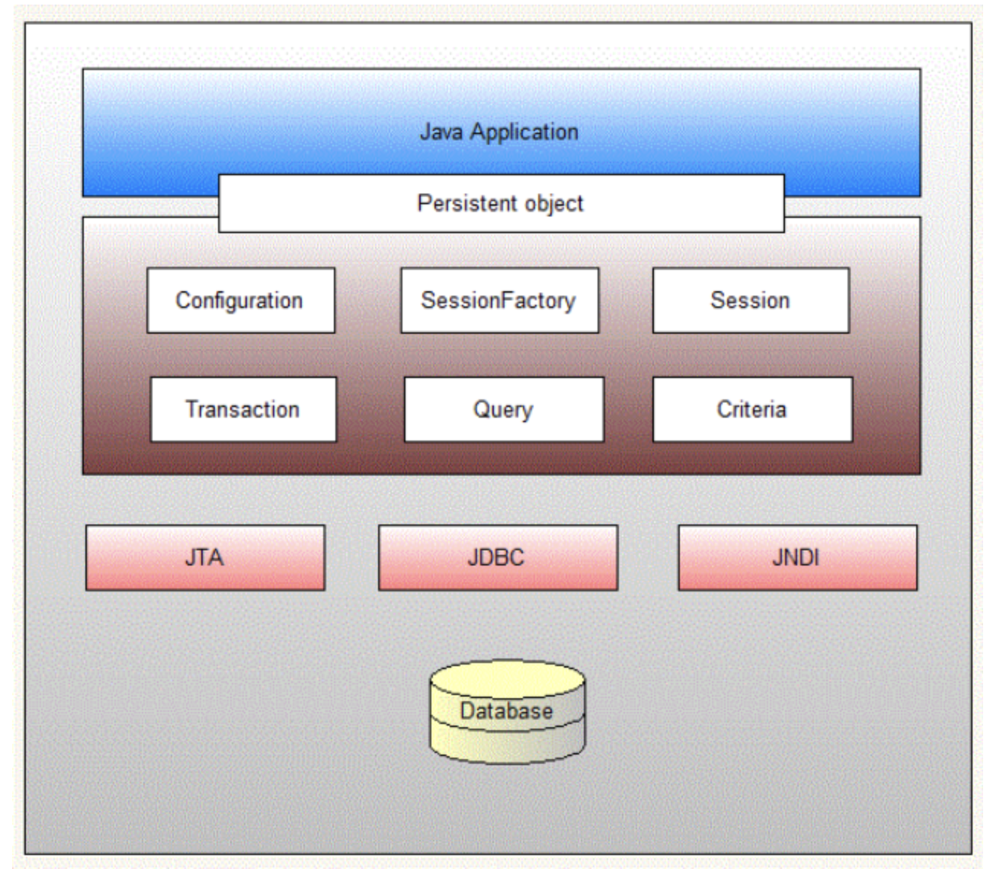

# Hibernate Core Interfaces
The Hibernate core interfaces are used in just about every Hibernate application. Using these interfaces, you can store and retrieve persistent objects and control transactions.





## Configuration

[Configuration](https://docs.jboss.org/hibernate/orm/5.4/javadocs/org/hibernate/cfg/Configuration.html) is a class defined in `org.hibernate.cfg` package. It represents a **configuration** or **properties** file for Hibernate. The configuration object is created once during **application initialization**. It is the first object created by Hibernate. Using the Configuration object we can create a SessionFactory object, which is eventually used to create a Session object to perform the object persistence operations.

```java
Configuration config = new Configuration();
config.configure().addAnnotatedClass(Employee.class);
```

* The `configure()` method loads mappings and properties from the hibernate.cfg.xml or hibernate.properties file which should be present in the classpath. 
* The `addAnnotatedClass()` method used to specify the entity class. 
* We can also use `setProperty()` method to add properties like hibernate.connection.url, hibernate.connection.username, hibernate.connection.password, etc.
* If the config file is not valid then it will throw an exception. If it is valid then it creates a meta-data in memory and returns the meta-data to object to represent the config file.


## Session Factory

[SessionFactory](https://docs.jboss.org/hibernate/orm/5.4/javadocs/org/hibernate/SessionFactory.html) is an interface defined in the `org.hibernate` package, and is used to create the **Session** Object. The SessionFactory object is used by all threads of an application. It is a **thread-safe** and **immutable** object mapped to a single database. It holds the **second-level cache** of data in hibernate.

```java
StandardServiceRegistry registry = new StandardServiceRegistryBuilder().configure().build();
SessionFactory sessionFactory = new MetadataSources( registry ).buildMetadata().buildSessionFactory();
```

## Session

[Session](https://docs.jboss.org/hibernate/orm/5.4/javadocs/org/hibernate/Session.html) is an interface defined in the `org.hibernate` package. Session objects are created using the SessionFactory and are used to perform CRUD operations.

* Session Objects wrap the **JDBC connection** and serve as a factory of **Transaction**, **Query**, and **Criteria** objects.  
* Session Objects are not thread-safe.
* It is lightweight, and holds a mandatory **first-level cache** of persistence objects.

```java
Session session = sessionFactory.openSession();
```

## Transaction

[Transaction](https://docs.jboss.org/hibernate/orm/5.4/javadocs/org/hibernate/Transaction.html) is an interface defined in the `org.hibernate` package. A transaction is associated with a **Session** and usually instantiated by a call to `Session.beginTransaction()`.  

* Transaction object is used whenever we perform any operation and based upon that operation there is some change in database.
* Within one transaction you can do several operations and can **commit the transaction** once after completing all operations. 
* We can also **rollback** all previous uncommitted operations. Transactions are not automatically committed when their session gets flushed. 
* Transactions are handled by an underlying transaction manager and JDBC transaction or JTA transaction. 

```java
Transaction tx = session.beginTransaction();
//set of operation performed on DB
tx..commit();
```

## Query

[Query](https://docs.jboss.org/hibernate/orm/3.2/api/org/hibernate/Query.html) is an interface defined in the `org.hibernate` package.  A Query instance is obtained by calling `Session.createQuery()`.

* **Query** can be used to expose extra functionality beyond that provided by `Session.iterate()` and `Session.find()`.
* You may select a particular page of a result set by calling `setMaxResults()` or `setFirstResult()`.
* You may use named query parameters.
* Queries are written in HQL or Native SQL of your database

```java
Query query=session.createQuery();
```

## Criteria

[Criteria](https://docs.jboss.org/hibernate/orm/3.5/javadocs/org/hibernate/Criteria.html) is an interface defined in the `org.hibernate` package. Criteria is a simplified API for retrieving entities by composing Criterion objects.

* The **Session** is a factory for Criteria. Criterion instances are obtained via the factory methods.

```java
Criteria criteria=session.createCriteria();
```


## References

* [Architecture](https://docs.jboss.org/hibernate/orm/5.4/userguide/html_single/Hibernate_User_Guide.html#architecture)
* [Hibernate Core Interfaces](https://www.decodejava.com/hibernate-architecture.htm)
