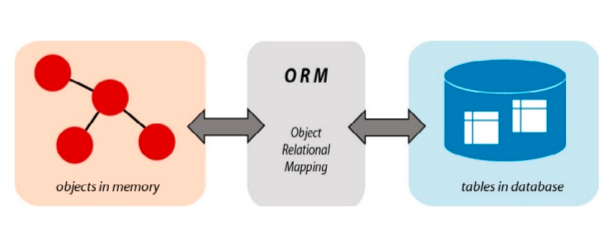
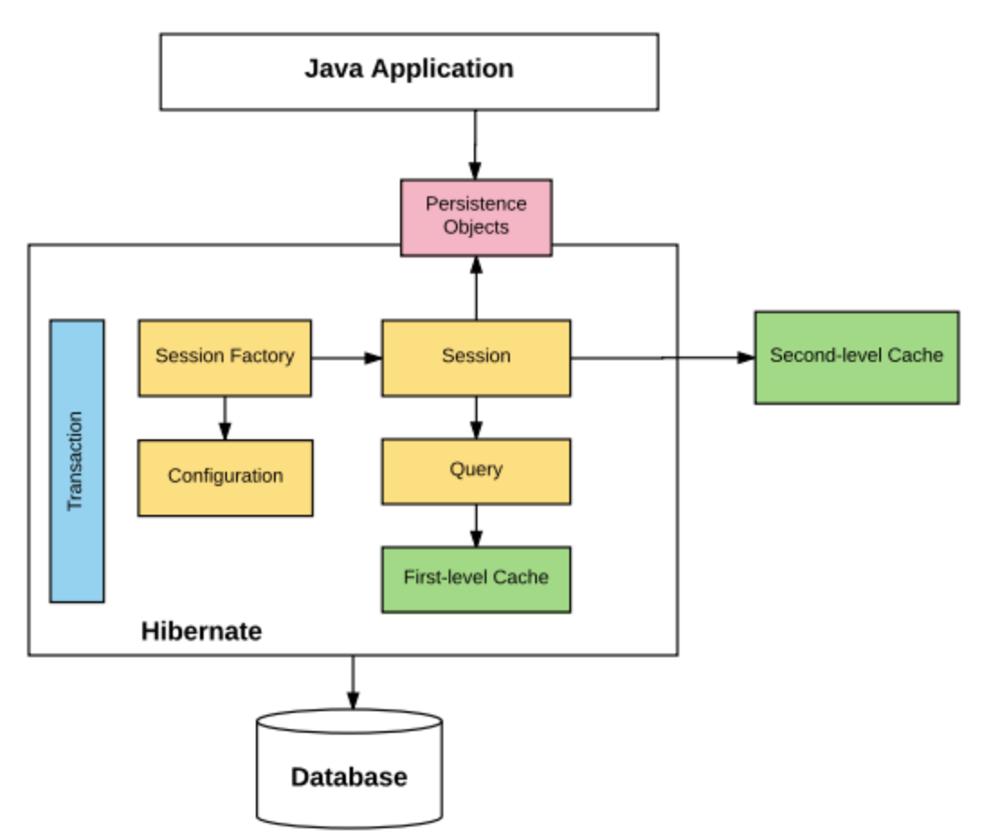
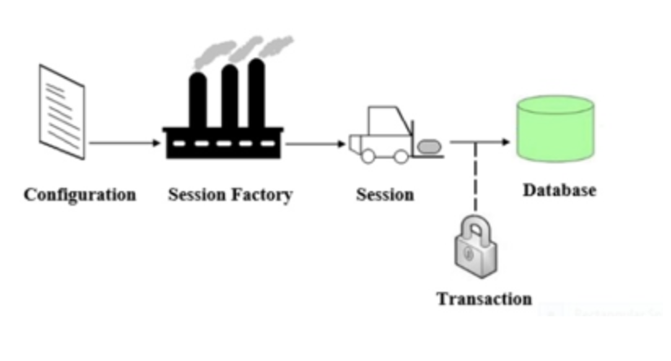

# Monday 

## Advanced Java

### Generics - Advanced
When using generics, sometimes you don't want to specify a specific type or concrete class - you may want your class to be able to accept a range of type parameters. To do this, you'll use a wildcard character, represented by a question mark `?`. The [Oracle tutorial](https://docs.oracle.com/javase/tutorial/java/generics/wildcards.html) on wildcards provides examples of how to use wildcards, along with upper and lower-bounded wildcards.

## Java 7 Features
Java 7 was released in 2011 and contains several new features that help speed development.

### `try-with-resources`
When using `try/catch` blocks, often times some object used in the code is a resource that should be closed after it is no longer needed to prevent memory leaks - for example a `FileReader`, `InputStream`, or a JDBC `Connection` object. With Java 7, we can use a `try-with-resources` block which will automatically close the resource for us:

#### Old way
```java
try {
  InputStream is = new FileInputStream("./some/file.ext");
  String s = is.read();
} catch(IOException e) {
} finally {
  is.close();
}
```

#### New way
```java
try(InputStream is = new FileInputStream("./some/file.ext")) {
  String s = is.read();
} catch(IOException e) {}
```

Whatever is placed within the parenthesis of the `try` statement will be closed automatically - thus, we don't need to explicitly call it within our `finally` block above. This new format requires the object in the `try` statement to **implement the [AutoCloseable](https://docs.oracle.com/javase/8/docs/api/java/lang/AutoCloseable.html) interface**.

### Diamond operator
Another nifty feature of Java 7 is the diamond operator - `&lt;&gt;`. To demonstrate, let's look at a line of Java code:

```java
List<String> strings = new ArrayList<String>();
```

In this one line, we've repeated the type information for the `List` in two places - on the left and right side of the assignment operation. The diamond operator simplifies this syntax by allowing the compiler to *infer* the type of the `List` from the left-hand side. The new syntax is:

```java
List<String> strings = new ArrayList<>(); // cool! less verbose
```

## Java 8 Features
Java 8 was released in 2014 and is one of the biggest updates to the language. It contains many new features that overhaul the way Java developers can write code.

### Date and Time API
Before Java 8, dates and times were represented using the `java.util.Date` and `java.util.Calendar` classes. There were several issues with these APIs, including lack of thread safety, timezones, and ease of use. Java 8 introduced a new API through the `java.time` package, which includes:
* `LocalDate` - only contains date information
* `LocalTime` - only contains time information
* `LocalDateTime` - contains a date and time
* `ZonedDateTime` - for working with time zones
* `Period` - represents a quantity of time (years, months, days)
* `Duration` - represents quantity of time (seconds, nanoseconds)
* `DateTimeFormatter` - for representing dates/times in a given format

More detailed explanations of the new Date and Time API is given in the [Javadocs](https://docs.oracle.com/javase/8/docs/api/java/time/package-summary.html).

### Lambda Expressions
Lambda expressions are one of the biggest new features of Java 8, and they introduce some important aspects of **functional programming** to Java. The most basic syntax of a lambda expression is:

```java
parameter(s) -> expression
```

For example, we can use the `.forEach` method of the `Iterable` interface, which accepts a lambda expression as its argument:

```java
List<String> names = new ArrayList<>();
names.add("Alice");
names.add("Bob");
names.add("Charlie");
names.forEach(str -> System.out.println(str));
```

This will print out the names just as if we had used a `for` loop. The lambda syntax could also be done with an explicit type declaration for the parameter, but the compiler can infer the type from the value used. For multiple parameters, parentheses are required around them. Also, curly braces are optional for single statements but required for multiple. Finally, the `return` keyword is also optional for a single expression because the value will be returned by default.

#### `.forEach()` method
The `forEach()` method actually accepts what is called a functional interface as its parameter (specifically a `Consumer`), which the lambda expression then implements at runtime. The `forEach()` method then loops through `names` and passes each element to the lambda expression to be "consumed".

#### Functional Interfaces
[Functional interfaces](https://docs.oracle.com/javase/8/docs/api/java/util/function/package-summary.html) are interfaces that **have only one abstract method**. This method is what lambdas are implementing when they are declared - the parameter types and return types of the lambda must match the functional interface method declaration. The Java 8 JDK comes with many built-in functional interfaces, listed in the Javadocs link above.

We can also use functional interfaces as types to which we can assign lambda functions, like so:

```java
interface MyFunctionalInt {
  int doMath(int number);
}

public class Execute {
  public static void main(String[] args) {
    MyFunctionalInt doubleIt = n -> n * 2;
	MyFunctionalInt subtractIt = n -> n - 2;
	int result1 = doubleIt.doMath(2);
	int result2 = subtractIt.doMath(8);
	System.out.println(result1); // 4
	System.out.println(result2); // 6
  }
}
```

### Stream API
The Java 8 [Stream API](https://docs.oracle.com/javase/8/docs/api/java/util/stream/package-summary.html) is a functional-style way of defining operations on a stream of elements. Streams are an abstraction which allow defining operations which do not modify the source data and are lazily executed. Streams **do not store data**, they simply define operations like filtering, mapping, or reducing, and can be combined with other operations and then executed. Some built-in `Stream`s are located in the `java.util.stream` package.

Streams are divided into *intermediate* and *terminal* operations. Intermediate streams return a new stream and are always lazy - they don't actually execute until a terminal operation is called. Terminal operations trigger the execution of the stream pipeline, which allows efficiency by perfoming all operations in a single pass over the data.

Finally, reduction operations take a sequence of elements and combine them into a single result. Stream classes have the `reduce()` and `collect()` methods for this purpose, with many built-in operations defined in the `Collectors` class.

```java
List<Student> students = new ArrayList<>();
// add students...
List<Double> grades = students.stream()
                          .filter(s -> s.isAttending())
						  .mapToDouble(s -> s.getGrade)
						  .collect(Collectors.toList());
```

### Optional Class
[The `Optional` class](https://docs.oracle.com/javase/8/docs/api/java/util/Optional.html) was introduced in Java 8 to reduce the need for excessive `null` value checking. An `Optional` is a kind of wrapper object which may or may not contain a value, with a few helper methods to handle existing or non-existent values (see Javadocs above).

Optionals are useful as replacements for `null` values when returning an "empty" response from a method. For example:

```java
public class OptionalExample {
  public Optional<String> getAmbiguousString(boolean b) {
    if (true) {
	  return Optional.of("awesome string!");
	} else {
	  return Optional.empty();
	}
  }
  
  public static void main(String[] args) {
    Optional<String> optString = getAmbiguousString(false);
	String theString = optString.orElse(""); // specify a fallback value
	System.out.println(theString);
	// we can use the String without fear of NullPointerException now
  }
}
```

### `default` and `static` methods in interfaces
Java 8 also adds new functionality to interfaces, by allowing interface methods to have implementations in some situations. By declaring a method as `default` in an interface, a "default" implementation of that method can be defined. The purpose of this is to allow additions to interfaces without breaking and having to change code in any of the classes which implement the interface. Thus, the `default` keyword allows updating existing interfaces in a way that is backwards compatible.

Methods can also now be declared as `static` in interfaces with an implementation. Since static methods belong to the interface, no overriding is necessary (or allowed, since it would simply be method hiding). `static` methods in interfaces are generally used as helper methods to assist with reusability of code.

The new features of interfaces in Java 8 bring them closer to the functionality of abstract classes, but there are still key differences. First, constructors are still not allowed in interfaces while they are in abstract classes. Secondly, interfaces allow for multiple inheritance while abstract classes cannot.

However, when two interfaces with `default` methods of the same method signature are implemented, the "diamond problem" - or multiple inheritance problem - can occur. The compiler will complain about duplicate default method inheritance, which can be resolved by overriding the default method with a custom implementation in the class.

	**Click the links below to access notes in our repo** 

   * ### [Lambdas](https://github.com/220613-Reston-Java-Angular-AWS/Curriculum-Notes/blob/newMain/Week-6/Lambda-Expressions.md)
   * ### [Functional Interfaces](https://github.com/220613-Reston-Java-Angular-AWS/Curriculum-Notes/blob/newMain/Week-6/Functional-Interfaces.md)
   * ### [java.util.Time Package](https://docs.oracle.com/javase/8/docs/api/java/time/package-summary.html)
   * ### [Stream API](https://github.com/220613-Reston-Java-Angular-AWS/Curriculum-Notes/blob/newMain/Week-6/Stream-API.md)


## Log4j

Log4j is a reliable, fast, and flexible logging framework for Java supported by Apache. It's commonly used to record application events, log granular debugging information for developers, and write exception events to files.

## Why do we need logging?
Logging records events that occur during software execution. As users execute programs on the client side, the system accumulates log entries for support teams. In general, it allows for developers to access information about applications to which we do not have direct access. Without logs, we would have no idea of knowing what went wrong when an application crashes, or track and monitor application performance.

Also, a logging framework like Log4j is critical because it allows us to use various logging levels and configure a threshold to determine which messages will be recorded in the application log files.

   * ### [Logging Levels](https://github.com/220613-Reston-Java-Angular-AWS/Curriculum-Notes/blob/newMain/Week-6/Loggin-Levels.md)
   * ### [Setting Logging Thresholds](https://github.com/220613-Reston-Java-Angular-AWS/Curriculum-Notes/blob/newMain/Week-6/Setting-Logging-Threshold.md)

<br>

# Tuesday 

## Intro to Multithreading

### Concurrency

**Concurrency** refers to breaking up a task or piece of computation into different parts that can be executed independently, out of order, or in partial order without affecting the final outcome. One way - but not the only way - of achieving concurrency is by using multiple threads in the same program.

Operating systems use concurrency to manage the many different programs that run on them. The GUI - graphical user interface - for example, is run at the same time as other processes. Without this, any process that took too long in the background, like reading / writing to files or making an HTTP request, would block the GUI and prevent any other user input.

### Multi-core Processing

Most computers these days have multiple cores or CPUs, which means that calculations at the hardware level can be done in parallel. Without multiple cores, operating systems can still achieve concurrency with a process called **time splicing** - this means running one process for a short time, then switching to another, and back very rapidly. This ensures that no process or application is completely blocked.

On multi-core systems, different processes can be run on different CPUs entirely. This enables true parallelization and is a key benefit of writing multithreaded programs.

### Introduction to Threads

A thread is a subset of a process that is also an independent sequence of execution, but threads of the main process run in the same memory space, managed independently by a scheduler. So, we can think of a thread as a "path of execution", but they can access the same objects in memory.

Every thread that is created in a program is given its own call stack, where it stores local variables references. However, all threads share the same heap, where the objects live in memory. Thus, two threads could have separate variable references on two different stacks that still point to the same object in the heap.

### Multithreading

Multithreading extends the idea of multitasking into applications where you can subdivide operations in a single application into individual, parallel threads. Each thread can have its own task that it performs. The OS divides processing time not just with applications, but between threads. Multi-core processors can actually run multiple different processes and threads concurrently, enabling true parallelization.

In Java, multithreading is achieved via the [`Thread`](https://docs.oracle.com/javase/8/docs/api/java/lang/Thread.html) class and/or the [`Runnable`](https://docs.oracle.com/javase/8/docs/api/java/lang/Runnable.html) interface.

#### A Note on Best Practices
In general, it is best to avoid implementing multithreading yourself if possible. The benefit of multithreaded applications is better performance due to non-blocking execution. However, you should always measure or attempt to estimate the performance benefit you will get by using threads versus the tradeoff in complexity and subtle bugs that might be generated. Usually there are frameworks, tools, or libraries that have implemented the problem you are trying to solve, and you can leverage those instead of trying to build your own solution. For example, web servers like Apache Tomcat have multithreading built-in and provide APIs for dealing with network requests without having to worry about threads.

   * ### [Thread Class](https://github.com/220613-Reston-Java-Angular-AWS/Curriculum-Notes/blob/newMain/Week-6/Thread-Class.md)
   * ### [Runnable Interfaces](https://github.com/220613-Reston-Java-Angular-AWS/Curriculum-Notes/blob/newMain/Week-6/Runnable-Interface.md)
   * ### [States of a Thread](https://github.com/220613-Reston-Java-Angular-AWS/Curriculum-Notes/blob/newMain/Week-6/States-of-a-Thread.md)

## Producer-Consumer Problem

The Producer-Consumer problem is a classic example of a multi-process synchronization problem. Here, we have  a *fixed-size buffer* and two classes of threads - *producers* and *consumers*. Producers produces the data to the queue and Consumers consume the data from the queue. Both producer and consumer shares the same fixed-size buffer as a queue.

**Problem** - The producer should produce data only when the queue is not full. If the queue is full, then the producer shouldn't be allowed to put any data into the queue. The consumer should consume data only when the queue is not empty. If the queue is empty, then the consumer shouldn't be allowed to take any data from the queue.

We can solve the Producer-Consumer problem by using `wait()` & `notify()`methods to communicate between producer and consumer threads. The `wait()` method to pause the producer or consumer thread depending on the queue size. The `notify()` method sends a notification to the waiting thread.

Producer thread will keep on producing data for Consumer to consume. It will use `wait()` method when Queue is full and use `notify()` method to send notification to Consumer thread once data is added to the queue.

```java
public synchronized void produce() {
	while (queue.size() == MAX_SIZE) {
		//Queue is full, Producer thread waiting for consumer to take data from the queue
		wait();
	}
	/* When queue has space, Producer produces the data and adds them into the queue.
	*  After that, Producer sends the notification to the Consumer.
	*/
	//producing data
	queue.add(data);
	notify();
}
```


Consumer thread will consume the data form the queue. It will also use `wait()` method to wait if queue is empty. It will also use `notify()` method to send notification to producer thread after consuming data from the queue.

```java
public synchronized String consume() {
	while (messages.isEmpty()) {
		//Queue is empty, Consumer thread waiting for producer to put data to the queue
		wait();
	}
		/* When queue has data, Consumer consumes the data and removes it from the queue.
		*  After that, Consumer sends the notification to the Producer.
		*/
		//consuming data
		queue.remove(data);
		notify()
}
```
## Synchronization

Synchronization is the capability to control the access of multiple threads to any shared resource.

### Synchronized keyword
In a multithreaded environment, a race condition occurs when 2 or more threads attempt to access the same resource. Using the `synchronized` keyword on a piece of logic enforces that only one thread can access the resource at any given time. `synchronized` blocks or methods can be created using the keyword. Also, one way a class can be "thread-safe" is if all of its methods are `synchronized`.

``` java
synchronized(objectidentifier) {
   // Access shared variables and other shared resources
}
```

## Deadlock
The term "deadlock" describes a situation where 2 or more threads are blocked trying to access the same resource, waiting for the other. Neither thread can continue execution, so the program halts indefinitely.


## Livelock
A Livelock is a situation where a request for an exclusive lock is denied repeatedly, as many overlapping shared locks keep on interfering each other. The processes keep on changing their status, which further prevents them from completing the task

<br>

# Wednesday 

## Object Relational Mapping (ORM) 

Most object-oriented applications use a relational database to store and manage the application data. The relational database represents data in a table, whereas the data in object-oriented applications encapsulated in an object.

We can access a class by using its objects. However, to access the tabular data, we need to use a query language. Using tabular data in an object-oriented application requires a conversion between the two types of data.

As a result, it is not possible to store the objects directly in a relational database. These differences between object-oriented and relational database paradigms are called **impedance mismatch**.

[Impedance Mismatch](https://en.wikipedia.org/wiki/Object-relational_impedance_mismatch) can exist at the following points:

* **Granularity** - refers to the mismatch in the number of classes that are mapped with a certain number of tables in the database.
 
* **Inheritance** - Java classes in the application are commonly related to each other through an inheritance hierarchy. However, the tables within the database can't be represented through an inheritance hierarchy.
 
* **Identity** - The relational database distinguishes an object instance on the basis of their primary key. However, an object model distinguishes an object on the basis of object identity and object equality.

* **Association** - In the object model, two classes are linked by association. However, in relational databases, the linking of tables is achieved with the help of foreign keys.
 
* **Navigation** - The ways of accessing objects in Java and in RDBMS are fundamentally different.

To solve the impedance mismatch, we use an **ORM** tool that converts the **data between relational databases and object oriented programming languages**.

[ORM](https://en.wikipedia.org/wiki/Object-relational_mapping) stands for **O**bject-**R**elational **M**apping, uses objects to connect the Object-Oriented programming language and the database systems, which facilitates the SQL to work along with the object-oriented programming concepts. 




### Benefits of ORM

* ORM maps an object to the table.
* We can hide the details of SQL queries from OO logic. This propagates the idea of data abstraction.
* It provides methods for automatic versioning and timestamping.
* It provides caching support for better performance.
* Best suited for large projects
* Injected transaction management
* Configurable logging
* Faster development of applications

There are lots of ORM tools available such as Hibernate, JPA, Active JPA, iBATIS, IBM Pure Query, etc.

### References

* [What is Object/Relational Mapping?](https://hibernate.org/orm/what-is-an-orm/)


## JPA

The [Java Persistence API](https://en.wikipedia.org/wiki/Java_Persistence_API)(JPA) is a standard API for accessing, persisting and managing data between Java objects/classes and a relational database. 

It is defined in the **javax.persistence** package. It uses **Java Persistence Query Language** (JPQL), which is an object-oriented query language to perform database operations. It uses the **EntityManager** interface to create, read, and delete operations for instances of mapped entity classes.


## Hibernate

[Hibernate](https://en.wikipedia.org/wiki/Hibernate_(framework)) is an object-relational mapping tool for Java programming language. It is an open-source persistent framework introduced by **Gavin King** in 2001.  It is a flexible and powerful ORM solution to map Java classes to database tables. Hibernate is an **implementation of JPA**, so it follows the common standards provided by the JPA. Historically Hibernate provided its own extensions to JPA interfaces and syntax, but has started to return to a more JPA-friendly syntax. Because of this, you will find significant differences between older versions of Hibernate and newer versions, starting around Hibernate 5.2.

It is defined in the **org.hibernate** package. It uses **Hibernate Query Language** (HQL), which is very similar to JPQL. Hibernate's **Session** interface is an extension to JPA's **EntityManager** interface, and so can create, read, and delete operations for instances of mapped entity classes. 


Since we have used **JDBC** (Java Database Connectivity) for a long time, we know that JDBC provides a Java API for accessing relational databases from Java programs, to execute SQL statements. 

**Drawbacks  in the JDBC approach:**
* If we use JDBC in large applications, it results in significant complexity.
* If we need to change our database (for example, MySQL to Oracle, we might have to rewrite many SQL queries to satisfy differences in SQL syntax between the two databases 
* We need to convert database ResultSet objects to Java Objects manually, and vice-versa. If the schema changes, we need to change the DDL, the POJO classes, *and* the conversions between the two
* The developer requires database-specific knowledge to write queries.
* The states of Java Objects are fetched and managed by developers. In other words, changes to data by the application need to be saved to the database manually

Hibernate is used to overcome these drawbacks of JDBC.

Some of the **advantages** of Hibernate are:

* Hibernate’s **transparent persistence** ensures the automatic connection between the application’s objects with the database tables. It reduces the lines of connection code. 

* Hibernate is **database independent**. It can be used to connect with any database like Oracle, MySQL, Sybase, etc. Changing the SQL sent to a database is as simple as changing the *database dialect* in the configuration file.

* Hibernate framework provides an **abstraction** -  Many common tasks are implemented for us internally, like establishing a connection with the database, writing a query to perform CRUD operations, etc. 

* Hibernate supports **dual-level Caching** mechanism. Through the caching concept, Hibernate retains the objects in the cache to reduce repeated hits to the database. This feature makes Hibernate highly scalable and optimizes the application’s performance.

### References

* [Hibernate](https://docs.jboss.org/hibernate/orm/5.4/userguide/html_single/Hibernate_User_Guide.html)
* [Difference Between Hibernate and JPA](https://www.educba.com/hibernate-vs-jpa/)


### Hibernate architecture 

Hibernate is a collection of various constituent components that work together to communicate with the database to ensure data integrity and consistency.

The following diagram illustrates the main building blocks of **Hibernate architecture**:



To persist data in the database, the application communicates with the Hibernate layer that contains the following core classes and interfaces of the Hibernate API:

* Configuration Class
* SessionFactory Interface
* Session Interface
* Transaction Interface
* Query Interfaces

**Persistent objects:** These are instances of POJO classes, that each represent a row in a table in the database. These objects get translated to a row in the related table in the database by the Hibernate. They are configured in mapping files (`YourClass.hbm.xml`) or annotated with `@Entity` annotation.


The following figure shows the working of the hibernate classes and interfaces :




## References

* [Architecture](https://docs.jboss.org/hibernate/orm/5.4/userguide/html_single/Hibernate_User_Guide.html#architecture)
* [Further Reading on Hibernate Interfaces](https://www.geeksforgeeks.org/hibernate-architecture/)


		**Click the links below to access the notes in our repo** 
	

   * ### [Interfaces of Hibernate](https://github.com/220613-Reston-Java-Angular-AWS/Curriculum-Notes/blob/newMain/Week-6/Hibernate-Core-Interfaces.md)
   * ### [XML overview](https://github.com/220613-Reston-Java-Angular-AWS/Curriculum-Notes/blob/newMain/Week-6/XML-overview.md)
   * ### [`hibernate.cfg.xml`](https://github.com/220613-Reston-Java-Angular-AWS/Curriculum-Notes/blob/newMain/Week-6/Hibernate-Configuration.md)
   * ### [Annotations for model classes](https://github.com/220613-Reston-Java-Angular-AWS/Curriculum-Notes/blob/newMain/Week-6/Annotation-for-model-classes.md)
   * ### [Hibernate Query Languages](https://github.com/220613-Reston-Java-Angular-AWS/Curriculum-Notes/blob/newMain/Week-6/Hibernate-Query-Languages.md)


