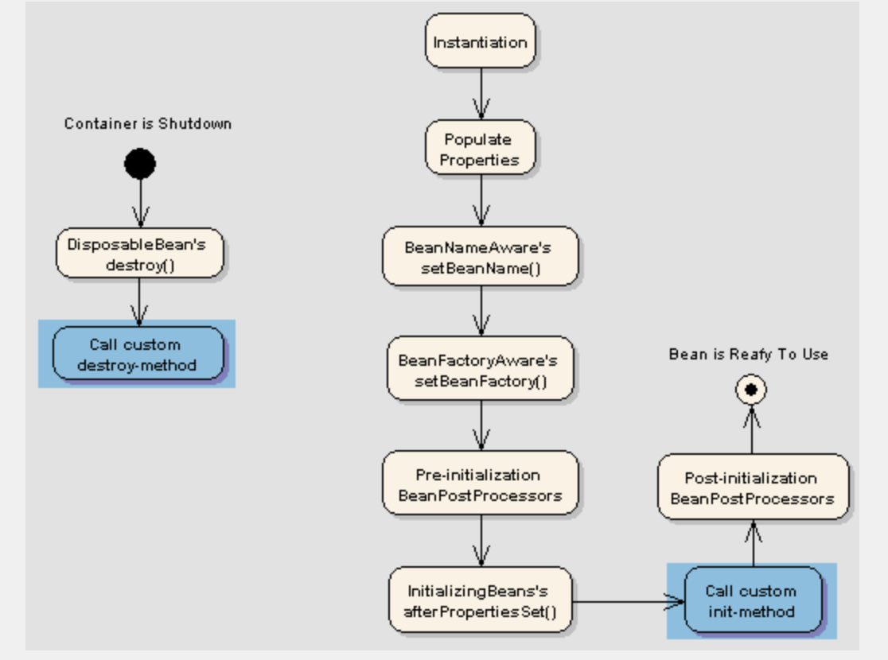

# Spring Module - Bean Lifecycle

This file details information regarding the lifecycle stages of Spring Beans as of version 4.

### Resources
* [Spring 4.0.x Documentation - IoC Container and Beans](https://docs.spring.io/spring/docs/4.0.x/spring-framework-reference/html/beans.html)
* [Bean Factory - Interface Documentation](https://docs.spring.io/spring/docs/current/javadoc-api/org/springframework/beans/factory/BeanFactory.html)
* [Spring Bean Life Cycle - Tutorialspoint](https://www.tutorialspoint.com/spring/spring_bean_life_cycle.htm)
* [Lifecycle Image Reference](https://howtodoinjava.com/spring-core/spring-bean-life-cycle/)

## Bean Lifecycle
The management of Beans, conducted by the BeanFactory or Application Context, includes instantiation, configuration and the eventual removal (or destruction) of beans. As a high-level overview:
1. Beans are first instantiated.
1. Their properties are set.
1. Any associated interfaces or objects are made aware of their existence.
1. The bean is made aware of any associated interfaces as well.
1. Any other methods, particularly custom created methods, are invoked.
1. Then the bean is ready for use.
1. Once the bean is no longer used, it is marked for removal and a destroy method is invoked for the bean
1. Custom destroy methods are invoked, if any.
1. Bean is the destroyed.

The following is a visualization of this lifecycle:

Specifically the lifecycle of a Spring Bean in an application context, pursuant to the associated interface methods is as follows:
Instantiate Bean - Bean is instantiated
Populate bean properties - Bean properties are established.
Related Interfaces are made aware. This includes:
* [BeanNameAware's setBeanName](https://docs.spring.io/spring/docs/current/javadoc-api/org/springframework/beans/factory/BeanNameAware.html) - Informs Bean Factory of Bean Name
* [BeanClassLoaderAware's setBeanClassLoader](https://docs.spring.io/spring/docs/current/javadoc-api/org/springframework/beans/factory/BeanClassLoaderAware.html) - Callback to inform bean [class loader](https://docs.oracle.com/javase/8/docs/api/java/lang/ClassLoader.html?is-external=true) of bean. A Class loader is an object responsible for loading class.
* [BeanFactoryAware's setBeanFactory](https://docs.spring.io/spring/docs/current/javadoc-api/org/springframework/beans/factory/BeanFactoryAware.html) - Informs bean of their owning bean factory
* [EnvironmentAware's setEnvironment](https://docs.spring.io/spring/docs/current/javadoc-api/org/springframework/context/EnvironmentAware.html) - Informs the bean of the environment in which it runs.
* [EmbeddedValueResolverAware's setEmbeddedValueResolver](https://docs.spring.io/spring/docs/current/javadoc-api/org/springframework/context/EmbeddedValueResolverAware.html) - Informs bean of notifications from StringValueResolver, when embedded definition values are resolved.

If using an application context, the following are also made aware:
* [ResourceLoaderAware's setResourceLoader](https://docs.spring.io/spring/docs/current/javadoc-api/org/springframework/core/io/ResourceLoader.html)
* [ApplicationEventPublisherAware's setApplicationEventPublisher](https://docs.spring.io/spring/docs/current/javadoc-api/org/springframework/context/ApplicationEventPublisher.html)
* [MessageSourceAware's setMessageSource](https://docs.spring.io/spring/docs/current/javadoc-api/org/springframework/context/MessageSource.html)
* [ApplicationContextAware's setApplicationContext](https://docs.spring.io/spring/docs/current/javadoc-api/org/springframework/context/ApplicationContextAware.html)
* [ServletContextAware's setServletContext (Specifically only applicable when running in a __web application context__)](https://docs.spring.io/spring/docs/current/javadoc-api/org/springframework/web/context/ServletContextAware.html)

After Awareness:
* [postProcessBeforeInitialization methods of BeanPostProcessors](https://docs.spring.io/spring/docs/current/javadoc-api/org/springframework/beans/factory/config/BeanPostProcessor.html#postProcessBeforeInitialization-java.lang.Object-java.lang.String-) - Method called before bean initialization callback methods are invoked, but after bean has been populated with property values.
* [InitializingBean's afterPropertiesSet](https://docs.spring.io/spring/docs/current/javadoc-api/org/springframework/beans/factory/InitializingBean.html#afterPropertiesSet--) - Method invoked by the owner bean factory after all bean properties have been set and satisfied Aware methods (BeanFactoryAware, ApplicationContextAware, etc...)
* [Custom init-method definition] - Custom Defined init method. Signature is `public void init()`. This method is detected by the [getInitMethodName Method](https://docs.spring.io/spring/docs/current/javadoc-api/org/springframework/beans/factory/support/AbstractBeanDefinition.html#getInitMethodName--)
* [postProcessAfterInitialization methods of BeanPostProcessors](https://docs.spring.io/spring/docs/current/javadoc-api/org/springframework/beans/factory/config/BeanPostProcessor.html#postProcessBeforeInitialization-java.lang.Object-java.lang.String-) - Callback which allows post processor to decide whether to apply either the FactoryBean, created object or both through corresponding instanceof FactoryBean checks.

* Bean is ready for use.

On shutdown of a bean factory (or destruction of a bean), the following lifecycle methods apply:
* [postProcessBeforeDestruction methods of DestructionAwareBeanPostProcessors](https://docs.spring.io/spring/docs/current/javadoc-api/org/springframework/beans/factory/annotation/InitDestroyAnnotationBeanPostProcessor.html#postProcessBeforeDestruction-java.lang.Object-java.lang.String-) - Applies the bean's BeanPostProcessor before its destruction inclucking the invocation of custom destruction callbacks
* [DisposableBean's destroy](https://docs.spring.io/spring/docs/current/javadoc-api/org/springframework/beans/factory/DisposableBean.html#destroy--) - Method invoked by bean factory (or ApplicationContext) when a bean is to be destroyed
* [Custom destroy-method definition] - Custom Defined destroy method. Signature is `public void destroy()`. This method is detected by the [getDestroyMethodName Method](https://docs.spring.io/spring-framework/docs/current/javadoc-api/org/springframework/beans/factory/support/AbstractBeanDefinition.html#getDestroyMethodName--)

It is worth nothing that Spring does not manage this entire lifecycle for all Beans, but rather only those which exist in particular [bean scopes](./bean-scopes.md).