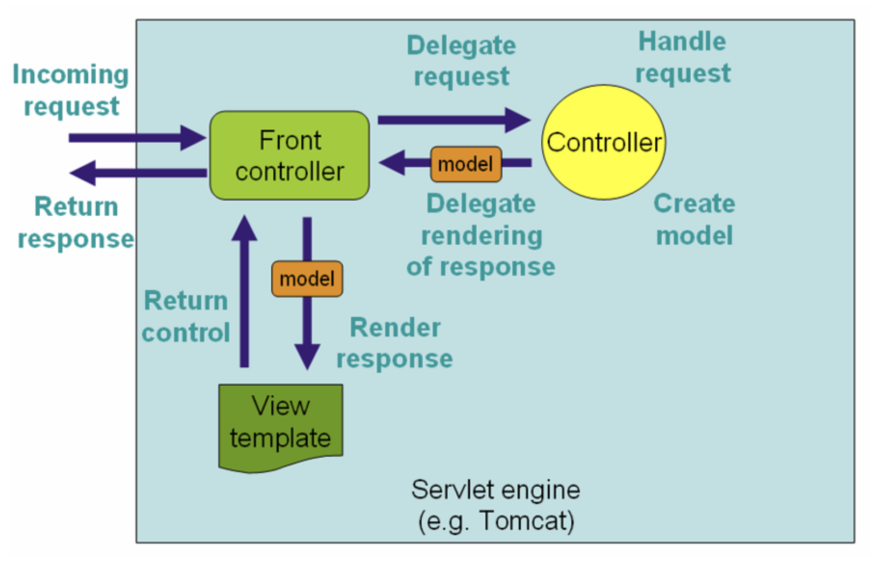
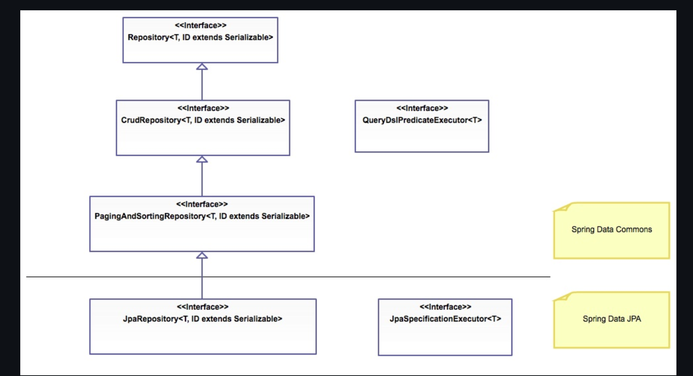
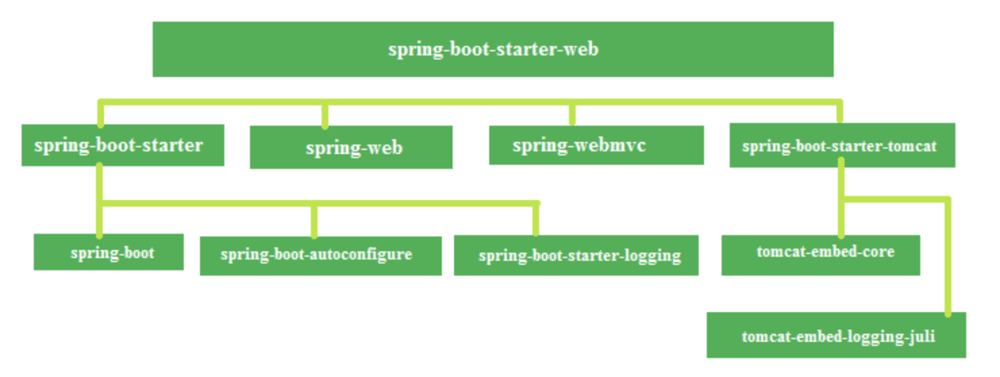

# Monday

## Spring Framework - Intro to Spring

The Spring Framework is an inversion of control container that provides flexible infrastructural support to create loosely coupled Java applications by utilizing dependency injection.

### References
* [Spring Framework API - Java Documentation](https://javadoc.io/doc/org.springframework/spring-core/latest/index.html)
* [Overview of Spring Framework - Spring Documentation 4.0.x](https://docs.spring.io/spring/docs/4.0.x/spring-framework-reference/html/overview.html)

## What is Spring?
Spring an umbrella term for a family of frameworks which can be utilized to rapidly create loosely coupled Java applications. These spring frameworks provide a comprehensive and configurable model for modern enterprise Java applications, which can be easily migrated to any kind of deployment platform. This ease is due to the core feature of the Spring frameworks, which focuses on [dependency injection](./ioc-dependency-injection) resulting from the framework acting as an [inversion of control](./ioc-dependency-injection) container.

Spring enables developers to build java applications utilizing a POJO design pattern, and applying enterprises services, as needed, non-invasively to those POJOs. This loose coupling allows developers to focus on business logic for applications as Spring handles the infrastructural needs. 

## Frameworks - Overview
The Spring family of frameworks consist of close to 20 modules, each focusing on a particular task or service. These are grouped into the following layers: Core Container, Data Access/Integration, Messaging, Web, AOP, Aspects, Instrumentation and Test.


### Core Container
The Core Container provide the basic framework for the IoC container and dependency injection.
* [Core & Beans](https://docs.spring.io/spring/docs/4.0.x/spring-framework-reference/html/beans.html#beans-introduction): These modules provide the fundamental framework for springs IoC container, including dependency injection features. Beans specifically feature the BeanFactory, which is a sophisticated implementation of the factory design pattern used to create beans, which are used in dependency injection.
* [Context](https://docs.spring.io/spring/docs/4.0.x/spring-framework-reference/html/beans.html#context-introduction): This modules builds off from the core and bean modules used for more enterprise functionality. The main feature, ApplicationContext represents the Spring IoC container and is used to instantiate, onfigure and assemble beans.
* [SpEL (Spring Expression Language)](https://docs.spring.io/spring/docs/4.0.x/spring-framework-reference/html/expressions.html): A module which provides a powerful expression language which can be used to query and manipulate an object graph at runtime, including setting and getting property values, property assignment, method invocation, accessing array content, collections and indexer and more.

### Data Access/Integration
The Data Access/Integration layer provides support for database management or layers of abstraction for ease of use.
* [JDBC (Java Database Connectivity)](): A module which provides a layer of abstraction for [JDBC](https://docs.spring.io/spring/docs/4.0.x/spring-framework-reference/html/jdbc.html#jdbc-introduction)
* [ORM (Object Relational Mapping)](https://docs.spring.io/spring/docs/4.0.x/spring-framework-reference/html/orm.html): A module which provides integration layers for ORM APIs, such as JPA, JDO and Hibernate
* [OXM (Object/XML Mapping)](https://docs.spring.io/spring/docs/4.0.x/spring-framework-reference/html/oxm.html): A module which provides a layer of abstraction for mapping implementations for JAXB, Castor, XMLBeans, JiBX and XStream
* [JMS (Java Messaging System)](https://docs.spring.io/spring/docs/4.0.x/spring-framework-reference/html/jms.html): A module which provides feature to produce and consume messages.
* Transaction: A module which provides programmatic and declarative support for transaction management in classes that implement special interfaces as well as POJOs

### Web
The Web layer provides basic web integration features for an application.
* [Web-Servlet](https://docs.spring.io/spring/docs/4.0.x/spring-framework-reference/html/mvc.html): A module which provides an implementation for Spring MVC, a clean separation between model code and web forms, and also integrates with other features of the Spring framework.
* [WebSocket](https://docs.spring.io/spring/docs/4.0.x/spring-framework-reference/html/websocket.html): A module which provides a standardized way to esablish a communication channel between a client and server with a single TCP connection.
* [Web-Portlet](https://docs.spring.io/spring/docs/4.0.x/spring-framework-reference/html/portlet.html): A module incredibly similar to the servlet workflow, that is marked by two distinct phases, an action phase, which is executed once when any backend changes occur, and a render phase, in which information is displayed to the user.

### [AOP (Aspect Oriented Programming)](https://docs.spring.io/spring/docs/4.0.x/spring-framework-reference/html/aop.html)
The AOP modules provides support for Aspect Oriented Programming, which is different way of thinking about program structure, as opposed to Object Oriented Programming. Aspect Oriented Programming aims to decouple code from functionality that is independent from the core functionality of that code (for example, logging information, and security are generalized functionality that is independent of other, specific business logic, and therefore would be handled by a specific aspect.

### [Aspects](https://docs.spring.io/spring/docs/4.0.x/spring-framework-reference/html/aop.html#aop-ataspectj)
Aspects, particularly AspectJ for Spring, is the module which, when enabled, allows for the use of the AspectJ supported style of declaring and autoproxying beans based on whether the bean is being advised by one or more aspects.

### Instrumentation
A module which provides support for instrumentation (the process of planning, installing, monitoring and maintaining systems) and classloader implementation used in an application server.

### [Test](https://docs.spring.io/spring/docs/4.0.x/spring-framework-reference/html/testing.html)
A module which provides support for integration and best practice unit testing, focusing on JUnit or TestNG, as well as mocking information.


## Spring Module - IOC Container and Dependency Injection

The Spring Framework acts as an Inversion of Control (IoC) Container by utilizing Dependency Injection. IoC or Dependency Injection, refers to the process whereby objects define their dependencies, but creation, assembly and injection of those objects is performed by the Spring IoC container.

### References
* [Spring 4.0 - IoC Container](https://docs.spring.io/spring/docs/4.0.x/spring-framework-reference/html/beans.html)
* [Inversion of Control and Dependency Injection - Martin Fowler](https://martinfowler.com/articles/injection.html)
* [IoC and Depedency Injection - Tutorials Teacher](https://www.tutorialsteacher.com/ioc/inversion-of-control)

## Inversion of Control
Inversion of Control is a design principle in which control over certain parts of object-oriented design is inverted to achieve loose coupling. An simple way to think of this would be to Suppose a user has a car and drives to work each day. Currently, the user is in control of the car. However, if the user schedules an uber instead, the control is inverted from the user to the uber driver, allowing the user to focus on other tasks while still allowing the car to ultimately be driven to work.

In Spring, the IoC Container is responsible for instantiating, configuring and assembling objects known as beans. It does this by getting information from the XML file and assembling the objects accordingly. In Spring there are two types of IoC Containers, the BeanFactory and Application context, which is built out of the Bean factory. More information on BeanFactory, ApplicationContext and Beans can be found in the [configuration lecture notes](./xml-vs-annotation-configuration.md).

The ApplicationContext interface is built on top of the BeanFactory with extra functionality, such as simple integration with Spring AOP, event propagation, message resource handling, and application layer specific context (such as WebApplicationContext for web applications).

## Dependency Injection
Fundamentally, every framework implements at least some level of Inversion of Control. Dependency Injection is a more specific term for what control is inverted with regard to the Spring Framework. As the name suggests, Dependency Injection is a design patters that removes dependencies of a program by providing the configuration in an external source, such as an ML file. This loosely coupled design then makes code easier to test, and implement in a wider variety of environments.

Dependency Injection can occur through the following methods:
* Constructor Injection: Dependency Injection accomplished when the container invokes a constructor with arguments to instantiate a bean in which each argument of said constructor represents a dependency.
* Setter Injection: Dependency Injection accomplished when the container calls setter methods on a bean after invoking a no-argument constructor to instatiate a bean.

### Constructor Injection Examples
__XML Configuration__
```
<beans>
    <bean id = "order" class = "com.revature.models.Order">
        <constructor-arg ref="account"/>
        <constructor-arg ref="item"/>
    </bean>

    <bean id = "account" class = "com.revature.models.Account">
    </bean>

    <bean id = "item" class = "com.revature.models.Item">
    </bean>
</beans>
```


__Annotation Configuration__
```
package com.revature.models;

import org.springframework.beans.factory.annotation.Autowired;

public class Order {
	private Account account;
	private int id;
        private Item item;

	@Autowired // multiple beans are distinguished by object type
	public Order(Account account, int id, Item item) {
		super();
		this.account = type;
		this.id = id;
		this.item = item;
	}

	...
}
```


__Java Configuration__
```
package com.revature.config;

// import statements
...

@Configuration
@ComponentScan({ "com.revature.repository;com.revature.services" })
public class AppConfig {
	
	...
	
	@Bean(name = "orderService")
	public OrderService getOrderService() {
		OrderServiceImpl oserv = new OrderServiceImpl(getOrderDao()); //<--- consturctor injection
		return oserv;
	}
}
```

### Setter Injection Examples
__XML Configuration__
NOTE: XML Configuration does not directly support setter injection, rather, it is accomplished through properties
```
<beans>

    ...

    <bean id="accountServ" class="com.revature.services.AccountServiceImpl">
        <property name="accountDao" ref="accountDao"/>
    </bean>

    <bean id="orderServ" class="com.revature.services.OrderServiceImpl">
        <property name="orderDao" ref="orderDao"/>
    </bean>

    <bean id="itemServ" class="com.revature.services.ItemServiceImpl">
        <property name="itemDao" ref="itemDao"/>
    </bean>

</beans>
```


__Annotation Configuration__
```
package com.revature.models;

import org.springframework.beans.factory.annotation.Autowired;

public class Order {
	private Account account;
	private int id;
        private Item item;

	@Autowired
	public void setItem(Item item) {
		this.item = item;
	}

	...
}
```


__Java Configuration__
```
package com.revature.config;

// import statements
...

@Configuration
@ComponentScan({ "com.revature.repository;com.revature.services" })
public class AppConfig {
	
	...
	
	@Bean(name="accountService")
	public AccountService getAccountService() {
		AccountServiceImpl aserv = new AccountServiceImpl();
		as.setAccountDao(getAccountDao()); //<---setter injection
		return aserv;
	}
}
```

### Constructor vs Setter Injection
* Constructor Injection is more secure, since dependencies are required to create an object, you are guaranteed to have each dependency populated
* Consturctor Injection enables the implementation of immutable objects
* Setter Injection allows for partial dependencies since Constructor injection requires all properties to be established upon bean instantiation.
* Setter Injection occurs after constructor injection, essentially putting giving setter injection precedence over constructor injection
* Setter Injection can easily change values, and does not create new bean instances, making it more flexible than constructor injection.
* Setter Injection can resolve circular references (i.e. if Object A and Object B are dependent on each other, setter injection can be used to resolve this, whereas Constructor injection would throw a BeanCurrentlyInCreationException).

   * ### [Spring Configuration](https://github.com/220613-Reston-Java-Angular-AWS/Curriculum-Notes/blob/newMain/Week-7/XML-vs-Annotation-vs-JavaConfig.md)
   * ### [Bean Lifecycle](https://github.com/220613-Reston-Java-Angular-AWS/Curriculum-Notes/blob/newMain/Week-7/Bean-Lifecycle.md)
   * ### [Injecting Primitives](https://github.com/220613-Reston-Java-Angular-AWS/Curriculum-Notes/blob/newMain/Week-7/Injecting-Primitives.md)
   * ### [Scopes of a Bean](https://github.com/220613-Reston-Java-Angular-AWS/Curriculum-Notes/blob/newMain/Week-7/Scopes-of-a-Bean.md)
   * ### [Stereotypes](https://github.com/220613-Reston-Java-Angular-AWS/Curriculum-Notes/blob/newMain/Week-7/Stereotypes.md)
   * ### [Spring ORM](https://github.com/220613-Reston-Java-Angular-AWS/Curriculum-Notes/blob/newMain/Week-7/Spring-ORM.md)
   * ### [Lombok](https://github.com/220613-Reston-Java-Angular-AWS/Curriculum-Notes/blob/newMain/Week-7/Lombok.md)
   
<br>

# Tuesday

## Aspect Oriented Programming and Cross Cutting Concerns

### References
* [Spring 4.0.x Framework Documentation - AOP with Spring](https://docs.spring.io/spring/docs/4.0.x/spring-framework-reference/html/aop.html)
* [Spring 4.0.x Framework Documentation - AOP API](https://docs.spring.io/spring/docs/4.0.x/spring-framework-reference/html/aop-api.html)
* [JavaDocs API - Spring 4.0.x](https://docs.spring.io/spring/docs/4.0.x/javadoc-api/overview-summary.html)
* [AspectJ API Docs](https://www.eclipse.org/aspectj/doc/released/runtime-api/index.html)
* [AspectJ API Docs - Annotations](https://www.eclipse.org/aspectj/doc/released/aspectj5rt-api/index.html)

## Aspect Oriented Programming and Cross Cutting Concerns
Aspect Oriented Programming is another way to think about structuring your program, which can be used complementary to Object Oriented Programming. In object oriented programming, classes are used as the key component used to drive the creation of objects, which serve the purpose of representing concrete ideas or things with states and behaviors. In Aspect Oriented Programming, the key component are aspects, which modularizes particular transactional concerns which can present across multiple classes, known as _cross-cutting concerns_. Examples of these concerns are, Database Access (security for a database), data entities (transactions to take place), error handling, or logging system messages. The defining characteristic of these _cross-cutting concerns_ is that they are actions that can take place across your classes, regardless of the class function or structure. In traditional object oriented programming, this would result in code redundancy, as the same code must be called multiple times throughout an application to perform these actions. Aspect Oriented Programming works to eliminate this redundancy by transferring responsibility of these common problems to aspects. Note that the Spring IoC Container is not dependent on AOP; however, the Spring AOP framework complements the IoC Container by providing a capable middleware solution for concerns.

### Important Terminology
* _Aspect_ - A representation of a concern which cuts across multiple classes.
* _Weaving_ - The process of linking aspects with other objects, such as beans, to create advised objects. This can be done at compile time (such as when using the AspectJ compiler), load time or runtime. Spring performs weaving at Runtime.
* _Join Point_ - A specified moment during the execution of a program, such as the invocation of a method, in which actions can be taken.
* _Advice _ - Action taken by an aspect at a specified Join point. 
* _Pointcut_ - A definition of which methods in our application advice ought to be injected into or around, for example, when a method of a certain name is executed. By default, spring uses AspectJ pointcut expression language.
* _Introduction_ - Declaration of new interfaces and corresponding implementations in subclasses of any advised object. Introductions use the `@DeclareParents` annotation with the _defaultImpl_ attribute to define a default concrete class for the bean definition. For Example:

__IFunction Interface__:
```
package com.revature.examples;

public interface IFunctional {
    public void function();
}
```

__FunctionalDefault__:
```
package com.revature.examples;

public class FunctionalDefault implements IFunctional {
    public void function() {
        System.out.println("This is the default function");
    }
}
```

__Aspect__:
```
package com.revature.examples;

import org.aspectj.lang.annotation.Aspect;
import org.aspectj.lang.annotation.DeclareParents;
import org.springframework.stereotype.Component;

@Component
@Aspect
public class AspectExample {
    @DeclareParents(value="com.revature.examples.*+",defaultImpl=FunctionalDefault.class)
    public static IFunctional iFunctional;
}
```
The '+' after the package is used to match the class (or interface) and all subclasses. This pointcut expression will match any interfaces or classes defined in the package `com.revature.examples` and also any subclass or implementing class of these classes, even if the implementing class or subclass is in another package.
* _Target Object_ - The object which is being advised by one or more aspects. The Spring AoP is implemented using proxies, and as such, this target object will always be a proxied object.
* _AOP Proxy_ - An object created in an AoP framework in order to implement advice defined in aspects. The utilization of these proxies allows for loose coupling between your advice targets. The Spring AoP framework supports JDK dynamic proxies (which is interface based) as well as a CGLIB proxy (which is class based).

Below is a visual representation of how the Spring Transaction proxy works:


At a high-level, when a method is invoked an AOP Proxy is informed, which informs the associated Advisor (in this case a transaction advisor). This advisor implementation can then inject advice as needed (based on configuration) before, or after invoking the target method. Note that additional custom advisors can come before or after the transaction advisor is run.

   * ### [Adivce](https://github.com/220613-Reston-Java-Angular-AWS/Curriculum-Notes/blob/newMain/Week-7/SpringAop-Advice.md)
   * ### [Pointcut & Join Points](https://github.com/220613-Reston-Java-Angular-AWS/Curriculum-Notes/blob/newMain/Week-7/SpringAop-Jointcut-and-JoinPoints.md)
   * ### [@AspectJ](https://github.com/220613-Reston-Java-Angular-AWS/Curriculum-Notes/blob/newMain/Week-7/SpringAop-AspectJ-support.md)
   * ### [AOP - Things You should know](https://github.com/220613-Reston-Java-Angular-AWS/Curriculum-Notes/blob/newMain/Week-7/AOP-AspectOrientedProgramming.md)

<br>

# Wednesday 

# Spring Module - MVC Architecture

This page details an overview of the Spring MVC Framework and explains how to utilize this framework to create a Spring based Web application

### References
* [Spring 4.0.x Documentation - Web MVC Framework](https://docs.spring.io/spring/docs/4.0.x/spring-framework-reference/html/mvc.html)
* [Spring 4.0.x API Docs](https://docs.spring.io/spring/docs/4.0.x/javadoc-api/overview-summary.html)


## Spring Model View Controller Architecture
The Spring MVC Framework, like many other MVC Frameworks, is a request driven structure, designed around a central Servlet which dispatches requests to controllers and offers functionality to support the web application. As a breif recap, Models represent data to be stored and/or retrieved from a database or environment, the View is the user interface and displays model data and the controller handles requests between the model and responds with appropriate views. Unlike other MVC frameworks, the Spring `DispatcherServlet` is completely itegrated with the Spring IoC container, allowing the use of every other Spring feature in addition to this functionality. A high level overview of this request processing structure can be viewed below:




### Dispatcher Servlet and MVC
The Spring Web Model-View-Controller (MVC) Framework is based on the use of a `DispatcherServlet`, which uses a `FrontController` design pattern. This `DispatcherServlet` routes requests to configurable handlers, view resolutions, and also provides support for uploading files. The default controller is based on the `@Controller` stereotype annotation, as well as the `@RequestMapping` annotation, both of which are detailed in the notes below.

The `DispatcherServlet`, as you may guess, is an actual `Servlet`. As such, it must inherit it's functionality from the `HttpServlet` base class, and is declared in the _web.xml_ file of your application. Any requests you want the `DispatcherServlet` to handle must also be mapped in the same _web.xml_ file. As a reminder, Servlets require a top-level Servlet element in which servlet-name, servlet-class and other optional elements (such as load-on-startup) are nested. Request Mappings utilize the top-level servlet-mapping element with nested servlet-name and url-pattern elements

For Example:
```
<web-app>
    <servlet>
        <description>This is an optional description of this servlet. An example servlet</description>
        <servlet-name>exampleServlet</servlet-name>
        <servlet-class>com.revature.web.Dispatcher</servlet-class>
        <load-on-startup>1</load-on-startup>
    </servlet>

    <servlet-mapping>
        <servlet-name>example</servlet-name>
        <url-pattern>/example/*</url-pattern>
    </servlet-mapping>

</web-app>
```

In this example, all requests which start with _/example_ will be handled by the `Dispatcher`, which is named _exampleServlet_.


### ViewResolvers and InternalResourceView
Before Discussing annotations, it is worth briefly discussing how views are resolved. All Spring Web MVC controllers must resolve to a logical view name, either explicitly (for example, returning a String, View or ModelAndView) or implicitly (i.e. based on conventions). In Spring, these views are resolved by a view resolver using a logical view name. Spring has a number of view resolvers, though we will only breifly discuss a few (more information can be found in the [Spring Documentation](https://docs.spring.io/spring/docs/4.0.x/spring-framework-reference/html/mvc.html#mvc-viewresolver)):

* AbstractCachingViewResolver: Abstract view resolver which, when extended, can cache views.
* XmlViewResolver: Implementation of ViewResolver that accepts an XML configuration file with the same DTD as Spring’s XML bean factories. The default configuration file is /WEB-INF/views.xml.
* UrlBasedViewResolver: Implementation of the ViewResolver which directly resolves view names to URLs, without an explicit mapping definition. Useful if if your logical names match the names of your views.
* InternalResourceViewResolver: Subclass of UrlBasedViewResolver that supports InternalResourceView (such as Servlets and JSPs) and subclasses (such as JstlView and TilesView). View classes for all views generated by this resolver can be set using setViewClass(..) Method. See the [UrlBasedViewResolver javadocs](https://docs.spring.io/spring-framework/docs/4.0.x/javadoc-api/org/springframework/web/servlet/view/UrlBasedViewResolver.html) for more details.

The `InternalResourceView` is a Wrapper class for JSP or other resources within the same web application. It can be used to expose model objects as request attributes and forward requests to a specified resource URL using the `RequestDispatcher`. In particular the `InteralResourceViewResolver` supports definitions for `InternalResourceView`s for a simple and straightforward resolution of `@Controller` class methods. 

For example:
```
<bean id="viewResolver" class="org.springframework.web.servlet.view.InternalResourceViewResolver">
   <property name="prefix" value="/WEB-INF/jsp/"/>
   <property name="suffix" value=".jsp"/>
 </bean>
```


### Spring Web Annotations
As discussed in the [stereotype annotation lecture notes](../a-framework/stereotypes.md), the `@Controller` annotation specifies a class as a _controller_, a special type of bean used particularly to handle web application requests. The introduction of the `@Controller` annotation, as of Spring 3.0, allows for the creation of RESTful Web services and applications through the use of the `@PathVariable` annotation as well as other flexible features. The dispatcher will scan these `@Controller`-annotated and `@RequestMapping`-annotated classes and detect any `@RequestMapping`-annotated methods. Depending on the context, this `@RequestMapping` annotation can be configured with url mapping, http request method types, url values, and other parameters. 

For example (Example from Spring Documentation):
```
@Controller
@RequestMapping("/appointments")
public class AppointmentsController {

    private final AppointmentBook appointmentBook;

    @Autowired
    public AppointmentsController(AppointmentBook appointmentBook) {
        this.appointmentBook = appointmentBook;
    }

    @RequestMapping(method = RequestMethod.GET)
    public Map<String, Appointment> get() {
        return appointmentBook.getAppointmentsForToday();
    }

    @RequestMapping(value="/{day}", method = RequestMethod.GET)
    public Map<String, Appointment> getForDay(@PathVariable @DateTimeFormat(iso=ISO.DATE) Date day, Model model) {
        return appointmentBook.getAppointmentsForDay(day);
    }

    @RequestMapping(value="/new", method = RequestMethod.GET)
    public AppointmentForm getNewForm() {
        return new AppointmentForm();
    }

    @RequestMapping(method = RequestMethod.POST)
    public String add(@Valid AppointmentForm appointment, BindingResult result) {
        if (result.hasErrors()) {
            return "appointments/new";
        }
        appointmentBook.addAppointment(appointment);
        return "redirect:/appointments";
    }
}
```
In this example, requests to the _AppointmentsController_ are indicated by the "/appointments" url, and may handle a combination of GET as well as POST HTTP methods depending on the information provided. If a GET request is made simply to /appointments, then the controller will return a Map using the `getAppointmentsForToday()` method. If the GET request is made to the url "/appointments/new", then an _AppointmentForm_ will be returned using the `AppointmentForm()` method.

Additionally, the special _redirect_ prefix used here allows for a `UrlBasedViewResolver` (and subclasses) to recognize that a redirect is needed, and may resolve the view using the logical name. When using this _redirect_ prefix supports both relative and absolute URLs:
relative*:
```
    return: "redirect:appointments/new";
```
*We used a relative path above

absolute
```
    return: "https://revature.com"";
```


### `@RequestBody`
After defining a Request Mapping, there are a number of ways to detect and utilize variables sent with the request. For information within the body of the request, you should use `@RequestBody`, which allows Spring to map data from the body of a request to a defined java object.

REQUEST:
```
<form action="loginExample" method="POST">
	<input type="text" name="username" value="Revature">
	<input type="password" name="password" value="password">
	<input type="submit" value="Post Data">
</form>
```

LOGIN OBJECT:
```
public class LoginForm {
	private String username;
	private String password;
	
	// constructors, getters, setters, etc...
}
```

CONTROLLER:
```
@Controller("examplePost")
public class ExampleController {

	...

	@RequestMapping(value="/loginExample", method=RequestMethod.POST)
	@ResponseStatus(value = HttpStatus.OK)
	public void postData(@RequestBody LoginForm loginForm) {
		System.out.println("Login values [username]: " + loginForm.getUsername()
		+ ", [password]: " + loginForm.getPassword());
	}
}
```


### `@ResponseStatus`
When a specific view is not returned, the logical name used is based on the value of the `@RequestMapping`, however you should still provide some response. The `@ResponseStatus` annotation marks a method or exception class with an HTTP response status code, as well as the reason that should be returned. These examples use this annotation primarily for debugging purposes, but this annotation can be useful when you do not expect to return a particular view from a controller.


### `@RequestParam`
Alternatively the `@RequestParam` annotation should be used to bind request parameters to specific values in the mapped method's signature. You may specify values when using `@RequestParam` either using the name attribute, or simply with the name (or value) of the parameter.
REQUEST:
```
<form action="loginExample" method="POST">
	<input type="text" name="username" value="Revature">
	<input type="password" name="password" value="password">
	<input type="submit" value="Post Data">
</form>
```

CONTROLLER:
```
@Controller("examplePost")
public class ExampleController {

	...

	@RequestMapping(value="/loginExample", method=RequestMethod.POST)
	@ResponseStatus(value = HttpStatus.OK)
	public void postData(@RequestParam(name="username") String username, @RequestParam("password") String password) {
		System.out.println("Login values [username]: " + username + ", [password]: " + password);
	}
}
```

The `@RequestParam` annotation also has a `required` attribute which dictates whether the specified parameter must be present for the request to complete. By default, this parameter is set to true, but can be optionally set to false:
`@RequestParam(name="id", required="false")`. Note that all of these examples could be expressed with the value attribute instead of the name attribute, which is functionally the same: `@RequestParam(value="id", required="false")`.


### `@PathVariable`
Finally, the `@PathVariable` annotation can identify properties directly within the URL of a request for use within a method. To map the url parameter, the parameter should be enclosed in curly braces within the RequestMapping value and the name should match the method parameter:

CONTROLLER:
```
@Controller
public class LibraryController {
	...

	@RequestMapping(value="/library/{bookISBN}", method=RequestMethod.GET)
	public String getBookName(@PathVariable int bookISBN) {
		switch (bookISBN) {
			case 12345:
				return "harry-potter";
			case 54321:
				return "huckleyberry-finn";
			default:
				return "error";
		}
	}
}
```


### `@RequestHeader`
In addition to request parameters and body content, header data can be viewed and mapped to a method in a similar syntax to the `@RequestParam` annotation. This mapping uses, as you may expect, the `@RequestHeader` annotation.

For example:
HEADER:
```
Host                    localhost:8080
Accept                  text/html,application/xhtml+xml,application/xml;q=0.9
Accept-Language         fr,en-gb;q=0.7,en;q=0.3
Accept-Encoding         gzip,deflate
Accept-Charset          ISO-8859-1,utf-8;q=0.7,*;q=0.7
Keep-Alive              300
```

CONTROLLER:
```
@RequestMapping("/displayHeaderInfo.do")
public void displayHeaderInfo(@RequestHeader("Accept-Encoding") String encoding,
        @RequestHeader("Keep-Alive") long keepAlive) {
    //...
}
```


### `@ResponseBody`
Configuration for responding to Requests can also be simplified with the Spring MVC Framework through the use of the `@ResponseBody` annotation. This annotation can be used to automatically marshal java objects into a JSON String.

CONTROLLER:
```
@Controller
public class LibraryController {
	@Autowired
	private LibraryService libraryService;

	...

	@RequestMapping(value="/library/all", method=RequestMethod.GET)
	public @ResponseBody List<Book> getAllBooks() {
		return libraryService.getAllBooks();
	}
}
```
This method would return a list of Book Objects as a JSON string, allowing the response to be parsed and displayed on a webpage.


### `@RestController`
Commonly, Spring Web Controllers implement a REST API, thus serving JSON, XML or custom MediaType content. As such, the `@RestController` annotation is a convenience stereotype annotation which combines the features of `@RequestMapping` with the `@ResponseBody` annotations. This allows the use of HTTP method specific Mapping annotations which automatically produce an XML, JSON or other response.

CONTROLLER:
```
@RestController
@RequestMapping("rest-library")
public class LibraryRestController {
	@Autowired
	private LibraryService libraryService;

	...

	@GetMapping("/all")
	public List<Book> getAllBooks() {
		return libraryService.getAllBooks();
	}

	@GetMapping("/{isbn}")
	public Book getBook(@PathVariable int id) {
		return libraryService.getBookByISBN(isbn);
	}
```


   * ### [Controller](https://github.com/220613-Reston-Java-Angular-AWS/Curriculum-Notes/blob/newMain/Week-7/MVC%20Annotations-Controller.md)
   * ### [Path Variable & Request Params](https://github.com/220613-Reston-Java-Angular-AWS/Curriculum-Notes/blob/newMain/Week-7/MVC%20Annotations-PathVariable.md)
   * ### [Request Mapping](https://github.com/220613-Reston-Java-Angular-AWS/Curriculum-Notes/blob/newMain/Week-7/MVC-Annotation-RequestMapping.md)
  
   <br>
   
# Thursday - Spring Data && Spring Boot !!

## Spring Data JPA
At this point, we have already utilized the Data Access Object (DAO) Layer to handle communication of data between our application and our repository. This DAO layer usually consists of a lot of boilerplate code, and as such can and should be simplified. There are numerous reasons to simplfy this code, including a decrease in the number of artifacts that need to be defined and maintained, consistency of data access patters, consistency of configuration, and quicker implementation for updated repository data.

The Spring Data module takes this simplification one step further by providing standard implementation for common DAO methods allowing for the removal of the DAO implementation and only requiring the definition of the DAO interface methods.

In order to leverage the Sping Data programming model with JPA, a DAO interface should extend the Spring _JpaRepository_ interface from the `org.springframework.data.jpa.repository` package. Note that it is possible to create a basic CRUD application by extending the spring _CrudRepository_ interface (from the `org.springframework.data.repository` package), though this only provides an interface for generic CRUD operations on a repository, and does not leverage the JPA.



Implementation of the Spring _JpaRepository_ provides the following:
* Sophisticated support to build repositories based on Spring and JPA
* Support for QueryDSL predicates and thus type-safe JPA queries 
  * QueryDSL is a framework which enables statically typed SQL-like queries, instead of requiring inline string queries or external XML files.
* Transparent auditing of Domain class
* Pagination (sequential numbering) support
* Dynamic query execution
* Support for integration of custom data access code
* Validation of `@Query` annotated queries during bootstrapping
* Support for XML based entity mapping
* JavaConfig based repository configuration by introducing `@EnableJpaRepositories`

# Spring Data Annotations

This page is a brief overview of the some of the Spring Data annotations. Please see the reference links for the official documentation

### References

- [Spring Data Annotations](https://docs.spring.io/spring-data/commons/docs/current/api/org/springframework/data/annotation/package-summary.html)

## Spring Data Annotations

Spring Data abstracts away the code required for data storage solutions, allowing us to focus more on the business logic. The following is a list and brief explanation of some common Spring Data annotations which allow us to configure how the queries are executed.

| Annotation                      | Purpose                                                                                   |
| ------------------------------- | ----------------------------------------------------------------------------------------- |
| @Transactional                  | Configure how the database transaction behaves. See the @Transactional notes.             |
| @NoRepositoryBean               | Creates and interface that provides common methods for child repositories                 |
| @Param                          | Parameters can be passed to queries defined with @Query                                   |
| @Id                             | Marks a field in a model class as the primary key                                         |
| @Transient                      | Mark a field as transient, to be ignored by the data store engine during reads and writes |
| @CreatedBy, @LastModifiedBy     | Auditing annotations that will automatically filled with the current principal            |
| @CreatedDate, @LastModifiedDate | Auditing annotations that will automatically fill with current date                       |
| @Query                          | Supply a JPQL query for repository methods                                                |

### @Transactional

See the notes on the @Transactional annotation for multiple examples

### NoRepositoryBean

```java
@NoRepositoryBean
public interface MyRepoBase<T, ID extends Serializable> extends JpaRepository<T, ID> {
    Optional<List<T>> findAllByPrice(Double price);
}

@Repository
public inteface BookRepo extends MyRepoBase<Book, Integer> {}
```

The interface `MyRepoBase` can now serve as a base for children repos like `BookRepo`. Spring will not create a bean of type `MyRepoBase`, but will create a `BookRepo` bean which will include all of the `JpaRepository` methods and also `findAllByPrice` from `MyBaseRepo`

### @Param

```java
@Repository
public inteface BookRepo extends MyRepoBase<Book, Integer> {

    @Query("FROM Book b WHERE b.title LIKE :title")
    Optional<List<T>> findBySimilarTitle(@Param("title") String title);
}
```

The `@Param` annotation binds the method parameter to the `title` parameter of `@Query`.

### @Id

This is essentially the same as the JPA annotation.

### @Transient

This is essentially the same as the JPA annotation.

### @CreatedBy, @LastModifiedBy, @CreatedDate, @LastModifiedDate

```java
public class Book {
    @CreateBy
    public User creator;

    @LastModifiedBy
    public User modifier;

    @CreatedDate
    public Date createdAt;

    @LastModifiedDate
    public Date modifiedAt;
}

```

### @Query

```java
@Query("SELECT COUNT(*) FROM Book b)
long getBookInventoryCount();
```

JPQL query.

```java
@Query("FROM Book b WHERE b.title LIKE :title")
Optional<List<T>> findBySimilarTitle(@Param("title") String title);
```

With named parameters.

```java
@Query("SELECT AVG(b.page_count) FROM Book b", nativeQuery=true)
int getAvgPageCount();
```

Natvie SQL query.


# JPA Example

Lets examine an example. First create a Spring project with the following dependencies:
* Spring Data JPA
* Spring Web (We will use this to interface with our application)
* H2 Database

If you choose to use Maven, the `pom.xml` file should look similar to this:
```
<?xml version="1.0" encoding="UTF-8"?>
<project xmlns="http://maven.apache.org/POM/4.0.0" xmlns:xsi="http://www.w3.org/2001/XMLSchema-instance"
    xsi:schemaLocation="http://maven.apache.org/POM/4.0.0 https://maven.apache.org/xsd/maven-4.0.0.xsd">
    <modelVersion>4.0.0</modelVersion>
    <parent>
        <groupId>org.springframework.boot</groupId>
        <artifactId>spring-boot-starter-parent</artifactId>
        <version>2.1.6.RELEASE</version>
        <relativePath/> <!-- lookup parent from repository -->
    </parent>
    <groupId>com.revature</groupId>
    <artifactId>JpaDemo</artifactId>
    <version>0.0.1-SNAPSHOT</version>
    <name>JpaDemo</name>
    <description>Demo project for Spring JPA - Spring Boot</description>

    <properties>
        <java.version>1.8</java.version>
    </properties>

    <dependencies>
        <dependency>
            <groupId>org.springframework.boot</groupId>
            <artifactId>spring-boot-starter-data-jpa</artifactId>
        </dependency>
	<dependency>
	    <groupId>org.springframework.boot</groupId>
	    <artifactId>spring-boot-starter-web</artifactId>
	</dependency>

        <dependency>
            <groupId>com.h2database</groupId>
            <artifactId>h2</artifactId>
            <scope>runtime</scope>
        </dependency>
	<dependency>
		<groupId>org.springframework.boot</groupId>
		<artifactId>spring-boot-starter-test</artifactId>
		<scope>test</scope>
	</dependency>
    </dependencies>

    <build>
        <plugins>
            <plugin>
                <groupId>org.springframework.boot</groupId>
                <artifactId>spring-boot-maven-plugin</artifactId>
            </plugin>
        </plugins>
    </build>

</project>
```

If you choose to use Gradle, the `build.gradle` file should look similar to this:
```
plugins {
    id 'org.springframework.boot' version '2.1.6.RELEASE'
    id 'io.spring.dependency-management' version '1.0.8.RELEASE'
    id 'java'
}

group = 'com.revature'
version = '0.0.1-SNAPSHOT'
sourceCompatibility = '1.8'

repositories {
    mavenCentral()
}

dependencies {
    implementation 'org.springframework.boot:spring-boot-starter-data-jpa'
    implementation 'org.springframework.boot:spring-boot-starter-web'
    runtimeOnly 'com.h2database:h2'
    testImplementation('org.springframework.boot:spring-boot-starter-test')
}

test {
	useJUnitPlatform()
}
```

Next, we must define a simple entity as a standard Bean. In this example, we will have a _Customer_ object associated with a _Customer_ table.
```
package com.revature.models;

import javax.persistence.Entity;
import javax.persistence.GeneratedValue;
import javax.persistence.Id;

@Entity
public class Customer {

  @Id // used to indicate field is the primary key
  @GeneratedValue // used to indicate property should be auto-generated
  private Integer id;

  private String firstName;
  private String lastName;

  // default constructor - for use by Spring JPA
  public Customer() {
    super();
    // TODO Auto-generated constructor sub
  }

  public Customer(String firstName, String lastName) {
    this.firstName = firstName;
    this.lastName = lastName;
  }

  @Override
  public String toString() {
    return "Customer[id=" + id + ", firstName=" + firstName + ", lastName=" + lastName + "]"
  }

  public Integer getId() {
    return id;
  }

  public void setId(Integer id) {
    this.id = id;
  }

  public String getFirstName() {
    return firstName;
  }

  public void setFirstName(String firstName) {
    this.firstName = firstName;
  }

  public String getLastName() {
    return lastName;
  }

  public void setLastName(String lastName) {
    this.lastName = lastName;
  }
}
```

Note that we have two constructors, the default no-args constructor exists for the sake of the JPA, and as such we will not use it directly. Instead, we will utilize the parameterized constructor to create instances of _Customer_ objects to be saved to the database.

Next, we create our repository interface:
```
package com.revature.repository;

import java.util.List;

import org.springframework.data.jpa.repository.JpaRepository;
import com.revature.models.Customer;

/*
 * Note that the generics for the JpaRepository should match the associated
 * model followed by the datatype of its id
 */
public interface CustomerRepository extends JpaRepository<Customer, Integer> {

  List<Customer> findByLastName(String lastName);

  Customer findById(Integer id);
}
```

Next, lets create a simple controller which we will use to interface with our application
```
package com.revature.controllers;

import java.util.List;

import org.springframework.beans.factory.annotation.Autowired;
import org.springframework.web.bind.annotation.GetMapping;
import org.springframework.web.bind.annotation.PathVariable;
import org.springframework.web.bind.annotation.PostMapping;
import org.springframework.web.bind.annotation.RequestBody;
import org.springframework.web.bind.annotation.RequestMapping;
import org.springframework.web.bind.annotation.RestController;

import com.revature.models.Customer;
import com.revature.repository.CustomerRepository;

@RestController
@RequestMapping
public class CustomerController {
	@Autowired
	private CustomerRepository customerRepository;
	
	@GetMapping(value="/all")
	public List<Customer> findAll(){
		return customerRepository.findAll();
	}
	
	@GetMapping(value="/last/{lastName}")
	public List<Customer> findByLastName(@PathVariable String lastName) {
		return customerRepository.findByLastName(lastName);
	}

	@GetMapping(value="/id/{id}")
	public Customer findById(@PathVariable Integer id) {
		return customerRepository.findById(id);
	}
	
	@PostMapping(value="/add")
	public Customer add(@RequestBody Customer customer) {
		customerRepository.save(customer);
		return customerRepository.findById(customer.getId());
	}
}
```

Note that this controller references a `findAll()` and `save()` method on our customerRepository though we have not defined these. These methods are already predefined in the JpaRepository Interface, so the only definitions we need to provide are ones which match properties of our Customer model object. A list of JPA methods can be [found here](https://docs.spring.io/spring-data/jpa/docs/current/api/org/springframework/data/jpa/repository/JpaRepository.html).

Make sure you configure your `application.properties` file:
```
#Configure DB connection
spring.h2.console.enabled=true
spring.datasource.platform=h2
spring.datasource.url=jdbc:h2:mem:testdb

#Configure the port and context path for app
server.port=8082
server.servlet.context-path=/customer
```

Finally, create the application class:
```
package com.revature;

import org.springframework.boot.SpringApplication;
import org.springframework.boot.autoconfigure.SpringBootApplication;

@SpringBootApplication
public class JpaDemoApplication {

  public static void main(String[] args) {
    SpringApplication.run(JpaDemoApplication.class, args);
  }

}
```

At this point you can add customers using postman to send `GET` and `POST` requests to save and retrieve customer data. If you would like to produce custom queries, you can do so using the `@Query` annotation in your repository interface. For example:
```
@Query("SELECT c FROM Customer c WHERE c.status = 1")
List<Customer> findAllActiveCustomers();
```

Here, we specify a "status" property for our class and utilize this to track "active" (1) or "inactive" (0) customers in our database.

Though the actual implementation of the Spring Data managed DAO is hidden (as we don't work with it directly) it is a simple enough implementation. In fact, Spring JPA provides a _SimpleJpaRepository_ interface, which extends the JpaRepository, that defines transaction semantics using annotations. Specifically, a read-only `@Transactional` annotation is used at the class level, which is then overridden for the nonread-only methods. The rest of the transaction semantics are default, but can easily be overridden manually on a per-method basis.

# JPQL Queries
JPQL is a SQL-like scripting language used by Spring JPA. Very similar to the prepared statements we used with JDBC code, JPQL can be parameterized. We basically write a JPQL template with variables inside, and then parameterize those variables before the query is executed. We can parameterize the template with indices or names, but we cannot do both in a single query. We must choose.

```java
@Query("SELECT u FROM User u WHERE u.status = :status and u.name = :name")
User findUserByStatusAndNameNamedParams(
  @Param("status") Integer status, 
  @Param("name") String name);
```

```java
@Query("SELECT u FROM User u WHERE u.status = ?1")
User findUserByStatus(Integer status);

@Query("SELECT u FROM User u WHERE u.status = ?1 and u.name = ?2")
User findUserByStatusAndName(Integer status, String name);
```


### References
* [Spring Data JPA - Reference Documentation](https://docs.spring.io/spring-data/jpa/docs/2.3.2.RELEASE/reference/html/#preface)
* [Spring JPA - API Docs](https://docs.spring.io/spring-data/jpa/docs/current/api/org/springframework/data/jpa/repository/JpaRepository.html)
* [Persistence with Spring Data JPA - Baeldung](https://www.baeldung.com/the-persistence-layer-with-spring-data-jpa)
* [Spring Data JPA - Github Repository](https://github.com/spring-projects/spring-data-jpa)
* [QueryDSL](http://www.querydsl.co-.md- Spring Data && Spring Boot !!


 ## Spring Boot Module - Spring Boot

Spring Boot is an open source Spring Framework project used to rapidly create Java based, production-grade applications utilizing Spring Framework's IOC and module integrations. Spring Boot simplifies the process of project startup and framework integration by applying highly opinionated auto-configurations for the different Spring Boot project modules like webmvc, data, security, messaging, etc... .

Spring Boot has really become popular as more and more companies create or convert their systems using microservice patterns.

### References

- [Spring Boot docs](https://docs.spring.io/spring-boot/docs/current/reference/html/getting-started.html#getting-started-introducing-spring-boot)
- [AutoConfiguration with Spring Boot](https://docs.spring.io/spring-boot/docs/1.3.8.RELEASE/reference/html/using-boot-auto-configuration.html)

### Spring Boot Dependency Management

Needless to say Spring and Spring Boot require an increasing number of dependencies. Spring Boot projects are built using dependency packages. The basic Spring Boot dependency packages are included in the project configuration (pom.xml or build.gradle) file and are called `spring-boot-starter-*`. Including one `spring-boot-starter-*` is enough to get your project started as it will include all the necessary pieces required to start developing and testing your solutions. A basic Spring Boot application configuration will container 4 parts:

- parent configuration
- spring-boot-starter
- spring-boot-starter-test
- spring-boot-maven-plugin

```xml
<parent>
    <groupId>org.springframework.boot</groupId>
    <artifactId>spring-boot-starter-parent</artifactId>
    <version>2.3.1.RELEASE</version>
    <relativePath/> <!-- lookup parent from repository -->
  </parent>
  <groupId>com.ex</groupId>
  <artifactId>phase-1</artifactId>
  <version>0.0.1-SNAPSHOT</version>
  <name>phase-1</name>
  <description>Spring boot demo phase 1</description>

  <properties>
    <java.version>1.8</java.version>
  </properties>

  <dependencies>
    <dependency>
      <groupId>org.springframework.boot</groupId>
      <artifactId>spring-boot-starter</artifactId>
    </dependency>

    <dependency>
      <groupId>org.springframework.boot</groupId>
      <artifactId>spring-boot-starter-test</artifactId>
      <scope>test</scope>
      <exclusions>
        <exclusion>
          <groupId>org.junit.vintage</groupId>
          <artifactId>junit-vintage-engine</artifactId>
        </exclusion>
      </exclusions>
    </dependency>
  </dependencies>

  <build>
    <plugins>
      <plugin>
        <groupId>org.springframework.boot</groupId>
        <artifactId>spring-boot-maven-plugin</artifactId>
      </plugin>
    </plugins>
  </build>
```

That will be all that you need for a basic Spring Boot project. Lets illustrate the difference between a basic project and more complicated one. A simple Spring Boot Web application will also have 4 parts:

- parent configuration
- spring-boot-starter-webmvc
- spring-boot-starter-test
- spring-boot-maven-plugin

And that is all the, `spring-boot-starter-webmvc` dependency replaces the `spring-boot-starter` dependency, but it contains all of the dependencies needed for the basic application and the web application.



In the diagram you can see how the `spring-boot-starter-webmvc` is an extension of the `spring-boot-starter`.

## AutoConfiguration

As we have covered the core Spring Framework and how to integrate different modules and wire dependencies, the biggest draw to using Spring Boot is the autoconfiguration. Spring Boot takes a highly opinionated stance on the module integrations reducing the amount of Spring Configuration needed to start developing and testing your solutions. Imagine integrating webmvc without having to start a server, or register your dispatcher servlet, or register your internal view resolver. Spring Boot automatically assumes you need all of these beans, creates them and wires them together. Better yet it automatically prescribes the solutions and its alternatives.

To further elaborate on this example if you include the Spring Boot WebMVC module you will automatically get:

- Embedded Tomcat Servlet Container (Jetty or UnderTow)
- Standard DispatcherServlet
- JSP Internal View Resolver

To enable auto configuration in Spring Boot, you need to include `@EnableAutoConfiguration` or `@SpringBootApplication` on a class. If you use `@EnableAutoConfiguration` then the class that the annotation is on must also be annotated with `@Configuration`. `@SpringBootApplication` doesn't require the same treatment, but it is important to note `@SpringBootApplication` is the combination of the `@SpringBootConfiguration`, `@EnableAutoConfiguration`, and `@ComponentScan` annotations.

The Spring team have created a tool call [Spring Initializr](https://start.spring.io) to help create Spring Boot application. Any application created using `Spring Initializr` either through the site or IDE plugin/integrations, will be create with a main class that is already annotated with `@SpringBootApplication`

## Overriding Configuration/Custom Configuration
Beside the features surrounding automatic configuration, Spring Boot offers a couple of other ways to configure the application in a manual way. Manual/Custom configuration can be done through either Java `code` configuration or `application.properties`.

Supplying custom configuration in the `application.properties` is the easier but less dynamic way of application configuration. The `application.properties` file is a set of key/value pairs that supply values for module beans or your own application beans.

### Overriding some Module bean configuration (application.properties)
```properties
server.port=80
server.servlet.context-path=/myapp
spring.application.name=My Super Awesome Application
```

The above snippet will override the server port of the embedded server and the application context of the embedded server, also it will change the default application name.

Using Java `code` configuration is a bit more complicated, but it is more dynamic than `application.properties`. Using `code` configuration requires the developer to understand a lot about the associated beans in the module in order to override the default configuration.

### Configuring Hibernate beans in code
```java
@Configuration
@EnableTransactionManagement
@EnableJpaRepositories
public class HibernateBeanConfiguration {
  
}
```


## Running a Spring Boot Application

Running a Spring Boot application is just a matter of either configuring your IDE to run the `main` method of the main class or using the included maven wrapper or gradle wrapper with the command `./mvnw spring-boot:run` or `./gradlew bootRun` respectively. It is important though to highlight the main method of the main class

```java
public static void main(String[] args) {
		SpringApplication.run(Application.class, args);
	}
```

The `main` method invokes the `SpringApplication.run` method which is passed the class type of the main class. This starts the Spring Boot application using the main class as the root class for configuration and component scanning.

It is super important to remember to keep classes and interfaces inside of the same root package of the project. Otherwise it will be required to include an additional `@ComponentScan` annotation to enumerate the other packages for scanning.

### Spring Boot CLI

Another, but not required tool, of Spring Boot is the Spring Boot CLI. The Spring Boot CLI allows for even faster application development or prototyping. The Spring Boot CLI runs groovy scripts, which gives Java-like syntax, but reduces the boilerplate code. [Spring Boot CLI](https://docs.spring.io/spring-boot/docs/current/reference/html/spring-boot-cli.html)

   * ### [Spring Boot Actuator](https://github.com/220613-Reston-Java-Angular-AWS/Curriculum-Notes/blob/newMain/Week-7/Spring-Boot-Actuator.md)
   * ### [Spring Boot Dev Tools](https://github.com/220613-Reston-Java-Angular-AWS/Curriculum-Notes/blob/newMain/Week-7/Spring-Boot-DevTools.md)
   * ### [Spring Boot Profiles](https://github.com/220613-Reston-Java-Angular-AWS/Curriculum-Notes/blob/newMain/Week-7/Spring-Boot-Profiles.md)
   * ### [Spring Boot Rest Template Requests](https://github.com/220613-Reston-Java-Angular-AWS/Curriculum-Notes/blob/newMain/Week-7/%23%20SpringBoot-RestTemplateRequests.md)
   <br>
   
# Friday

## AWS Elastic Compute Cloud (EC2)
Amazon Elastic Compute Cloud (Amazon EC2) is a web service that provides secure, resizable compute capacity in the cloud. It is designed to make web-scale cloud computing easier for developers.

[](./../images/ec-2.pg)

##### Amazon EC2 provides:
* Virtual computing environments, known as instances
* Preconfigured templates for your instances, known as **Amazon Machine Images (AMIs)**, that package the bits you need for your server (including the operating system and additional software)
* Various configurations of CPU, memory, storage, and networking capacity for your instances, known as **instance types**
* Secure login information for your instances using key pairs (AWS stores the public key, and you store the private key in a secure place)
* A firewall that enables you to specify the protocols, ports, and source IP ranges that can reach your instances using **security groups**


### Elastic Web-Scale Computing
You can increase or decrease capacity within minutes and commission one to thousands of instances simultaneously.

### Completely Controlled
AWS EC2 give you complete control including root accessto each instance and can stop and start instances without losing data and use web service APIs.

### Flexible Cloud Hosting Serices
You can choose from multiple instance types & operating systems as well as instances with varying memory, CPU, and storage configurations.


#### Elasticity
The “Elastic” nature of the service allows developers to instantly scale to meet spikes in traffic or demand. When computing requirements unexpectedly change (up or down), Amazon EC2 can instantly respond, meaning that developers have the ability to control how many resources are in use at any given point in time.

#### Instances
An instance is a virtual server in the cloud. Its configuration at launch is a copy of the AMI that you specified when you launched the instance.

You can launch different types of instances from a single AMI. An instance type essentially determines the hardware of the host computer used for your instance. Each instance type offers different compute and memory capabilities. Select an instance type based on the amount of memory and computing power that you need for the application or software that you plan to run on the instance. For more information about the hardware specifications for each Amazon EC2 instance type, see [Amazon EC2 Instance Types](https://aws.amazon.com/ec2/instance-types/).

### Create an EC2 Instance
1. Sign into AWS as a root user.  Go to **EC2 Dashboard**. Select `Launch Instance`.
2. Choose an **Amazon Machin Image (AMI)** - select `Amazon Linux 2 AMI (HVM), SSD Volume Type` - 64 bit (x86).
3. Choose an **Instance Type** - select t2 micro (Free tier eligible)
4. Skip through steps 3-5 until you get to `6. Configure Security Group`.
5. **Configure Security Group**: configure your security group so that you can access your EC2 instance from SSH - change `Source` to `Anywhere`.
6. Proceed to launch until you are prompted to `Select an existing key pair or create a new key pair`.
7. Name your key pair `mynewkeypair`.  Click `Download`, then click `Launch Instance`.
8. Your EC2 Instance has now been launched. Go to the [SSH Into EC2 Instance](./ssh-into-ec2.md) to learn how to connect to your EC2 through SSH client.

### References
* [AWS EC2 Documentation](https://docs.aws.amazon.com/AWSEC2/latest/UserGuide/concepts.html)

