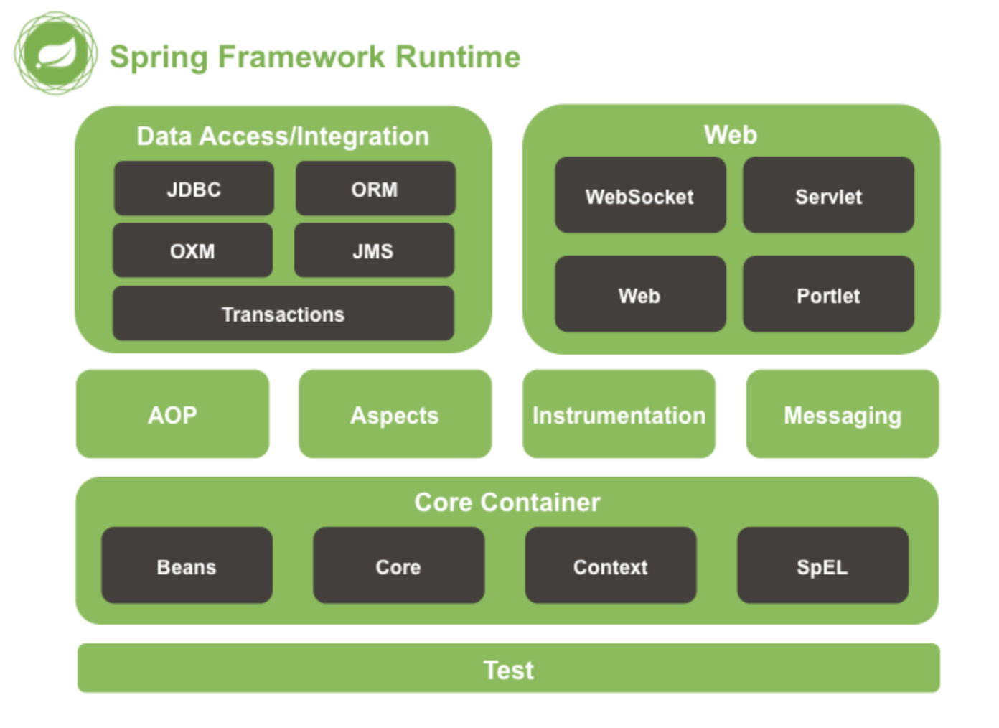
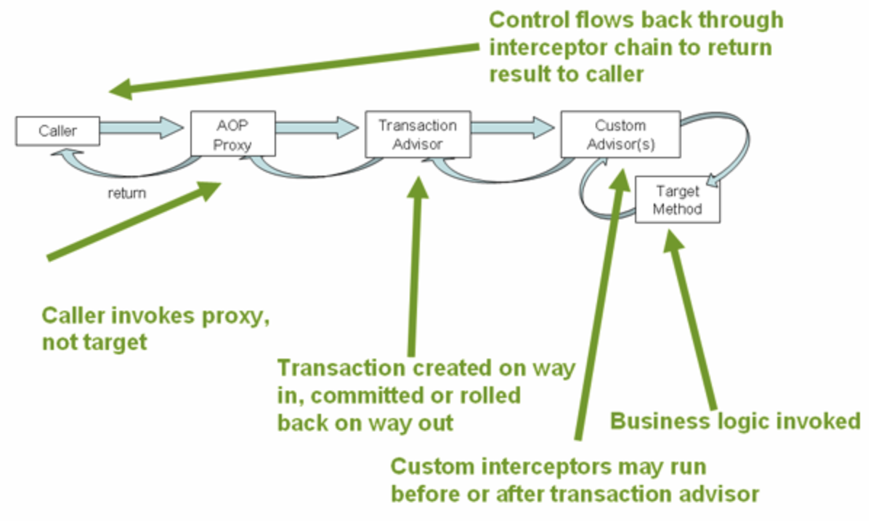

# Monday

## Spring Framework - Intro to Spring

The Spring Framework is an inversion of control container that provides flexible infrastructural support to create loosely coupled Java applications by utilizing dependency injection.

### References
* [Spring Framework API - Java Documentation](https://javadoc.io/doc/org.springframework/spring-core/latest/index.html)
* [Overview of Spring Framework - Spring Documentation 4.0.x](https://docs.spring.io/spring/docs/4.0.x/spring-framework-reference/html/overview.html)

## What is Spring?
Spring an umbrella term for a family of frameworks which can be utilized to rapidly create loosely coupled Java applications. These spring frameworks provide a comprehensive and configurable model for modern enterprise Java applications, which can be easily migrated to any kind of deployment platform. This ease is due to the core feature of the Spring frameworks, which focuses on [dependency injection](./ioc-dependency-injection) resulting from the framework acting as an [inversion of control](./ioc-dependency-injection) container.

Spring enables developers to build java applications utilizing a POJO design pattern, and applying enterprises services, as needed, non-invasively to those POJOs. This loose coupling allows developers to focus on business logic for applications as Spring handles the infrastructural needs. 

## Frameworks - Overview
The Spring family of frameworks consist of close to 20 modules, each focusing on a particular task or service. These are grouped into the following layers: Core Container, Data Access/Integration, Messaging, Web, AOP, Aspects, Instrumentation and Test.



### Core Container
The Core Container provide the basic framework for the IoC container and dependency injection.
* [Core & Beans](https://docs.spring.io/spring/docs/4.0.x/spring-framework-reference/html/beans.html#beans-introduction): These modules provide the fundamental framework for springs IoC container, including dependency injection features. Beans specifically feature the BeanFactory, which is a sophisticated implementation of the factory design pattern used to create beans, which are used in dependency injection.
* [Context](https://docs.spring.io/spring/docs/4.0.x/spring-framework-reference/html/beans.html#context-introduction): This modules builds off from the core and bean modules used for more enterprise functionality. The main feature, ApplicationContext represents the Spring IoC container and is used to instantiate, onfigure and assemble beans.
* [SpEL (Spring Expression Language)](https://docs.spring.io/spring/docs/4.0.x/spring-framework-reference/html/expressions.html): A module which provides a powerful expression language which can be used to query and manipulate an object graph at runtime, including setting and getting property values, property assignment, method invocation, accessing array content, collections and indexer and more.

### Data Access/Integration
The Data Access/Integration layer provides support for database management or layers of abstraction for ease of use.
* [JDBC (Java Database Connectivity)](): A module which provides a layer of abstraction for [JDBC](https://docs.spring.io/spring/docs/4.0.x/spring-framework-reference/html/jdbc.html#jdbc-introduction)
* [ORM (Object Relational Mapping)](https://docs.spring.io/spring/docs/4.0.x/spring-framework-reference/html/orm.html): A module which provides integration layers for ORM APIs, such as JPA, JDO and Hibernate
* [OXM (Object/XML Mapping)](https://docs.spring.io/spring/docs/4.0.x/spring-framework-reference/html/oxm.html): A module which provides a layer of abstraction for mapping implementations for JAXB, Castor, XMLBeans, JiBX and XStream
* [JMS (Java Messaging System)](https://docs.spring.io/spring/docs/4.0.x/spring-framework-reference/html/jms.html): A module which provides feature to produce and consume messages.
* Transaction: A module which provides programmatic and declarative support for transaction management in classes that implement special interfaces as well as POJOs

### Web
The Web layer provides basic web integration features for an application.
* [Web-Servlet](https://docs.spring.io/spring/docs/4.0.x/spring-framework-reference/html/mvc.html): A module which provides an implementation for Spring MVC, a clean separation between model code and web forms, and also integrates with other features of the Spring framework.
* [WebSocket](https://docs.spring.io/spring/docs/4.0.x/spring-framework-reference/html/websocket.html): A module which provides a standardized way to esablish a communication channel between a client and server with a single TCP connection.
* [Web-Portlet](https://docs.spring.io/spring/docs/4.0.x/spring-framework-reference/html/portlet.html): A module incredibly similar to the servlet workflow, that is marked by two distinct phases, an action phase, which is executed once when any backend changes occur, and a render phase, in which information is displayed to the user.

### [AOP (Aspect Oriented Programming)](https://docs.spring.io/spring/docs/4.0.x/spring-framework-reference/html/aop.html)
The AOP modules provides support for Aspect Oriented Programming, which is different way of thinking about program structure, as opposed to Object Oriented Programming. Aspect Oriented Programming aims to decouple code from functionality that is independent from the core functionality of that code (for example, logging information, and security are generalized functionality that is independent of other, specific business logic, and therefore would be handled by a specific aspect.

### [Aspects](https://docs.spring.io/spring/docs/4.0.x/spring-framework-reference/html/aop.html#aop-ataspectj)
Aspects, particularly AspectJ for Spring, is the module which, when enabled, allows for the use of the AspectJ supported style of declaring and autoproxying beans based on whether the bean is being advised by one or more aspects.

### Instrumentation
A module which provides support for instrumentation (the process of planning, installing, monitoring and maintaining systems) and classloader implementation used in an application server.

### [Test](https://docs.spring.io/spring/docs/4.0.x/spring-framework-reference/html/testing.html)
A module which provides support for integration and best practice unit testing, focusing on JUnit or TestNG, as well as mocking information.


## Spring Module - IOC Container and Dependency Injection

The Spring Framework acts as an Inversion of Control (IoC) Container by utilizing Dependency Injection. IoC or Dependency Injection, refers to the process whereby objects define their dependencies, but creation, assembly and injection of those objects is performed by the Spring IoC container.

### References
* [Spring 4.0 - IoC Container](https://docs.spring.io/spring/docs/4.0.x/spring-framework-reference/html/beans.html)
* [Inversion of Control and Dependency Injection - Martin Fowler](https://martinfowler.com/articles/injection.html)
* [IoC and Depedency Injection - Tutorials Teacher](https://www.tutorialsteacher.com/ioc/inversion-of-control)

## Inversion of Control
Inversion of Control is a design principle in which control over certain parts of object-oriented design is inverted to achieve loose coupling. An simple way to think of this would be to Suppose a user has a car and drives to work each day. Currently, the user is in control of the car. However, if the user schedules an uber instead, the control is inverted from the user to the uber driver, allowing the user to focus on other tasks while still allowing the car to ultimately be driven to work.

In Spring, the IoC Container is responsible for instantiating, configuring and assembling objects known as beans. It does this by getting information from the XML file and assembling the objects accordingly. In Spring there are two types of IoC Containers, the BeanFactory and Application context, which is built out of the Bean factory. More information on BeanFactory, ApplicationContext and Beans can be found in the [configuration lecture notes](./xml-vs-annotation-configuration.md).

The ApplicationContext interface is built on top of the BeanFactory with extra functionality, such as simple integration with Spring AOP, event propagation, message resource handling, and application layer specific context (such as WebApplicationContext for web applications).

## Dependency Injection
Fundamentally, every framework implements at least some level of Inversion of Control. Dependency Injection is a more specific term for what control is inverted with regard to the Spring Framework. As the name suggests, Dependency Injection is a design patters that removes dependencies of a program by providing the configuration in an external source, such as an ML file. This loosely coupled design then makes code easier to test, and implement in a wider variety of environments.

Dependency Injection can occur through the following methods:
* Constructor Injection: Dependency Injection accomplished when the container invokes a constructor with arguments to instantiate a bean in which each argument of said constructor represents a dependency.
* Setter Injection: Dependency Injection accomplished when the container calls setter methods on a bean after invoking a no-argument constructor to instatiate a bean.

### Constructor Injection Examples
__XML Configuration__
```
<beans>
    <bean id = "order" class = "com.revature.models.Order">
        <constructor-arg ref="account"/>
        <constructor-arg ref="item"/>
    </bean>

    <bean id = "account" class = "com.revature.models.Account">
    </bean>

    <bean id = "item" class = "com.revature.models.Item">
    </bean>
</beans>
```


__Annotation Configuration__
```
package com.revature.models;

import org.springframework.beans.factory.annotation.Autowired;

public class Order {
	private Account account;
	private int id;
        private Item item;

	@Autowired // multiple beans are distinguished by object type
	public Order(Account account, int id, Item item) {
		super();
		this.account = type;
		this.id = id;
		this.item = item;
	}

	...
}
```


__Java Configuration__
```
package com.revature.config;

// import statements
...

@Configuration
@ComponentScan({ "com.revature.repository;com.revature.services" })
public class AppConfig {
	
	...
	
	@Bean(name = "orderService")
	public OrderService getOrderService() {
		OrderServiceImpl oserv = new OrderServiceImpl(getOrderDao()); //<--- consturctor injection
		return oserv;
	}
}
```

### Setter Injection Examples
__XML Configuration__
NOTE: XML Configuration does not directly support setter injection, rather, it is accomplished through properties
```
<beans>

    ...

    <bean id="accountServ" class="com.revature.services.AccountServiceImpl">
        <property name="accountDao" ref="accountDao"/>
    </bean>

    <bean id="orderServ" class="com.revature.services.OrderServiceImpl">
        <property name="orderDao" ref="orderDao"/>
    </bean>

    <bean id="itemServ" class="com.revature.services.ItemServiceImpl">
        <property name="itemDao" ref="itemDao"/>
    </bean>

</beans>
```


__Annotation Configuration__
```
package com.revature.models;

import org.springframework.beans.factory.annotation.Autowired;

public class Order {
	private Account account;
	private int id;
        private Item item;

	@Autowired
	public void setItem(Item item) {
		this.item = item;
	}

	...
}
```


__Java Configuration__
```
package com.revature.config;

// import statements
...

@Configuration
@ComponentScan({ "com.revature.repository;com.revature.services" })
public class AppConfig {
	
	...
	
	@Bean(name="accountService")
	public AccountService getAccountService() {
		AccountServiceImpl aserv = new AccountServiceImpl();
		as.setAccountDao(getAccountDao()); //<---setter injection
		return aserv;
	}
}
```

### Constructor vs Setter Injection
* Constructor Injection is more secure, since dependencies are required to create an object, you are guaranteed to have each dependency populated
* Consturctor Injection enables the implementation of immutable objects
* Setter Injection allows for partial dependencies since Constructor injection requires all properties to be established upon bean instantiation.
* Setter Injection occurs after constructor injection, essentially putting giving setter injection precedence over constructor injection
* Setter Injection can easily change values, and does not create new bean instances, making it more flexible than constructor injection.
* Setter Injection can resolve circular references (i.e. if Object A and Object B are dependent on each other, setter injection can be used to resolve this, whereas Constructor injection would throw a BeanCurrentlyInCreationException).

   * ### [Spring Configuration](https://github.com/220613-Reston-Java-Angular-AWS/Curriculum-Notes/blob/newMain/Week-7/XML-vs-Annotation-vs-JavaConfig.md)
   * ### [Bean Lifecycle](https://github.com/220613-Reston-Java-Angular-AWS/Curriculum-Notes/blob/newMain/Week-7/Bean-Lifecycle.md)
   * ### [Injecting Primitives](https://github.com/220613-Reston-Java-Angular-AWS/Curriculum-Notes/blob/newMain/Week-7/Injecting-Primitives.md)
   * ### [Scopes of a Bean](https://github.com/220613-Reston-Java-Angular-AWS/Curriculum-Notes/blob/newMain/Week-7/Scopes-of-a-Bean.md)
   * ### [Stereotypes](https://github.com/220613-Reston-Java-Angular-AWS/Curriculum-Notes/blob/newMain/Week-7/Stereotypes.md)
   * ### [Spring ORM](https://github.com/220613-Reston-Java-Angular-AWS/Curriculum-Notes/blob/newMain/Week-7/Spring-ORM.md)
   * ### [Lombok](https://github.com/220613-Reston-Java-Angular-AWS/Curriculum-Notes/blob/newMain/Week-7/Lombok.md)
   
<br>

# Tuesday

## Aspect Oriented Programming and Cross Cutting Concerns

### References
* [Spring 4.0.x Framework Documentation - AOP with Spring](https://docs.spring.io/spring/docs/4.0.x/spring-framework-reference/html/aop.html)
* [Spring 4.0.x Framework Documentation - AOP API](https://docs.spring.io/spring/docs/4.0.x/spring-framework-reference/html/aop-api.html)
* [JavaDocs API - Spring 4.0.x](https://docs.spring.io/spring/docs/4.0.x/javadoc-api/overview-summary.html)
* [AspectJ API Docs](https://www.eclipse.org/aspectj/doc/released/runtime-api/index.html)
* [AspectJ API Docs - Annotations](https://www.eclipse.org/aspectj/doc/released/aspectj5rt-api/index.html)

## Aspect Oriented Programming and Cross Cutting Concerns
Aspect Oriented Programming is another way to think about structuring your program, which can be used complementary to Object Oriented Programming. In object oriented programming, classes are used as the key component used to drive the creation of objects, which serve the purpose of representing concrete ideas or things with states and behaviors. In Aspect Oriented Programming, the key component are aspects, which modularizes particular transactional concerns which can present across multiple classes, known as _cross-cutting concerns_. Examples of these concerns are, Database Access (security for a database), data entities (transactions to take place), error handling, or logging system messages. The defining characteristic of these _cross-cutting concerns_ is that they are actions that can take place across your classes, regardless of the class function or structure. In traditional object oriented programming, this would result in code redundancy, as the same code must be called multiple times throughout an application to perform these actions. Aspect Oriented Programming works to eliminate this redundancy by transferring responsibility of these common problems to aspects. Note that the Spring IoC Container is not dependent on AOP; however, the Spring AOP framework complements the IoC Container by providing a capable middleware solution for concerns.

### Important Terminology
* _Aspect_ - A representation of a concern which cuts across multiple classes.
* _Weaving_ - The process of linking aspects with other objects, such as beans, to create advised objects. This can be done at compile time (such as when using the AspectJ compiler), load time or runtime. Spring performs weaving at Runtime.
* _Join Point_ - A specified moment during the execution of a program, such as the invocation of a method, in which actions can be taken.
* _Advice _ - Action taken by an aspect at a specified Join point. 
* _Pointcut_ - A definition of which methods in our application advice ought to be injected into or around, for example, when a method of a certain name is executed. By default, spring uses AspectJ pointcut expression language.
* _Introduction_ - Declaration of new interfaces and corresponding implementations in subclasses of any advised object. Introductions use the `@DeclareParents` annotation with the _defaultImpl_ attribute to define a default concrete class for the bean definition. For Example:

__IFunction Interface__:
```
package com.revature.examples;

public interface IFunctional {
    public void function();
}
```

__FunctionalDefault__:
```
package com.revature.examples;

public class FunctionalDefault implements IFunctional {
    public void function() {
        System.out.println("This is the default function");
    }
}
```

__Aspect__:
```
package com.revature.examples;

import org.aspectj.lang.annotation.Aspect;
import org.aspectj.lang.annotation.DeclareParents;
import org.springframework.stereotype.Component;

@Component
@Aspect
public class AspectExample {
    @DeclareParents(value="com.revature.examples.*+",defaultImpl=FunctionalDefault.class)
    public static IFunctional iFunctional;
}
```
The '+' after the package is used to match the class (or interface) and all subclasses. This pointcut expression will match any interfaces or classes defined in the package `com.revature.examples` and also any subclass or implementing class of these classes, even if the implementing class or subclass is in another package.
* _Target Object_ - The object which is being advised by one or more aspects. The Spring AoP is implemented using proxies, and as such, this target object will always be a proxied object.
* _AOP Proxy_ - An object created in an AoP framework in order to implement advice defined in aspects. The utilization of these proxies allows for loose coupling between your advice targets. The Spring AoP framework supports JDK dynamic proxies (which is interface based) as well as a CGLIB proxy (which is class based).

Below is a visual representation of how the Spring Transaction proxy works:



At a high-level, when a method is invoked an AOP Proxy is informed, which informs the associated Advisor (in this case a transaction advisor). This advisor implementation can then inject advice as needed (based on configuration) before, or after invoking the target method. Note that additional custom advisors can come before or after the transaction advisor is run.

   * ### [Adivce](https://github.com/220613-Reston-Java-Angular-AWS/Curriculum-Notes/blob/newMain/Week-7/SpringAop-Advice.md)
   * ### [Pointcut & Join Points](https://github.com/220613-Reston-Java-Angular-AWS/Curriculum-Notes/blob/newMain/Week-7/SpringAop-Jointcut-and-JoinPoints.md)
   * ### [@AspectJ](https://github.com/220613-Reston-Java-Angular-AWS/Curriculum-Notes/blob/newMain/Week-7/SpringAop-AspectJ-support.md)
   * ### [AOP - Things You should know](https://github.com/220613-Reston-Java-Angular-AWS/Curriculum-Notes/blob/newMain/Week-7/AOP-AspectOrientedProgramming.md)

<br>

# Wednesday 

# Spring Module - MVC Architecture

This page details an overview of the Spring MVC Framework and explains how to utilize this framework to create a Spring based Web application

### References
* [Spring 4.0.x Documentation - Web MVC Framework](https://docs.spring.io/spring/docs/4.0.x/spring-framework-reference/html/mvc.html)
* [Spring 4.0.x API Docs](https://docs.spring.io/spring/docs/4.0.x/javadoc-api/overview-summary.html)


## Spring Model View Controller Architecture
The Spring MVC Framework, like many other MVC Frameworks, is a request driven structure, designed around a central Servlet which dispatches requests to controllers and offers functionality to support the web application. As a breif recap, Models represent data to be stored and/or retrieved from a database or environment, the View is the user interface and displays model data and the controller handles requests between the model and responds with appropriate views. Unlike other MVC frameworks, the Spring `DispatcherServlet` is completely itegrated with the Spring IoC container, allowing the use of every other Spring feature in addition to this functionality. A high level overview of this request processing structure can be viewed below:


### Dispatcher Servlet and MVC
The Spring Web Model-View-Controller (MVC) Framework is based on the use of a `DispatcherServlet`, which uses a `FrontController` design pattern. This `DispatcherServlet` routes requests to configurable handlers, view resolutions, and also provides support for uploading files. The default controller is based on the `@Controller` stereotype annotation, as well as the `@RequestMapping` annotation, both of which are detailed in the notes below.

The `DispatcherServlet`, as you may guess, is an actual `Servlet`. As such, it must inherit it's functionality from the `HttpServlet` base class, and is declared in the _web.xml_ file of your application. Any requests you want the `DispatcherServlet` to handle must also be mapped in the same _web.xml_ file. As a reminder, Servlets require a top-level Servlet element in which servlet-name, servlet-class and other optional elements (such as load-on-startup) are nested. Request Mappings utilize the top-level servlet-mapping element with nested servlet-name and url-pattern elements

For Example:
```
<web-app>
    <servlet>
        <description>This is an optional description of this servlet. An example servlet</description>
        <servlet-name>exampleServlet</servlet-name>
        <servlet-class>com.revature.web.Dispatcher</servlet-class>
        <load-on-startup>1</load-on-startup>
    </servlet>

    <servlet-mapping>
        <servlet-name>example</servlet-name>
        <url-pattern>/example/*</url-pattern>
    </servlet-mapping>

</web-app>
```

In this example, all requests which start with _/example_ will be handled by the `Dispatcher`, which is named _exampleServlet_.


### ViewResolvers and InternalResourceView
Before Discussing annotations, it is worth briefly discussing how views are resolved. All Spring Web MVC controllers must resolve to a logical view name, either explicitly (for example, returning a String, View or ModelAndView) or implicitly (i.e. based on conventions). In Spring, these views are resolved by a view resolver using a logical view name. Spring has a number of view resolvers, though we will only breifly discuss a few (more information can be found in the [Spring Documentation](https://docs.spring.io/spring/docs/4.0.x/spring-framework-reference/html/mvc.html#mvc-viewresolver)):

* AbstractCachingViewResolver: Abstract view resolver which, when extended, can cache views.
* XmlViewResolver: Implementation of ViewResolver that accepts an XML configuration file with the same DTD as Spring’s XML bean factories. The default configuration file is /WEB-INF/views.xml.
* UrlBasedViewResolver: Implementation of the ViewResolver which directly resolves view names to URLs, without an explicit mapping definition. Useful if if your logical names match the names of your views.
* InternalResourceViewResolver: Subclass of UrlBasedViewResolver that supports InternalResourceView (such as Servlets and JSPs) and subclasses (such as JstlView and TilesView). View classes for all views generated by this resolver can be set using setViewClass(..) Method. See the [UrlBasedViewResolver javadocs](https://docs.spring.io/spring-framework/docs/4.0.x/javadoc-api/org/springframework/web/servlet/view/UrlBasedViewResolver.html) for more details.

The `InternalResourceView` is a Wrapper class for JSP or other resources within the same web application. It can be used to expose model objects as request attributes and forward requests to a specified resource URL using the `RequestDispatcher`. In particular the `InteralResourceViewResolver` supports definitions for `InternalResourceView`s for a simple and straightforward resolution of `@Controller` class methods. 

For example:
```
<bean id="viewResolver" class="org.springframework.web.servlet.view.InternalResourceViewResolver">
   <property name="prefix" value="/WEB-INF/jsp/"/>
   <property name="suffix" value=".jsp"/>
 </bean>
```


### Spring Web Annotations
As discussed in the [stereotype annotation lecture notes](../a-framework/stereotypes.md), the `@Controller` annotation specifies a class as a _controller_, a special type of bean used particularly to handle web application requests. The introduction of the `@Controller` annotation, as of Spring 3.0, allows for the creation of RESTful Web services and applications through the use of the `@PathVariable` annotation as well as other flexible features. The dispatcher will scan these `@Controller`-annotated and `@RequestMapping`-annotated classes and detect any `@RequestMapping`-annotated methods. Depending on the context, this `@RequestMapping` annotation can be configured with url mapping, http request method types, url values, and other parameters. 

For example (Example from Spring Documentation):
```
@Controller
@RequestMapping("/appointments")
public class AppointmentsController {

    private final AppointmentBook appointmentBook;

    @Autowired
    public AppointmentsController(AppointmentBook appointmentBook) {
        this.appointmentBook = appointmentBook;
    }

    @RequestMapping(method = RequestMethod.GET)
    public Map<String, Appointment> get() {
        return appointmentBook.getAppointmentsForToday();
    }

    @RequestMapping(value="/{day}", method = RequestMethod.GET)
    public Map<String, Appointment> getForDay(@PathVariable @DateTimeFormat(iso=ISO.DATE) Date day, Model model) {
        return appointmentBook.getAppointmentsForDay(day);
    }

    @RequestMapping(value="/new", method = RequestMethod.GET)
    public AppointmentForm getNewForm() {
        return new AppointmentForm();
    }

    @RequestMapping(method = RequestMethod.POST)
    public String add(@Valid AppointmentForm appointment, BindingResult result) {
        if (result.hasErrors()) {
            return "appointments/new";
        }
        appointmentBook.addAppointment(appointment);
        return "redirect:/appointments";
    }
}
```
In this example, requests to the _AppointmentsController_ are indicated by the "/appointments" url, and may handle a combination of GET as well as POST HTTP methods depending on the information provided. If a GET request is made simply to /appointments, then the controller will return a Map using the `getAppointmentsForToday()` method. If the GET request is made to the url "/appointments/new", then an _AppointmentForm_ will be returned using the `AppointmentForm()` method.

Additionally, the special _redirect_ prefix used here allows for a `UrlBasedViewResolver` (and subclasses) to recognize that a redirect is needed, and may resolve the view using the logical name. When using this _redirect_ prefix supports both relative and absolute URLs:
relative*:
```
    return: "redirect:appointments/new";
```
*We used a relative path above

absolute
```
    return: "https://revature.com"";
```


### `@RequestBody`
After defining a Request Mapping, there are a number of ways to detect and utilize variables sent with the request. For information within the body of the request, you should use `@RequestBody`, which allows Spring to map data from the body of a request to a defined java object.

REQUEST:
```
<form action="loginExample" method="POST">
	<input type="text" name="username" value="Revature">
	<input type="password" name="password" value="password">
	<input type="submit" value="Post Data">
</form>
```

LOGIN OBJECT:
```
public class LoginForm {
	private String username;
	private String password;
	
	// constructors, getters, setters, etc...
}
```

CONTROLLER:
```
@Controller("examplePost")
public class ExampleController {

	...

	@RequestMapping(value="/loginExample", method=RequestMethod.POST)
	@ResponseStatus(value = HttpStatus.OK)
	public void postData(@RequestBody LoginForm loginForm) {
		System.out.println("Login values [username]: " + loginForm.getUsername()
		+ ", [password]: " + loginForm.getPassword());
	}
}
```


### `@ResponseStatus`
When a specific view is not returned, the logical name used is based on the value of the `@RequestMapping`, however you should still provide some response. The `@ResponseStatus` annotation marks a method or exception class with an HTTP response status code, as well as the reason that should be returned. These examples use this annotation primarily for debugging purposes, but this annotation can be useful when you do not expect to return a particular view from a controller.


### `@RequestParam`
Alternatively the `@RequestParam` annotation should be used to bind request parameters to specific values in the mapped method's signature. You may specify values when using `@RequestParam` either using the name attribute, or simply with the name (or value) of the parameter.
REQUEST:
```
<form action="loginExample" method="POST">
	<input type="text" name="username" value="Revature">
	<input type="password" name="password" value="password">
	<input type="submit" value="Post Data">
</form>
```

CONTROLLER:
```
@Controller("examplePost")
public class ExampleController {

	...

	@RequestMapping(value="/loginExample", method=RequestMethod.POST)
	@ResponseStatus(value = HttpStatus.OK)
	public void postData(@RequestParam(name="username") String username, @RequestParam("password") String password) {
		System.out.println("Login values [username]: " + username + ", [password]: " + password);
	}
}
```

The `@RequestParam` annotation also has a `required` attribute which dictates whether the specified parameter must be present for the request to complete. By default, this parameter is set to true, but can be optionally set to false:
`@RequestParam(name="id", required="false")`. Note that all of these examples could be expressed with the value attribute instead of the name attribute, which is functionally the same: `@RequestParam(value="id", required="false")`.


### `@PathVariable`
Finally, the `@PathVariable` annotation can identify properties directly within the URL of a request for use within a method. To map the url parameter, the parameter should be enclosed in curly braces within the RequestMapping value and the name should match the method parameter:

CONTROLLER:
```
@Controller
public class LibraryController {
	...

	@RequestMapping(value="/library/{bookISBN}", method=RequestMethod.GET)
	public String getBookName(@PathVariable int bookISBN) {
		switch (bookISBN) {
			case 12345:
				return "harry-potter";
			case 54321:
				return "huckleyberry-finn";
			default:
				return "error";
		}
	}
}
```


### `@RequestHeader`
In addition to request parameters and body content, header data can be viewed and mapped to a method in a similar syntax to the `@RequestParam` annotation. This mapping uses, as you may expect, the `@RequestHeader` annotation.

For example:
HEADER:
```
Host                    localhost:8080
Accept                  text/html,application/xhtml+xml,application/xml;q=0.9
Accept-Language         fr,en-gb;q=0.7,en;q=0.3
Accept-Encoding         gzip,deflate
Accept-Charset          ISO-8859-1,utf-8;q=0.7,*;q=0.7
Keep-Alive              300
```

CONTROLLER:
```
@RequestMapping("/displayHeaderInfo.do")
public void displayHeaderInfo(@RequestHeader("Accept-Encoding") String encoding,
        @RequestHeader("Keep-Alive") long keepAlive) {
    //...
}
```


### `@ResponseBody`
Configuration for responding to Requests can also be simplified with the Spring MVC Framework through the use of the `@ResponseBody` annotation. This annotation can be used to automatically marshal java objects into a JSON String.

CONTROLLER:
```
@Controller
public class LibraryController {
	@Autowired
	private LibraryService libraryService;

	...

	@RequestMapping(value="/library/all", method=RequestMethod.GET)
	public @ResponseBody List<Book> getAllBooks() {
		return libraryService.getAllBooks();
	}
}
```
This method would return a list of Book Objects as a JSON string, allowing the response to be parsed and displayed on a webpage.


### `@RestController`
Commonly, Spring Web Controllers implement a REST API, thus serving JSON, XML or custom MediaType content. As such, the `@RestController` annotation is a convenience stereotype annotation which combines the features of `@RequestMapping` with the `@ResponseBody` annotations. This allows the use of HTTP method specific Mapping annotations which automatically produce an XML, JSON or other response.

CONTROLLER:
```
@RestController
@RequestMapping("rest-library")
public class LibraryRestController {
	@Autowired
	private LibraryService libraryService;

	...

	@GetMapping("/all")
	public List<Book> getAllBooks() {
		return libraryService.getAllBooks();
	}

	@GetMapping("/{isbn}")
	public Book getBook(@PathVariable int id) {
		return libraryService.getBookByISBN(isbn);
	}
```


   * ### []()
   * ### []()
   * ### []()
  
   
