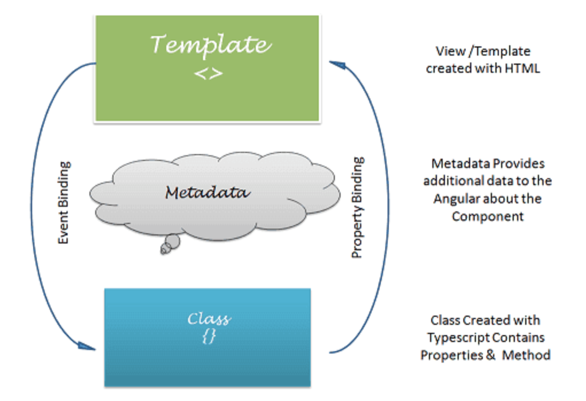

## Data Binding

* In Angular, Data Binding provides the communication between a component and the DOM. 
* It is a technique used to bind the data *from an HTML template to a Component class* or *from a Component class to an HTML template*.  
* Angular allows both **one-way data binding**  and **two-way data binding**.

## One-way data binding

One-way data binding allows us to manipulate the views through the models. If we make any changes in the class, it gets reflected in the template. In Angular, One-way data binding achieved through:

* Interpolation or String Interpolation
* Property binding
* Event binding

### String Interpolation

In String Interpolation, we bind the data from a typescript class to the template by using the expression in double curly braces. It is one-way from component class to the template. For example:`{{ data }}`. 

**Example:** In *app.component.ts* file, we declared a `name` variable.
```typescript
export class AppComponent {
    name = "John";
}
```   
In *app.component.html* file, we can access the `name` variable using string interpolation.

```html
<p> Hello, {{username}} !!! </p>
```

### Property Binding

Property binding allows us to bind values to the attributes of HTML elements. Whenever the value of the component changes, the Angular updates the element attribute in the template. It's also a one-way binding from component class to template.

**Example:** In *app.component.ts* file, we declared a `image` variable.
```typescript
export class AppComponent {
   image = "https://assets.winni.in/c_limit,dpr_1,fl_progressive,q_80,w_600/35184_everlasting-paradise.jpeg";
}
```   
In *app.component.html* file, we can access the `name` variable using string interpolation.

```html
<h3>Property Binding</h3>

<h3>String Interpolation</h3>

```
String interpolation and property binding are somewhat interchangeable. If we need to set element properties to non-string data values, we must use Property binding, not String Interpolation.

### Event Binding

Event binding allows us to bind DOM events such as keystrokes, button clicks, mouse overs, touches, etc to a function in the component. It is one way from template to the component class.

**Example:** When we click the submit button, it calls the `onSubmit()` method defined in the component. Here, all DOM events are closed within parentheses.
```html
<input type="submit" (click) ="onSubmit()"/>
```
## References

* [Angular Docs - Interpolation and Template Expressions](https://angular.io/guide/template-syntax#interpolation-and-template-expressions)


## Two-way data binding

In one-way data binding, any changes in the template are not reflected in the component class. To solve this, Angular provides two-way data binding.

Two-way data binding is achieved by combining **property binding** and **event binding** together. 




Two-way data binding is useful in data entry forms. The Angular uses the `ngModel` directive to achieve two-way binding on HTML `<form>` elements.  

To use the `ngModel` directive, we need to import the **FormsModule** package into our Angular module. 

**Syntax:**
```html
 <input type="text" name="value" [(ngModel)]="value">
 ```

The `ngModel` directive is placed inside the square & parentheses and assigned to the property in the component class.


**Example**
Import the **FormsModule** in the *app.module.ts* file.
```typescript
import { BrowserModule } from '@angular/platform-browser';
import { NgModule } from '@angular/core';
import {FormsModule} from '@angular/forms';
import { AppComponent } from './app.component';

@NgModule({
  declarations: [
    AppComponent
  ],
  imports: [
    BrowserModule,
    FormsModule
  ],
  providers: [],
  bootstrap: [AppComponent]
})
export class AppModule { }
```
 In *app.component.ts* file, we declare a `name` variable and in *app.component.html* file, we use the `ngModel` directive for two-way binding.

```html
Enter your name: <input type="text" [(ngModel)]='name'><br>
<p>Hello, {{ name }} !!!</p>
```

## References

* [Angular Two-Way Data Binding](https://malcoded.com/posts/angular-data-binding/)