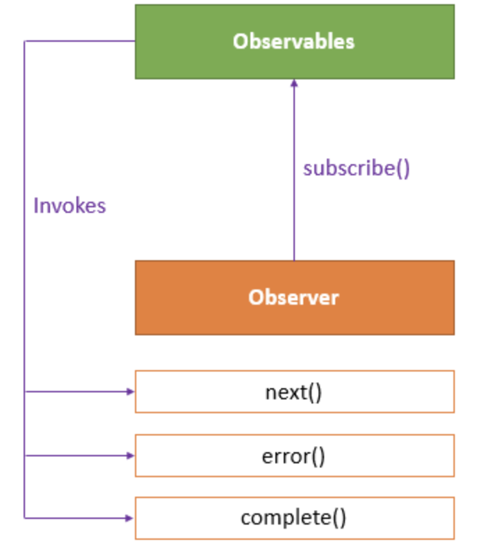
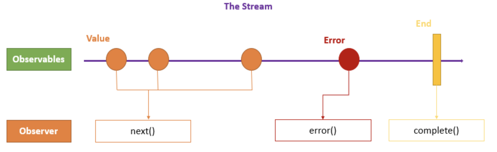

## Observables

Observables provide support for passing messages between parts of your application. We can use observables for event handling, asynchronous programming, and handling multiple values.

The obserser pattern is similar to the [publish/subscribe](https://en.wikipedia.org/wiki/Publish%E2%80%93subscribe_pattern) design pattern. Observables define a function for publishing values, but it is not executed until a consumer subscribes to it. The subscribed consumer then receives notifications until the function completes, or until they unsubscribe.

An observable can deliver multiple values of any type (literals, messages, or events). The API for receiving values is the same whether the values are delivered synchronously or asynchronously and the setup and the logic are both handled by the observable. We'll only concentrate on subscribing to consume values, and when done, unsubscribing. The observer subscribes to the observable to receive the value. To execute the observable we have created and begin receiving notifications, we call its `subscribe()` method, passing an observer. The `unsubscribe()` method is called to stop receiving notifications.  



The observer defines three callback methods -  `next()`, `error()`, and `complete()`. The observable invokes the `next()` callback whenever the value arrives in the stream. It passes the value as the argument to the next callback. If the error occurs, then the `error()` callback is invoked. It invokes the `complete() `callback when the stream completes.



**Example:** 
```typescript
import {Observable, of } from "rxjs";

export class AppComponent {
// Create simple observable that emits three values
myObservable = of(1, 2, 3);

// Create observer object
myObserver = {
  next: x => console.log('Observer got a next value: ' + x),
  error: err => console.error('Observer got an error: ' + err),
  complete: () => console.log('Observer got a complete notification'),
};

// Execute with the observer object
constructor(){
  this.myObservable.subscribe(this.myObserver);
}
// Logs:
// Observer got a next value: 1
// Observer got a next value: 2
// Observer got a next value: 3
// Observer got a complete notification
  
}
```

> **NOTE:**  The `of(...items)`returns an *Observable instance* that synchronously delivers the values provided as arguments.

### Promises vs Observables

In Angular, we can use either Promises or Observables for handling asynchronous data. 

**The difference is** - a Promise emits a single value while Observable can emit multiple values. So, while handling a HTTP request, a Promise can manage a single response for the same request, but if there are multiple responses to the same request, then we have to use an Observable.

**Example:** 
```typescript
const promise = new Promise((data) =>{ 
    data(1);
    data(2);
    data(3);    }).then(element => console.log('Promise '+ element));
// Logs:
// Promise 1

const observable = new Observable((data) => {
    data.next(1);
    data.next(2);
    data.next(3);   }).subscribe(element => console.log('Observable ' + element));

// Logs:
//Observable 1
//Observable 2
//Observable 3
```

## References

* [Angular Docs - Observables Overview](https://angular.io/guide/observables)


