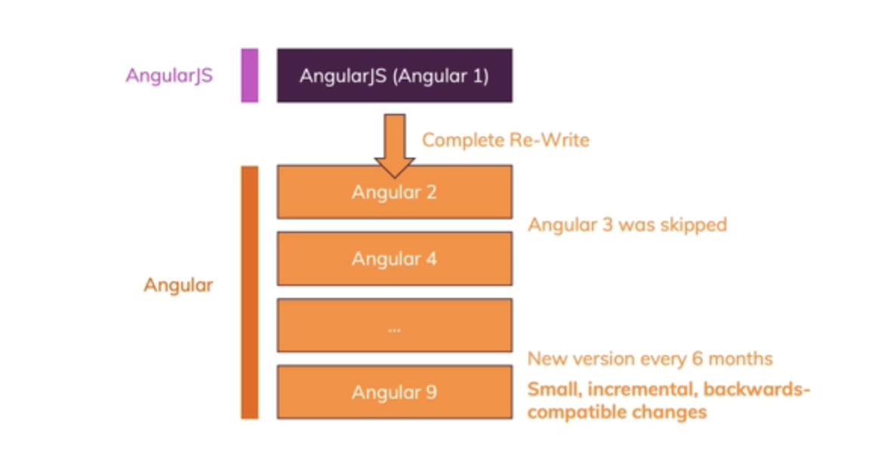
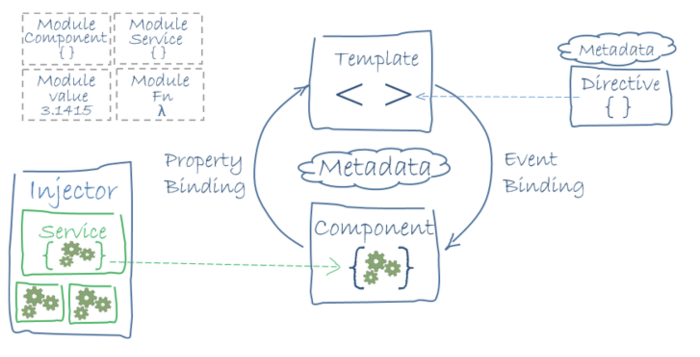
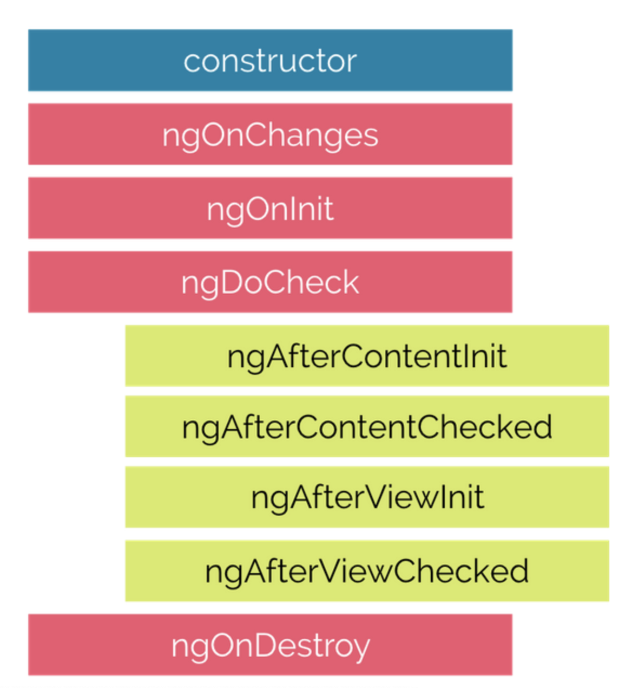
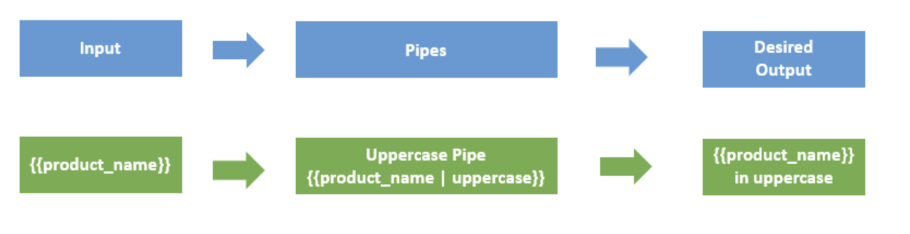

# Monday 

## Node.js

[Node.js](https://en.wikipedia.org/wiki/Node.js) is an open-source, cross-platform **run-time environment** built on Chrome's V8 JavaScript engine.

Node.js is used to execute **JavaScript** code outside of a web browser. It provides a library of various JavaScript modules, which simplifies the development of web applications. 

Global companies like Netflix, Facebook, Walmart Linkedin, Uber, etc., use Node.js for building their applications. It has helped companies create various applications like social media apps, video and text chat engines, real-time tracking apps, online games, and collaboration tools.

## npm - node package manager

[npm](https://en.wikipedia.org/wiki/Npm_(software)) is a package manager for the JavaScript programming language. It is the default package manager for the JavaScript runtime environment -Node.js. 

npm consists of three components - the website, the Command Line Interface (CLI), and the registry. The **website** discovers packages, set up profiles, and manage access to public or private packages. The **CLI** runs from a terminal and allow us to interact with npm. The **registry** is a public database of JavaScript packages comprised of software and metadata.

## Why we need Node.js for Angular

We use Node.js and npm as tools for building Angular or React apps. Angular is a front-end framework used to create a web application and is written in Typescript. The browser only understands JavaScript code, so we need to compile Typescript (.ts file) to plain JavaScript (.js file). We use Node.js and npm to perform this compilation, then we can deploy them in production.

### Installation of Node and npm

We need to add Node.js and an npm package manager to our development environment.

* Download Node.js from [nodejs.org](https://nodejs.org/en/download/) and install it. To check the version, run `node -v` in a terminal.

* The npm CLI gets installed with Node.js by default. To check that you have installed npm, run `npm -v` in a  terminal. npm can install packages in a **node_modules** folder in our working directory. 

## References 

* [Angular Docs - Setup](https://angular.io/guide/setup-local)


## package.json file

All npm packages contain a file, usually in the **project root**, called **package.json**. This file is used to give information to npm that allows it to identify the project as well as handle the project's dependencies. This file contains **metadata** relevant to the project, such as project description, the version of the project, license information, etc.,

Node.js generates a package.json file by running the `npm init` command in the terminal. The generated package.json file contains a **name**, **version**, **description**, **main** (entry point), any **scripts**, the **author**, and **license** type of our project. The structure of package.json file is shown below:

```json
{
  "name": "MyApp",
  "version": "1.0.0",
  "description": "",
  "main": "index.js",
  "scripts": {...},
  "keywords" : ["util", "functional", "server", "client", "browser"],
  "author" : "John Adams",
  "contributors" : [],
  "dependencies" : [],
  "devDependencies" : [],
  "repository" : {..},
  "license": "ISC"
}
```

**dependencies** - The [Dependencies](https://angular.io/guide/npm-packages#dependencies) section in the package.json file is essential for running applications. It contains a list of packages or modules installed using npm that are required to run the project.

**devDependencies** - The [DevDependencies](https://angular.io/guide/npm-packages#dev-dependencies) section in the package.json file is used only for developing applications. It contains a list of packages or modules that are required only for development. These packages are installed only on the developer's machine and will not be run for a production build.

## References

* [npm-package.json](https://docs.npmjs.com/files/package.json)
* [Angular Docs - npm dependencies](https://angular.io/guide/npm-packages)

## TypeScript

* [Typescript](https://www.typescriptlang.org/) is a **typed superset of JavaScript**. 
* It is an **open-source** and  **object-oriented programming language** that supports classes, interfaces, inheritance, modules, etc., developed by **Microsoft**. 
* It can be used to **manipulate the DOM** for adding or removing elements, similar to JavaScript. 
* It is **portable** across browsers, devices, and operating systems.
* It supports **strong typing** or **static typing**, unlike JavaScript. 
* TypeScript files are saved with a `.ts` extension and then compiled into JavaScript using the TypeScript compiler. 
* TypeScript gets compiled to JavaScript, which can run on any JavaScript runtime environment.(Eg: Node.js)

### Setting up Typescript

You can install Typescript using NPM (Node Package Manager) or the TypeScript Visual Studio Plugin.

After installing NPM, run the `npm install -g typescript` command to install TypeScript. To check the version, run the `tsc -v` command in the terminal. 

To compile the TypeScript code, run the `tsc` command, followed by the name of the file you are compiling. For example, `tsc hello.ts`. After compliation, typescript compiler creates a javascript file with the same name (hello.js). Run the javascript file using `node hello.js` command in the terminal. 


## References

* [Get TypeScript](https://www.typescriptlang.org/#download-links)
* [TypeScript Docs - 5 minutes overview of the Language](https://www.typescriptlang.org/docs/handbook/typescript-in-5-minutes.html)


   * ### [Variable - datatypes](https://github.com/220613-Reston-Java-Angular-AWS/Curriculum-Notes/blob/newMain/Week-8/Variable-datatypes.md)
   * ### [Classes & Access Modifiers](https://github.com/220613-Reston-Java-Angular-AWS/Curriculum-Notes/blob/newMain/Week-8/Classes%26AccessModifiers.md)
   * ### [Decorators](https://github.com/220613-Reston-Java-Angular-AWS/Curriculum-Notes/blob/newMain/Week-8/Decorators.md)
   * ### [Interfaces](https://github.com/220613-Reston-Java-Angular-AWS/Curriculum-Notes/blob/newMain/Week-8/Interfaces.md)
   

##  History of Angular

Angular is a **TypeScript-based open-source framework** used to develop **dynamic web applications**.

Angular is a [Single Page Application](./spa.md) (SPA) Framework. An SPA is a web application that fits on a single page. All our code (JavaScript , HTML , CSS ) is retrieved with a single page load. Navigation between pages is performed without refreshing the whole page.


### Angular Versions with release dates

* AngularJS or Angular 1 - October 20, 2010
* Angular 2 - September 14, 2016
* Angular 4 - March 23, 2017
* Angular 5 - November 1, 2017
* Angular 6 - May 4th, 2018
* Angular 7 - October 18, 2018
* Angular 8 - May 28, 2019
* Angular 9 - February 6, 2020

**Angular** is commonly referred to as Angular 2+ or by one of the above versions, to distance the modern framework from the original AngularJS. 




[AngularJS](https://en.wikipedia.org/wiki/AngularJS) is a **JavaScript-based open-source front-end web framework**. It doesn't support the features of a server-side programming language, nor dynamic loading of the page. 

[Angular](https://en.wikipedia.org/wiki/Angular_(web_framework)) is a **complete rewrite** of AngularJS. AngularJS was completely based on **controllers** and **scopes** whereas, Angular uses **component hierarchy** as its main architecture. 

### Angular JS vs Angular (Angularr 2+)

| Angular JS| Angular 4+|
| ------ | ------ |
| Uses MVC architecture to build the applications. |  Uses component based UI to build the applications.|
| AngularJS is written in JavaScript. | Angular is compatible with the most recent versions of TypeScript that have powerful type checking and object-oriented features. |
| To bind an image/property or an event with AngularJS, you have to remember the right ng directive. | Angular focuses on “( )” for event binding and “[ ]” for property binding.|
|AngularJS doesn't support mobiles. | Angular support mobiles. |

Angular uses the **TypeScript** language, which has features like :

* Static Typing
* Object-Oriented Programming based on classes
* Support for reactive programming using RxJS

The main building blocks of Angular are **modules**, **components**, **templates**, **metadata**, **data binding**, **directives**, **services**, and **dependency injection**. The following diagram shows how these building blocks of an Angular Application are related :




We'll discuss each block later in this section. 

## References

* [AngularJS to Angular - a brief history](https://blog.risingstack.com/angularjs-to-angular-history-and-tips-to-get-started/#angularjstoangularabriefhistory)
* [Angular Versions](https://mindmajix.com/angular-versions)

## Single Page Application

A [Single Page Application](https://en.wikipedia.org/wiki/Single-page_application#:~:text=A%20single%2Dpage%20application%20(SPA,browser%20loading%20entire%20new%20pages.)) (SPA) is a web application that fits on a **single page in the browser**. All our JavaScript, HTML, CSS code retrieved by the browser with a **single page load**. Navigation between pages performed **without refreshing the whole page**. SPA uses AJAX and HTML5 to build responsive web applications. 

**Examples of single-page apps** - Gmail, Google Maps, Facebook, Twitter, Trello, etc.,

**Advantages of SPAs**

* **Fast and responsive** -  SPAs update only the required content instead of the entire page for each request to the server.  The HTML/CSS/Scripts are only loaded once throughout the lifespan of an application. Only data is transmitted back and forth. This significantly improves the website’s speed.

* **Caching capabilities** - SPA sends a request to the server and caches all received data locally. Then it can reuse this data and work even offline. If a user has poor connectivity, local data can be synchronized with the server when the connection allows.

* SPA provides a **pleasant user experience** on desktops as well as on mobile phones, since it only changes the content and not the page.

**Disadvantages of SPAs**

* Doesn’t Perform Well With **SEO** ([Search engine optimization](https://en.wikipedia.org/wiki/Search_engine_optimization)).
* **Security** - SPAs are less secure towards [Cross-site scripting](https://en.wikipedia.org/wiki/Cross-site_scripting) (XSS) attacks.
* While overall performance is better, more data is frontloaded which can make the first page load a little slower


Frameworks like AngularJS, Angular, Ember.js, ExtJS, Knockout.js, Meteor.js, React and Vue.js uses SPA principles to create a web application.

## References

* [What Is a Single Page Application and Why Do People Like Them so Much?](https://www.bloomreach.com/en/blog/2018/07/what-is-a-single-page-application.html)
* [Video Tutuorial- SPA](https://www.youtube.com/watch?v=F_BYg2QGsC0)

## Webpack

In our web application, we use many javascript files that are added into the HTML pages via `<script>` tags.  For each user request, the browser loads these bunch of script files inside the HTML page. This is inefficient as it reduces the page speed since the browser requests each script file separately.

This can be solved by **bundling** several files together into one file to be downloaded by the browser in one single request.

**Module bundlers** are used to bundle a group of JavaScript modules with their dependencies and merge them into a single file in the correct order, which can be executed by the browser.

[Webpack](https://webpack.js.org/) is a powerful static module bundler for JavaScript applications that packages all modules in our application into a bundle and serves it to the browser.

Webpack builds a [dependency graph](https://webpack.js.org/concepts/dependency-graph/) when it processes the application. It starts from a list of modules defined in its config file (`webpack.config.js`) and recursively builds a dependency graph that includes every module our application needs, then packages all of those modules into a small bundle that can be loaded by the browser.

## References

* [WebPack Docs](https://webpack.js.org/concepts/)


    **Click the link below to install Angular**

    * ### [Angular CLI](https://github.com/220613-Reston-Java-Angular-AWS/Curriculum-Notes/blob/newMain/Week-8/Angular-CLI.md)
    
<br>

# Tuesday 

## Angular Components

Components are the basic building blocks in the Angular application. Components contain the data & UI logic that defines the view and behavior of the web application.

Components in Angular are defined using a [@Component](https://angular.io/api/core/Component) decorator. It includes a selector, template, style, and other properties, and it specifies the metadata required to process the component.

Angular applications can have multiple components. Each component handles a small part of UI. These components work together to produce the complete user interface of the application. An Angular application has one **root component** (AppComponent) which is specified in the bootstrap array under the main **ngModule** module defined in the **app.module.ts** file.

## `@Component` Decorator

In *src/app*, we can find the below files referred to as a root component of the application.

* **app.component.css** -  holds all the CSS styles 
* **app.component.html**  -  this is template contains typical HTML elements and alters the HTML based on our app's logic and DOM manipulations. 
* **app.component.ts** -  contains typescript code to control the component behavior.

Let's have a look at the app.component.ts file under app folder and understand the code behind the root component of the application.

```typescript
import { Component } from '@angular/core';
 @Component ({
 selector: 'app-root',
 templateUrl: './app.component.html' ,
 styleUrls: ['./app.component.css']
 })
 export class AppComponent {
 title = 'myfirstapp';
 } 
```
In this file, we export the *AppComponent* class, and we decorate it with the `@Component` decorator, imported from the `@angular/core` package, which takes a few metadata, such as:

* **selector:** A CSS selector that tells Angular to create and insert an instance of this component wherever it finds the corresponding tag in template HTML. For example, if an app's HTML contains <app-root></app-root>, then Angular inserts an instance of the AppComponent view between those tags.

* **templateUrl:** The module-relative address of this component's HTML template. Alternatively, you can provide the HTML template inline, as the value of the **template** property. 

* **styleUrls:** This is an array of relative paths to where the component can find the styles used to style the HTML view. Alternatively, you can provide the CSS Style inline, as the value of the **styles** property.

The template is an HTML file in Angular. Let's have a look at the app.component.html file under app folder.
```html
<h3> Hello World </h3>
<p> {{ title}} app is running...</p>
```
The `title` inside the double curly bracket used for rendering the view. Angular looks for a title property in our component and binds the property to our view. This is called **data binding**.

AppComponent uses an inline template and style to render the view of the application:

```typescript
import { Component } from ‘@angular/core’;
 @Component ({
 selector: 'app-root',
 template: `
 <h3> Hello World</h3>
 <p> {{ title}} app is running... </p>
 ` ,
 styles: ['h3:{ background-color : red;}', 'p{font-weight:bold}']
 })
 export class AppComponent {
    title = 'myfirstapp';
 } 
 ```

> **Note:** In the case of a Multi-line template, you can use BackTicks/graves (`` ` ``) to enclose the template string.

**How to create a component in Angular?**

Run the `ng generate component <component_name>` or `ng g c <component-name>` command in the terminal to create a component
 

For example: When we run `ng g c server` in the terminal, CLI creates a component and registers this component in the AppModule. Now, you're able to see a *server* folder inside *src/app*. This *server* folder contains 4 files - *server.component.html*, *server.component.spec.ts*, *server.component.ts* and *server.component.css*.


## References

* [Angular Docs - Introduction to components and templates](https://angular.io/guide/architecture-components)


## Components Life Cycle Hooks

Angular creates a component; renders it; creates and renders its children; checks it when it’s data-bound properties change; and destroys it before removing it from the DOM. These events are called **"Lifecycle Hooks"**. These Lifecycle hooks have eight different function calls which correspond to the lifecycle event. Every angular component has a life cycle event carried out in 2 different phases -  one linked to the component itself and the other linked to the children of that component.

## Eight lifecycle hooks in Angular

The below diagram illustrates the order in which the eight hooks are executed.



**constructor()** - The constructor of the component class gets executed first, before the execution of any other lifecycle hook events. If we need to inject any dependencies into the component, then the constructor is the best place to do so.

**ngOnChanges()** - Called whenever the input properties of the component change. It returns a *SimpleChanges* object which holds any current and previous property values.

**ngOnInit()** - Called once to initialize the component and set the input properties. It initializes the component after Angular first displays the data-bound properties. 

**ngDoCheck()** - Called during all change-detection runs that Angular can't detect on its own. Also called immediately after the `ngOnChanges()` method.

**ngAfterContentInit()** - Invoked once after Angular performs any content projection into the component’s view.

**ngAfterContentChecked()** - Invoked after each time Angular checks for content projected into the component. It's called after `ngAfterContentInit()` and every subsequent `ngDoCheck()`.

**ngAfterViewInit()** - Invoked after Angular initializes the component's views and its child views.

**ngAfterViewChecked()** - Invoked after each time Angular checks for the content projected into the component. a It called after `ngAfterViewInit()` and every subsequent `ngAfterContentChecked()`.

**ngOnDestroy()** - Invoked before Angular destroys the directive or component.

## Refereneces

* [Angular Docs - Hooking into the component lifecycle](https://angular.io/guide/lifecycle-hooks)


## @NgModule

Every Angular application consists of at least one module, the root module. We bootstrap that module to launch the application.

NgModules are TypeScript classes decorated with the [@NgModule](https://angular.io/api/forms/NgModel) decorator imported from the `@angular/core` package.

NgModule takes metadata and describes how to compile a component's template and how to create an injector at runtime. It identifies the module's own components, directives, and pipes and makes them public through the export property which can be used by external components.

The Angular CLI generates the basic *AppModule* (src/app/app.module.ts file) when creating a new application.

```typescript
// imports
import { BrowserModule } from '@angular/platform-browser';
import { NgModule } from '@angular/core';

import { AppComponent } from './app.component';

// @NgModule decorator with its metadata
@NgModule({
  declarations: [AppComponent],
  imports: [BrowserModule],
  providers: [],
  bootstrap: [AppComponent]
})
export class AppModule {}
```

`@NgModule` takes the below metadata to launch the application:

* **declarations** —  contains a list of components, directives, and pipes, which belong to this module. 

* **imports** —  contains a list of modules, which are used by the component templates in this module reference.  For example, we import *BrowserModule* to have browser-specific services such as DOM rendering, sanitization, and location. 

* **providers** — the list of service providers that the application needs.

* **bootstrap** — contains the root component of the application

Angular CLI creates an application with one component (AppComponent), so it is in both the declarations and the bootstrap arrays.

## Bootstrapping in Angular:

The steps involved in starting an angular application:

* The *main.ts* is an entry point of an angular application.
* Then, we bootstrap an angular application and we pass *app.module.ts* as an argument. In *app.module.ts*, we tell the Angular to bootstrap the *AppComponent*.
* Then, Angular analyzes this *AppComponent* and knows there is an `app-root` selector defined.
* Now, Angular able to handle `app-root` in the *index.html* file.
* Finally, the *index.html* file is loaded on the browser.

## References

* [Angular Docs - NgModules](https://angular.io/guide/ngmodules)
* [Angular Docs - Launching your app with a root module](https://angular.io/guide/bootstrapping)

## Angular Directives

Angular directives allow us to manipulate the DOM. The directive is a marker on a DOM element that tells Angular to change the appearance, behavior, and layout of the DOM element and its children.  In Angular, most directives begin with ng, where ng stands for Angular, and extend the HTML. 

### Types of Directive 

There are three kinds of directives in Angular:

1. **Component Directives** - Component directives alter the details of how the component should be processed, instantiated, and used at runtime. 

2. **Structural Directives** - Structural directives are used to manipulate and change the structure of the DOM elements. 

3. **Attribute Directives** - Attribute directives are used to change the look and behavior of the DOM elements.

## Structural directives

Structural directives are used for adding, removing, or manipulating DOM elements. Structural directives start with an asterisk (*) followed by a directive name.  There are three built-in structural directives - **ngIf**, **ngFor** and **ngSwitch**.

### ngIf Directive

The `*ngIf` directive allows us to add or remove DOM Elements based upon the Boolean expression. It doesn't hide the elements, but generally adds or removes them physically from the DOM.

*Example:* 
```html
<p *ngIf="true">
  Expression is true, this paragraph is in DOM.
</p>
<p *ngIf="false">
  Expression is false, this paragraph is not in DOM.
</p>
```
We can also have an **else block** associated with an `*ngIf` directive.

*Example:*
```html
<div *ngIf="5>10; else elseBlock">  
5 is greater than 10....
</div>  
<ng-template #elseBlock>  
10 is greater than 5... 
</ng-template>  
```

### ngFor Directive

 The `*ngFor` directive is used to repeat a part of the HTML template once per each item from an iterable list.

 For example, we can iterate an array items defined in *app.component* class.
 ```typescript
 import { Component } from '@angular/core';

@Component({
  selector: 'app-root',
  templateUrl: './app.component.html',
  styleUrls: ['./app.component.css']
})
export class AppComponent {
  customers : Customer[] = [
    {id : 234 , name: 'John'},
    {id : 235 , name: 'Adam'},
    {id : 236 , name: 'Nick'}
  ];
}
class Customer { 
  id :number;
  name: string;
} 
```
In app. component.html, iterate over the *customers* object using `*ngFor` directive.
```html
<tr *ngFor="let customer of customers;">
  <td>{{customer.id}}</td>
  <td>{{customer.name}}</td>   
</tr>
```

### ngSwitch Directive

The Angular *NgSwitch* has a set of cooperating directives: **NgSwitch**, **NgSwitchCase**, and **NgSwitchDefault**.

The syntax for `ngSwitch` Directive:
```html
<container_element [ngSwitch]="switch_expression">  
    <inner_element *ngSwitchCase="match-1">...</inner_element>  
    <inner_element *ngSwitchCase="match-2">...</inner_element>  
    <inner_element *ngSwitchCase="match-3">...</inner_element>  
    <inner_element *ngSwitchDefault>...</inner_element>  
</container_element>
``` 
*NgSwitch* is an attribute directive that controls the behavior of the other two switch structural directives - *NgSwitchCase* and *NgSwitchDefault*. That's why we write *NgSwitch* as `[ngSwitch]`, *NgSwitchCase* as `*ngSwitchCase`, and *NgSwitchDefault* as `*ngSwitchDefault`.

*NgSwitchCase* displays its element when its value matches the switch value. *NgSwitchDefault* displays its element when no sibling *NgSwitchCase* matches the switch value.

*Example:*
```html
<div class = 'input-num'>
Enter the number<input type='text' [(ngModel)]="num" />
</div>
<div [ngSwitch]="num">
  <div *ngSwitchCase="'1'">You entered - One</div>
  <div *ngSwitchCase="'2'">You entered - Two</div>
  <div *ngSwitchCase="'3'">You entered - Three</div>
  <div *ngSwitchCase="'4'">You entered - Four</div>
  <div *ngSwitchCase="'5'">You entered - Five</div>
  <div *ngSwitchDefault> ...default </div>
</div>
```


### `<ng-template>`  

Structural directives can work with the HTML5 `<ng-template>` element, which is designed to hold template code. 

*Example:*
```html
<ng-template [ngIf]='true'>
  <p>I am the content to show</p>
</ng-template>
```

## References

* [Angular Docs - Structural directives](https://angular.io/guide/structural-directives)


## Attribute Directives

Attribute directives are used to change the look and behavior of the DOM elements.There are two built-in attribute directives - **ngClass** and **ngStyle**.

### ngClass Directive

The `[ngClass]` directive is used for adding or removing the CSS classes on an HTML element. It allows us to apply CSS classes dynamically based on expression evaluation. 

**Syntax:** `<some-element [ngClass]="value"> ....</some-element>`

The value can be 
* **string** - the CSS classes declared as string. For example, `<some-element [ngClass]="'first second'">...</some-element>` where `first` and `second` are the two CSS Classes delimited by space. Both the `first` and `second` CSS style will be applied to the element.

* **Array** - the CSS classes declared as Array elements. For example,`<some-element [ngClass]="['first', 'second']">...</some-element>` 

* **Object** - in which *keys* are CSS classes and *values* are expression that  evaluates true or false.  The CSS Class applied to the element when the expression evaluates a truthy value, else they will be removed. For example,`<some-element [ngClass]="{'first': true, 'second': true, 'third': false}">...</some-element>`

**Example:**
The CSS classes in the *app.component.css* file:
```css
.red { 
    background-color: red;
}
.size20 {
    font-size: 20px; 
    font-style: italic;
}
```
Using `[ngClass]` directive in the *app.template.html* file, to add or remove CSS Classes on the element.
```html
<h3 [ngClass]="'red'"> Need your attention</h3>
<div [ngClass]="['red','size20']"> Red Background, Text with Size 20px  </div>
<div [ngClass]="{'red':false,'size20':true}">Text with Size 20px</div>
 ```

### ngStyle Directive

The `[ngStyle]` directive allows us to dynamically change the style of HTML element based on the expression.

**Syntax:** `<some-element [ngStyle]="objExp">...</some-element>`

**Example:**
```html
Enter the username: <input type = 'text' [(ngModel)] = 'name'>
<div [ngStyle]="{'background-color':username === 'Admin' ? 'green' : 'red' }"></<div>
```

### Custom Directives

We can create our custom directives to use in the Angular component with the CLI command `ng generate directive <name of the directive>`.

**For example**, When we run this command `ng generate directive text` in a terminal, the CLI creates *text.directive.ts* file and corresponding test file *text.directive.spec.ts* under *src/app* folder in our application. Also, CLI declares this directive class under *AppModule*.

Lets have a look at text.directive.ts file.
```typescript
import { Directive} from '@angular/core';

@Directive({
  selector: '[appText]'
})
export class TextDirective {
	//You can add custom styling of DOM Elements here....
    constructor() {
    
    }
}
```

Then, you use this directive in the template of the root AppComponent and apply the directive as an attribute. 

For Example: `<p appText> Text inside....</p>`

## References

* [Angular Docs - Attribute directives](https://angular.io/guide/attribute-directives)

   * ### [Data Binding](https://github.com/220613-Reston-Java-Angular-AWS/Curriculum-Notes/blob/newMain/Week-8/Data-Binding.md)
  
  <br>
  
# Wednesday 

## Pipes

Pipes provide a way to transform values in an Angular template. Pipes are used with a Pipe (`|`) character, and take integers, strings, arrays, and date as input and returns a desired formatted output which can be displayed in the browser.

For example, a Date object shows the date in this format: `Sat Aug 03 2019 19:48:11 GMT+0530 (India Standard Time)` which is not easy for the normal users to understand. It’s better to have the date in this format `Saturday, 03 Aug 2019 07:50 PM`. This can be achieved using pipes. 

**Syntax:** `{{title | uppercase}}`



Pipes can be easily used in HTML templates. For example,

```typescript
lastLoggedInTime = new Date(2018, 5, 25);
```
Here, the difference in using pipes.

```html
<h3> Without date Pipe </h3>
<div>
    Last Logged in @ {{lastLoggedInTime}}
    <!-- OUTPUT  Last Logged in @ Mon Jun 25 2018 11:48:11 GMT+0530 (India Standard Time) -->
</div>Copy
<h3> With date Pipe </h3>
<div>
    Last Logged in @ {{lastLoggedInTime | date}}
    <!-- OUTPUT  Last Logged in @ Jun 25, 2018 -->
</div>
```
### Parameterizing a pipe

Pipes accept the any number of optional parameters to fine-tune their output. To add parameters to a pipe, follow the pipe name with a colon ( : ) and then the parameter value. For example,

```html
<p>Date Of birth : {{ birthday | date:"MM/dd/yy" }} </p>
<!-- OUTPUT Date Of birth : 05/19/87 -->
```
### Chaining pipes

We can chain pipe together in effective combinations. For example,

```html
<p>Date Of birth : {{ birthday | date | uppercase}} </p>
<!-- OUTPUT Date Of birth : MAY 19, 1997 -->
```

### Built-in pipes

Angular has the following built-in pipes:

* **Date pipe** - Used for formatting dates.

* **Decimal pipe** - Used for formatting numbers. 
The syntax for Decimal Pipe: `{{ value_expression | number : digitInfo }}` where, `digitInfo` is optional. 
The represntaion of `digitInfo`: `{minIntegerDigits}.{minFractionDigits}-{maxFractionDigits}`.
Where,
`minIntegerDigits` - minimum integers before the decimal point (default is 1).
`minFractionDigits` - minimum digits after the decimal point (default is 0).
`maxFractionDigits` - maximum after the decimal point (default is 3).
If `minFractionDigits` and `maxFractionDigits` value is 0, then the number is rounded off to nearest value.
*Example:*
```html
<p>{{3.676 | number}}</p>
<!--output '3.676'-->
<p>{{ 3.67 | number:'3.4-6'}}</p>
<!--output '003.1400'-->
<p>{{-2.5 | number:'1.0-0'}}</p>
<!--output '-3'-->
```

* **Currency pipe** - Used for formatting currencies.
*Example:*
```html
<p>{{75 | currency}}</p>
<!-- output '$75.00' --> 

<p>A: {{ 75 | currency:'CAD'}}</p>
<!-- output 'CA$75.00' -->

<p>A: {{ 75 | currency:'CAD':'code'}}</p>
<!-- output 'CAD75.00' -->
```

* **Percent pipe** - Used for formatting percentage values.
*Example:*
```html
<p>{{ 26 | percent}}</p>
<!--output '26%'-->

<p>{{ 134.95 | percent:'4.3-5'}}</p>
<!--output '134.950%'-->
```

* **Slice pipe** - Used for Slicing strings.
*Example:*
```html
<p>{{'abcdefghij' | slice:0:4}} </p>
<!-- output 'abcd' -->

<p>{{'abcdefghij' | slice:4:0}} </p>
<!-- output '' -->

<p>{{'abcdefghij' |slice:-4}} </p>
<!-- output 'ghij' -->
```

* **Lowercase pipe** - Used for converting strings into lowercase.
*Example:*
```html
<p>{{'tHIs is sUndAY' | lowercase}}</p> 
<!-- output "this is sunday" --> 
```
* **Uppercase pipe** - Used for converting strings into uppercase.
*Example:*
```html
<p>{{'tHIs is sUndAY' | uppercase}}</p> 
<!-- output "THIS IS SUNDAY" --> 
```
* **Titlecase pipe** - Used for converting strings into title case.
*Example:*
```html
<p>{{'tHIs is a sUndAY' | titlecase}}</p> 
<!-- output "This Is Sunday" --> 
```
* **Json pipe** - Used for Converting values into a JSON-format representation. 
*Example:*
```typescript
@Component({
  selector: 'json-pipe',
  template: `<div>
    <p>With JSON pipe: {{object | json}} </p>
    <!-- With JSON pipe: { "foo": "bar",  "xyz": 3, "numbers": [ 1, 2, 3, 4, 5 ]  } --> 

    <p>Without JSON pipe: {{object}} </p>
    <!-- Without JSON pipe: [object Object] -->
  </div>`
})
export class JsonPipeComponent {
  object: Object = { "foo": "bar",  "xyz": 3, "numbers": [ 1, 2, 3, 4, 5 ]};
}
```
* **Async Pipe**  - Used for unwrapping values from an asynchronous primitive. The async pipe subscribes to an *Observable* or *Promise* and returns the latest value it has emitted. 
*Example: Here, we bind the Promise with the template. Clicking the Resolve button resolves the promise.*
```typescript
@Component({
  selector: 'async -pipe',
  template: `<div>
    <h3> Async Pipes for Promise</h3>
    <button (click)="clicked()">{{ arrived ? 'Reset' : 'Resolve' }}</button>
    <p>Wait for it... {{ logMessage | async }}</p>
  </div>`
})
export class AsyncPipeComponent {
  logMessage: Promise<string>|null = null;
  arrived: boolean = false;
 
  private resolve: Function|null = null;
 
  constructor() { this.reset(); }
 
  reset() {
    this.arrived = false;
    this.logMessage = new Promise<string>((resolve, reject) => { this.resolve = resolve; });
  }
 
  clicked() {
    if (this.arrived) {
      this.reset();
    } else {
      this.resolve !('Hello User!!!!');
      this.arrived = true;
    }
  }
}
```

## References

* [Angular Docs - Pipes](https://angular.io/guide/pipes)
* [Built-In Pipes](https://angular.io/guide/pipes)

### Custom Pipes

We can create custom pipes using the `ng g pipe <pipe-name>` command in the terminal with the Angular CLI.

**For example**, we create a custom pipe to count words by running the `ng g pipe wordcount` command in the terminal. The CLI creates 2 files - *wordcount.pipe.spec.ts* and *wordcount.pipe.ts* under *src/app* folder and updates the *app.module.ts* file.

**app.module.ts**
```typescript
import { BrowserModule } from '@angular/platform-browser';
import { NgModule } from '@angular/core';
import { AppComponent } from './app.component';
// Custom Pipe imported here by Angular CLI
import { WordcountPipe } from './wordcount.pipe';

@NgModule({
  declarations: [
    AppComponent,
    WordcountPipe  
  ],
  imports: [
    BrowserModule
  ],
  providers: [],
  bootstrap: [AppComponent]
})
export class AppModule { }
```
In *wordcount.pipe.ts* file, we write the logic for word count.

```typescript
import { Pipe, PipeTransform } from '@angular/core';

@Pipe({name: 'wordcount'})
export class WordcountPipe implements PipeTransform {
  transform(value: any, args?: any): number {
    return value.trim().split(' ').length;
  }
}
```

* We import the `@Pipe` decorator from the core Angular library. If the Class is decorated with the `@Pipe` decorator, Angular knows that class is a pipe.

* In the `@Pipe` decorator, we define the pipe *name* that used within template expressions. 

* The pipe class implements the **PipeTransform** interface to perform a transformation.

* There is a **transform** method that accepts an input value followed by optional parameters and returns the transformed value.

```typescript
interface PipeTransform {
  transform(value: any, ...args: any[]): any
}
```
In *app.component.html* file,
```html
<p> {{ "Angular is an application design framework" | wordcount}} </p>
<!--output '6' -->
```

We can have additional arguments to the **transform** method for each parameter passed to the pipe.

*Example:*
```typescript
@Pipe({name: 'powerUp'})
export class powerUpPipe implements PipeTransform {
  transform(value: number, power?: number): number {
    return Math.pow(value, isNaN(power) ? 1 : power);
  }
}
```
In *app.component.html* file,
```html
<p> {{ 2 | powerUp }} </p>
<!--output '2' -->
<p> {{ 2 | powerUp : 3}} </p>
<!--output '8' -->
<p> {{ 5 | powerUp : 2}} </p>
<!--output '25' -->
```

## References

* [Angular Docs - Custom Pipes](https://angular.io/guide/pipes#custom-pipes)
* [Custom Pipes](https://codecraft.tv/courses/angular/pipes/custom-pipes/)

   * ## [Services & Dependency Injection](https://github.com/220613-Reston-Java-Angular-AWS/Curriculum-Notes/blob/newMain/Week-8/Services%26DependencyInjection.md)
   * ## [RxJS - Observables](https://github.com/220613-Reston-Java-Angular-AWS/Curriculum-Notes/blob/newMain/Week-8/Observables.md)
   * ## [RxJS - Subjects](https://github.com/220613-Reston-Java-Angular-AWS/Curriculum-Notes/blob/newMain/Week-8/Subjects.md)
   
<br>

# Thursday

## HttpClient 

Most front-end applications need to communicate with a server over the HTTP protocol, in order to download or upload data and accesss other back-end services. Angular provides a simplified client HTTP API for Angular applications, the *HttpClient* service class in [@angular/common/http](https://angular.io/api/common/http).

The Angular *HttpClient* offers testability features, typed request and response objects, request and response interception, Observable APIs, and streamlined error handling.

The *HttpClient* Module is already included when creating a new Angular app. We just need to register it in our Angular application. In `src/app/app.module.ts` file, import the *HttpClient* module to make use of the *HttpClient* service.

```typescript
import { HttpClient }    from '@angular/common/http';
```
Also, include the HttpClientModule in `@NgModule`'s imports array.
```typescript
@NgModule({
  imports: [
    BrowserModule,
    HttpClient
   ]
})
```
Now, the Angular *HttpClient* is ready to use or inject with the Angular service or component.

The *HttpClient* service is used for communication between front-end web apps and backend services. This communication is done over the HTTP protocol. The *HttpClient* service is available as an injectable class, with methods to perform HTTP requests. The Angular *HttpClient* Methods are `request()`, `delete()`, `get()`, `patch()`, `post()`, `put()`, `head()`, `jsonp()`, and `options()`. All HttpClient methods return an **Observable** of something. In general, an observable can return multiple values over time. An observable from *HttpClient* always emits a single value and then completes, never to emit again.

The *HttpHeaders* service is used for the header configuration options of an HTTP request. HTTP Headers let the client and the server share additional information about the HTTP request or response. For example, we use the content-type header to indicate the media type of the resource like JSON, text, blob, etc. 

### Handling Errors with HttpClient 

By using Angular's *HttpClient* along with `catchError` from RxJS, we can easily write a function to handle errors within each service. *HttpClient* will also conveniently parse JSON responses and returns an observable object. 

There are two categories of errors which need to be handled differently:
* Client-side: Network problems and front-end code errors. With *HttpClient*, these errors return *ErrorEvent* instances. 
* Server-side: AJAX errors, user errors, back-end code errors, database errors, file system errors. With *HttpClient*, these errors return HTTP Error Responses.

By verifying if an error is an instance of *ErrorEvent*, we can figure out which type of error we have and handle it accordingly. 

To catch errors, we "pipe" the observable result from `http.get()` (or any *HttpClient* methods) through an RxJS `catchError()` operator. Also, we add the `retry(1)` function to the pipe to retry all requests once before failing.

## Example:

We are going to create a fake backend server using the [json-server](https://www.npmjs.com/package/json-server) NPM module in our Angular app. This module will allow us to communicate with a server to which we can send and receive data locally.

Run the `npm install -g json-server`command to set the fake json-server globally.

In the root folder of the Angular project, create a folder by the name of `backend` and also create a file by the name of `database.json`. This file will have our fake JSON data. Add some fake data to the `database.json` file: 
```json
{
  "employees": [
        {"id" : 12 , "name" : "Chris", "age" : 22 },
        {"id" : 13 , "name" : "Joseph", "age" : 25 },
        {"id" : 14 , "name" : "Alex", "age" : 35 }
    ]
}
```
 We are done setting up a fake JSON server in our Angular application. To start the fake JSON server, run the `json-server --watch backend/database.json` command in the terminal. Now, your fake json server is up and running on the port **3000**. You are able to view this employees array by visiting http://localhost:3000/employees on the browser. Now that our server is ready, we communicate with the server through HTTP Requests. 

We create service file that allow us to handle all HTTP requests to our application. All *HttpClient* methods return an **observable** object, so we need to cast the observable object into an *Employee* type. 

Before, we create the service file we need to create an interface to define the *employee* type. So, the observable object returned by the HttpClient Methods can be cast to the *Employee* type.
```typescript
export interface Employee{
    id : number;
    name : string;
    age : number;
}
```
Let's create a *employee.service.ts file* to handle all HTTP requests. We import the `HttpClient` and `HttpHeaders` services to make the HTTP request work. Here, we create CRUD operations using *HttpClient* methods (GET, POST, PUT, DELETE) and also there is some error handling logic in it. 
```typescript
import { Injectable } from '@angular/core';
import { HttpClient, HttpHeaders } from '@angular/common/http';
import { Observable, throwError } from 'rxjs';
import { catchError, retry } from 'rxjs/operators';
import { Employee } from './Employee';

@Injectable({providedIn: 'root'})
export class EmployeeService {
  // Base url
  baseurl = 'http://localhost:3000/employees/';
  
  constructor(private http: HttpClient) { }
  
  // Http Headers
  httpOptions = {
    headers: new HttpHeaders({
      'Content-Type': 'application/json'
    })
  }
  
  // POST
  CreateEmployee(data): Observable<Employee> {
    return this.http.post<Employee>(this.baseurl , JSON.stringify(data), this.httpOptions)
    .pipe(
      retry(1),
      catchError(this.errorHandl)
    )
  }  
  
  // GET
  GetEmployee(id): Observable<Employee> {
    return this.http.get<Employee>(this.baseurl + id)
    .pipe(
      retry(1),
      catchError(this.errorHandl)
    )
  }
  
  // GET
  GetEmployees(): Observable<Employee> {
    return this.http.get<Employee>(this.baseurl)
    .pipe(
      retry(1),
      catchError(this.errorHandl)
    )
  }
  
  // PUT
  UpdateEmployee(id, data): Observable<Employee> {
    return this.http.put<Employee>(this.baseurl + id, JSON.stringify(data), this.httpOptions)
    .pipe(
      retry(1),
      catchError(this.errorHandl)
    )
  }
  
  // DELETE
  DeleteEmployee(id){
    return this.http.delete<Employee>(this.baseurl + id, this.httpOptions)
    .pipe(
      retry(1),
      catchError(this.errorHandl)
    )
  }
  
  // Error handling
  errorHandl(error) {
    let errorMessage = '';
    if(error.error instanceof ErrorEvent) {
      // Get client-side error
      errorMessage = error.error.message;
    } else {
      // Get server-side error
      errorMessage = `Error Code: ${error.status}\nMessage: ${error.message}`;
    }
    console.log(errorMessage);
    return throwError(errorMessage);
  }
 
}
```
Let's make an **HTTP POST Request** to add one employee to the *employees* array in the local server using *HttpClient* service.

In the *app.component.ts* file,
```typescript
export class AppComponent implements OnInit{ 
    constructor(private employeeService : EmployeeService){}
    new_employee = {
        "id" : "18",
        "name" : "Grace",
        "age" :"22"
    };
    ngOnInit(){
        this.employeeService.CreateEmployee(this.new_employee)
            .subscribe(data =>{
                console.log("Post Request for creating new employee");
                console.log("id: " + data.id); 
                console.log("name: " + data.name);
                console.log("age: " + data.age);
            }
        );
    } 
}
//Logs:
//Post Request for creating new employee
// id: 18
// name: Grace
// age: 22
```

Now let's make an **HTTP GET Request** to get a specific employee details from the *employees* array in the local server using *HttpClient* service.

In the *app.component.ts* file,
```typescript
export class AppComponent implements OnInit{ 
  constructor(private employeeService : EmployeeService){}
  employee : Employee;
  ngOnInit(){
      this.employeeService.GetEmployee(12)
          .subscribe(data =>{
              console.log("GET Request to get a employee with id - 12");
              console.log("name: " + data.name);
              console.log("age: " + data.age);
          }
      );
  } 
}
//Logs:
//GET Request to get a employee with id - 12
// name: Chris
// age: 22
```

Let's make an **HTTP GET Request** to get all the employee details in the *employees* array.

In the *app.component.ts* file,
```typescript
@Component({
  selector: 'app-root',
  template: `
<div>
  <h2> Employee List</h2>
  <ul *ngFor = "let emp of employees">
    <li>{{ emp.id }} - {{ emp.name }} - {{emp.age}}</li> 
  </ul>
</div>
  `,
  styleUrls: ['./app.component.css']
})
export class AppComponent implements OnInit{ 
  constructor(private employeeService : EmployeeService){}
  employees : Employee;
  ngOnInit(){
      this.employeeService.GetEmployees()
          .subscribe(data =>{
                this.employees = data;
          }
      );
  } 
}
```
Output:


Let's make an **HTTP PUT Request** to update a specific employee details in the *employees* array.

```typescript
export class AppComponent implements OnInit{ 
  constructor(private employeeService : EmployeeService){}
  employee = {
    "name": "Adam",
    "age": "28"
  }
  ngOnInit(){
      this.employeeService.UpdateEmployee(18, this.employee )
          .subscribe(data =>{
              console.log("PUT Request to update the employee with id - 18");
              console.log("updated name :" + data.name);
              console.log("updated age :" + data.age);
          }
      );
  } 
}
//Logs:
//PUT Request to update the employee with id - 18
//updated name :Adam
//updated age :28
```

Let's make an **HTTP DELETE Request** to delete a specific employee in the *employees* array.
```typescript
export class AppComponent implements OnInit{ 
  constructor(private employeeService : EmployeeService){}
  ngOnInit(){
    this.employeeService.DeleteEmployee(18)
          .subscribe(data =>{
              console.log("DELETE Request to delete the employee with id - 18");
              console.log(data);             
          }
      );
  } 
}
```
Console Logs:


We can request a specific employee's details by passing the `id` in the request URL. If the `id` in the request URL is not present in the *employee* array, it results in an server- side error. These errors can be handled by the error handler method defined in the *EmployeeService*.
```typescript
//Here, we make get request for the already deleted employee record which returns HTTP error response.
ngOnInit(){
    this.employeeService.GetEmployee(18)
          .subscribe(data =>{
              console.log("GET Request to get a employee with id - 18");
              console.log(data);

          }
      );
    }
```
Console Logs:


## References

* [Communicating with backend services using HTTP](https://angular.io/guide/http)
* [Sample HTTP requests for the Tour of Heroes application](https://angular.io/tutorial/toh-pt0)
* [RxJS - ErrorHandling](https://www.learnrxjs.io/learn-rxjs/operators/error_handling)
* [HttpClient](https://angular.io/api/common/http/HttpClient)
* [HttpHeaders](https://angular.io/api/common/http/HttpHeaders)
* [HttpErrorResponse](https://angular.io/api/common/http/HttpErrorResponse)

## Publisher/Subscriber Design Pattern

The Publisher/Subscriber design pattern describes the flow of messages between applications, devices, or services. 

A message is published by **Publishers** to a **Channel**, that will be consumed by all **Subscribers** monitoring that channel. 

When the Publisher pushes messages to a channel (live-feed data streams), the subscribers who subscribed to this channel are immediately notified. Any publisher may also be a subscriber. Messages can be text, sensor data, audio, video, or other digital content.

The Pub-Sub pattern is usually implemented in an asynchronous way. In the Observer pattern the observers are aware of the observable, but in Pub-Sub pattern, publishers and subscribers don’t need to know each other. They simply communicate with the help of message queues.


**Example - Pub-Sub pattern**
```typescript
class PubSub {
  constructor() {
    this.handlers = [];
  }

//publisher publishes the topic to the channel
  publish(event, args) {
    this.handlers.forEach(topic => {
      if (topic.event === event) {
        topic.handler(args)
      }
    })
  }

// subscriber gets notifications when there is a new feed in the subscribed channel
  subscribe(event, handler, context) {
    if (typeof context === 'undefined') { context = handler; }
    this.handlers.push({ event: event, handler: handler.bind(context) });
  }
}

export default new PubSub();
```

## Using Angular to Connect to a Spring Endpoint

Connecting an Angular application to a Spring endpoint is nearly as simple as changing the URL in your service. The only snag is CORS. CORS stands for Cross Origin Resource Sharing, and it is used to restrict what entities are allowed to access resources belonging to other servers. Usually, when you run an Angular application, it is running on a different server than your Spring application. Most browsers will see this as an attempted attack and refuse the connection. To fix this, we must explicitly allow our resource to be accessed by our application, which we can do with the `@CrossOrigin` annotation in Spring.

Below find an example RestController. _Note the `@CrossOrigin` annotation._
```
@RestController
@RequestMapping(value="/cats")
@CrossOrigin
public CatController() {

    @Autowired
    private CatRepository cr;

    @GetMapping
    public ResponseEntity<List<Cat>> allcats() {
	    return ResponseEntity.status(HttpStatus.OK).body(cr.findAll());
    }
}
```

Below find a sample function using httpClient to access the endpoint. _Note that the URL used will depend on how you set up your Spring project._
```
getCats(): Observable<Cat[]> {
    return this.http.get<Cat[]>('http://localhost:8080/app/cats');
}
```

   * ### [Routing](https://github.com/220613-Reston-Java-Angular-AWS/Curriculum-Notes/blob/main/Week-8/Routing.md)
   * ### [Routing guards](https://github.com/220613-Reston-Java-Angular-AWS/Curriculum-Notes/blob/main/Week-8/Routing-guards.md)
	
# Friday 

## JavaScript Unit Testing with Jasmine

#### References
* [Getting started - docs](https://jasmine.github.io/setup/nodejs.html)
* [Test suite tutorial](https://jasmine.github.io/tutorials/your_first_suite)

### Jasmine unit testing

Jasmine is a JavaScript library for unit testing. It has a simple API that lets you declare test suites and test cases and perform assert statements.

Once you install Jasmine and 
configure it properly, you get access to a few helpful testing functions: `describe()` for declaring test suites, `it()` for individual test cases
(or specs), and `expect()` for asserting conditions. Let's look at a simple example.

```javascript
function sumOfArray(arr) {
  let sum = 0;
  for (let i=0; i < arr.length; i++) {
    sum += arr[i];
  }
  return sum;
}

describe('test of sum function', () => {
  it('should sum properly', () => {
    let arr = [3,6,2,1];
    expect(sumOfArray(arr)).toEqual(12);
  });
});
```

As you can see, both `describe` and `it` functions take a string description and a callback function as parameters. There are also other functions
we can use such as `beforeEach`, `beforeAll`, `afterEach`, and `afterAll`. These run before and after either the entire test suite or individual test cases.

Finally, there are other assert methods that can be used and combined for more complex asserts. You can check the Jasmine documentation for more information.

### Setup
*This guide assumes you have node.js set up.*

We're going to create an application, we'll call the CatApp. We'll talk about the code in this repository later, but for now, let's just examine the project directory:

```
CatApp
 |- app
 |  |- app.js
 |  |- catHelper.js
 |  |- catService.js
 |- README.md
```

Our first step is to install Jasmine. We're going to install Jasmine as part of our project. The command to install Jasmine locally to our project is `npm install --save-dev jasmine`. The `--save-dev` is important to ensure that the Jasmine code is not packaged with your production application.

Next we want to set up some folders for our tests to live in. Fortunately, Jasmine has the ability to do this for you. Run the command `npx jasmine init`.

Let's take another look at our project:
```
CatApp
 |- app
 |  |- app.js
 |  |- catHelper.js
 |  |- catService.js
 |- node_modules
 |- spec
 |  |- support
 |  |  |-jasmine.json
 |- package-lock.json
 |- README.md
```
You see that the command has created a `spec` folder that includes a Jasmine configuration file, `jasmine.json`. The default configuration specifies that our testing files should end in `spec.js`.

### Specs
In Jasmine, a testing file is called a spec. Within the spec file, we can create our test suites with our tests in them. We can run our specs with the command `npx jasmine`.

Example:

```
CatApp
 |- app
 |  |- app.js
 |  |- catHelper.js
 |  |- catService.js
 |- node_modules
 |- spec
 |  |- support
 |  |  |-jasmine.json
 |  |- helper.spec.js
 |- package-lock.json
 |- README.md
```
_catHelper.js_:
```JavaScript
const service = require('./catService');

function changeColor(cat, color) {
    cat.color = color;
}

function printCat(cat) {
    return cat.name + ' is ' + cat.color;
}

function getCatList() {
    return service.getCats().then(data => {
        data.forEach(element => {
            element.color = element.color.toUpperCase();
        });
        return data;
    });
}

exports.changeColor = changeColor;
exports.printCat = printCat;
exports.getCatList = getCatList;
```

_helper.spec.js_
```JavaScript
let catHelper = require('../app/catHelper');

describe('Cat Helper', function() {
    let cat;

    beforeEach(function() {
        cat = {name: 'Happy', color: 'Blue'};
    });

    it('returns the name of the cat and the color of the cat', function() {
        let expected = 'Happy is Blue';
        expect(catHelper.printCat(cat)).toBe(expected);
    })
  
    it('Changes the color of the cat to the given color.', function() {
        catHelper.changeColor(cat, 'Black');
        expect(cat.color).toBe('Black');
    })
});
```

In the above example, we used the `beforeEach()` function to run a function prior to every test.
## Spies
Here's what our `catService.js` looks like:
```JavaScript
const fetch = require('node-fetch');

async function getCats() {
    return await fetch('https://localhost:8080/cats').then((response) => {
        return response.json();
    });
}

exports.getCats = getCats;
```
We can't really test this code, or any code that relies upon it because we don't have access to the server that this code is attempting to retrieve data from. In the previous example, in `catHelper.js`, we have a function called `getCatList`. All getCatList seems to do is change the color to all-caps. To test that code, we'll need to mock this service. Fortunately, we can mock our services using `spies`.

In Jasmine, a `spy` is an object that "spies" upon any and all calls to a specific function. When we make a call to that function, the spy will step in and do whatever we tell it to do.

Here's an example. Note that we have added a `afterEach()` to tear down our objects after each test.

```JavaScript
let catHelper = require('../app/catHelper');
let catService = require('../app/catService');

describe('Cat Helper', function() {
    let cat;
    let catList = [];

    beforeEach(function() {
        cat = {name: 'Happy', color: 'Blue'};
        catList.push({name: 'Happy', color: 'Blue'});
        catList.push({name: 'Happy', color: 'Blue'});
        catList.push({name: 'Happy', color: 'Blue'});

        spyOn(catService, "getCats").and.returnValue(
            Promise.resolve(catList)
        );
    });

    afterEach(function() {
        cat = null;
        catList = [];
    })

    it('returns the name of the cat and the color of the cat', function(done) {
        let expected = 'Happy is Blue';
        expect(catHelper.printCat(cat)).toBe(expected);
        done();
    })
  
    it('Changes the color of the cat to the given color.', function(done) {
        catHelper.changeColor(cat, 'Black');
        expect(cat.color).toBe('Black');
        done();
    })

    it('returns three cats with the color "BLUE"', function(done) {
        catHelper.getCatList().then(data => {
            expect(data.length).toBe(3);
            data.forEach((cat) => {
                expect(cat.color).toBe('BLUE');
            });
            done();
        });
    })
});
```
## Karma
Karma is a tool that allows you to execute source code against test code for multiple browsers. Essentially, it runs your web-based JavaScript unit tests against browsers. It will even watch your code and rerun the tests if the code changes. Once the code has executed, it will present the results to the developer. One of the more popular frameworks for unit testing with Karma is Jasmine. 
	
   * ## [Testing in Angular w/ Jasmine & Karma](https://github.com/220613-Reston-Java-Angular-AWS/Curriculum-Notes/blob/newMain/Week-8/Testing-in-Angular-with-Jasmine%26Karma.md)
