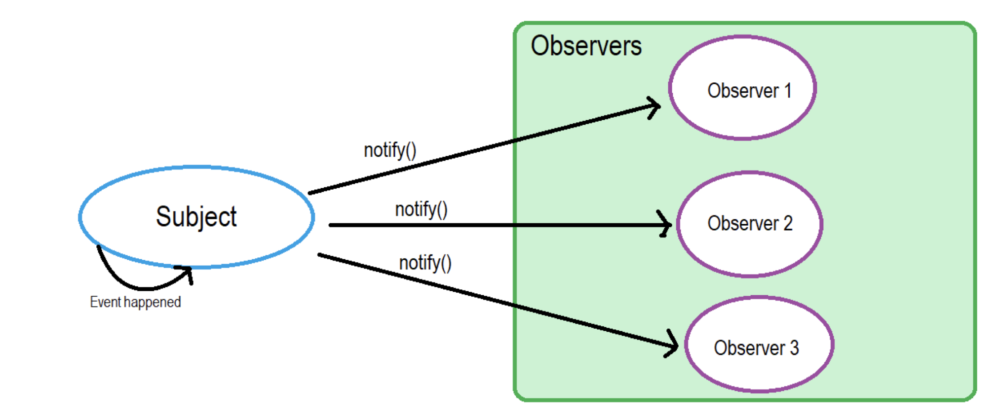

## RxJS - Subjects

**R**eactive E**x**tensions for **J**ava**S**cript([RxJS](https://rxjs.dev/guide/overview)) is a framework for reactive programming using observables that makes it easier to write asynchronous code.

An RxJS Subject is a special type of Observable that allows values to be multicasted to many Observers.

By default an RxJS Observable is unicast, i.e. each subscribed observer has an independent execution of the Observable, whereas multicast means that the Observable execution is shared by multiple Observers. 

Every Subject is an Observer. It is an object with the methods `next(v)`, `error(e)`, and `complete()`. To feed a new value to the Subject, just call `next(theValue)`, and it will be multicast to the Observers registered to listen to the Subject. We subscribe to the Subject to recieve values normally.



**Example:**  Here, we have two Observers attached to a Subject and we feed some values to the Subject.

```typescript
import { Subject } from "rxjs";
export class AppComponent implements OnInit{
  ngOnInit(){
      const subject = new Subject();
      //First Observer
      subject.subscribe({
         next: (data) => console.log('First observer prints '+ data)
      });
      subject.next(1);
      //Second Observer
      subject.subscribe({
         next: (data) => console.log('Second observer prints '+ data)
      });
      subject.next(34);
      subject.next(14);
   }
//Logs:
//First observer prints 1
//First observer prints 34
//Second observer prints 34
//First observer prints 14
//Second observer prints 14
}
```
In this example, we have two observers for the subject that returns data values. If we notice, the second observer did not receive the very first `next` value because the subject simultaneously holds and efficiently distributes the values according to scope and definition. 

## Subject Variants

There are 3 subject variants:

### Behavior subject
It used to temporarily store the current data value of any observer declared before it. 
**Example:**
```typescript
ngOnInit(){
   const subject = new BehaviorSubject(0);
   //First Observer
   subject.subscribe({
      next: (data) => console.log('First observer prints '+ data)
   });
   subject.next(1111);
   subject.next(2222);
   //Second Observer
   subject.subscribe({
      next: (data) => console.log('Second observer prints '+ data)
   });
   subject.next(3333);
}
//Logs:
//First observer prints 0
//First observer prints 1111
//First observer prints 2222
//Second observer prints 2222
//First observer prints 3333
//Second observer prints 3333
```
Here, subject stores last data value '2222' and then reports by the new observer even though it was defined after the reference to it. Also, the new constructor takes an initial value.

### Replay subject

Replay Subject provides a option to choose how many values we want to emit from the last observer. This subject stores and then passes the last specificed option values to the new observer.
**Example:**
```typescript
ngOnInit(){
   const subject = new ReplaySubject(2);
   //First Observer
   subject.subscribe({
      next: (data) => {
         return console.log('First observer prints ' + data);
      }
   });
   subject.next(1111);
   subject.next(2222);
   //Second Observer
   subject.subscribe({
      next: (data) => {
         return console.log('Second observer prints ' + data);
      }
   });
   subject.next(3333);
}
//Logs:
//First observer prints 1111
//First observer prints 2222
//Second observer prints 1111
//Second observer prints 2222
//First observer prints 3333
//Second observer prints 3333
```
Here, subject stores last 2 data values ('1111' & '2222') and then reports them to the new observer.

### Async subject
A Async Subject emits the last value to observers when the sequence is completed.
```typescript
ngOnInit(){
   const subject = new AsyncSubject();
   //First Observer
   subject.subscribe({
      next: (data) => console.log('First observer prints '+ data)
   });
   subject.next(1);
   subject.next(2);
   //Second Observer
   subject.subscribe({
      next: (data) => console.log('Second observer prints '+ data)
   });
   subject.next(3);
   subject.complete();
}
//Logs:
//First observer prints 3
//Second observer prints 3
```
Here, we execute the subject only after a `complete` method is called. 

## References

* [RxJS Docs - Subjects Overview](https://rxjs-dev.firebaseapp.com/guide/subject)