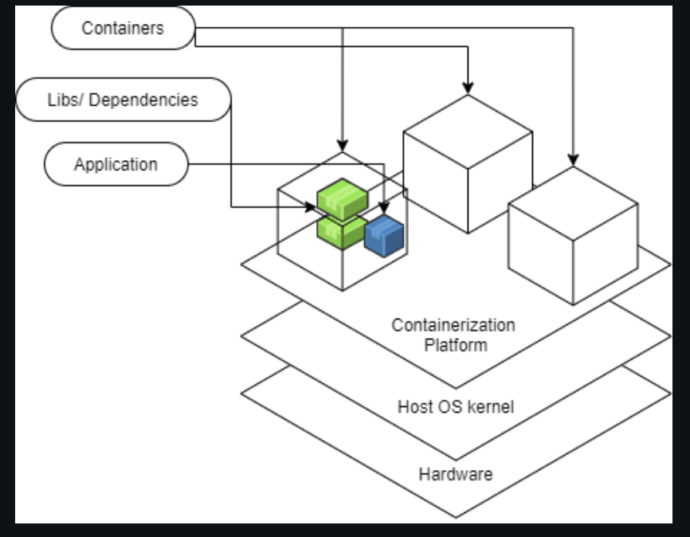
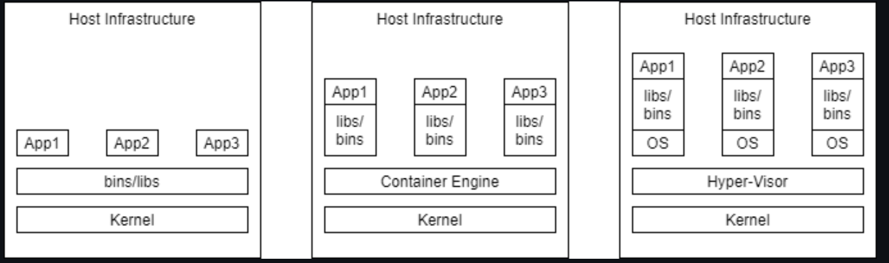

# Monday 

#### References
Resources associates can use to lookup information about the technology
* [EC2 Linux User Guide](https://docs.aws.amazon.com/AWSEC2/latest/UserGuide/concepts.html)

## AWS Elastic Compute Cloud (EC2)
Amazon Elastic Compute Cloud (Amazon EC2) is a web service that provides secure, resizable compute capacity in the cloud. It is designed to make web-scale cloud computing easier for developers.

[](./../images/ec-2.png)

##### Amazon EC2 provides:
* Virtual computing environments, known as instances
* Preconfigured templates for your instances, known as **Amazon Machine Images (AMIs)**, that package the bits you need for your server (including the operating system and additional software)
* Various configurations of CPU, memory, storage, and networking capacity for your instances, known as **instance types**
* Secure login information for your instances using key pairs (AWS stores the public key, and you store the private key in a secure place)
* A firewall that enables you to specify the protocols, ports, and source IP ranges that can reach your instances using **security groups**


### Elastic Web-Scale Computing
You can increase or decrease capacity within minutes and commission one to thousands of instances simultaneously.

### Completely Controlled
AWS EC2 give you complete control including root accessto each instance and can stop and start instances without losing data and use web service APIs.

### Flexible Cloud Hosting Serices
You can choose from multiple instance types & operating systems as well as instances with varying memory, CPU, and storage configurations.


#### Elasticity
The “Elastic” nature of the service allows developers to instantly scale to meet spikes in traffic or demand. When computing requirements unexpectedly change (up or down), Amazon EC2 can instantly respond, meaning that developers have the ability to control how many resources are in use at any given point in time.

#### Instances
An instance is a virtual server in the cloud. Its configuration at launch is a copy of the AMI that you specified when you launched the instance.

You can launch different types of instances from a single AMI. An instance type essentially determines the hardware of the host computer used for your instance. Each instance type offers different compute and memory capabilities. Select an instance type based on the amount of memory and computing power that you need for the application or software that you plan to run on the instance. For more information about the hardware specifications for each Amazon EC2 instance type, see [Amazon EC2 Instance Types](https://aws.amazon.com/ec2/instance-types/).

### Create an EC2 Instance
1. Sign into AWS as a root user.  Go to **EC2 Dashboard**. Select `Launch Instance`.
2. Choose an **Amazon Machin Image (AMI)** - select `Amazon Linux 2 AMI (HVM), SSD Volume Type` - 64 bit (x86).
3. Choose an **Instance Type** - select t2 micro (Free tier eligible)
4. Skip through steps 3-5 until you get to `6. Configure Security Group`.
5. **Configure Security Group**: configure your security group so that you can access your EC2 instance from SSH - change `Source` to `Anywhere`.
6. Proceed to launch until you are prompted to `Select an existing key pair or create a new key pair`.
7. Name your key pair `mynewkeypair`.  Click `Download`, then click `Launch Instance`.
8. Your EC2 Instance has now been launched. Go to the [SSH Into EC2 Instance](./ssh-into-ec2.md) to learn how to connect to your EC2 through SSH client.

### References
* [AWS EC2 Documentation](https://docs.aws.amazon.com/AWSEC2/latest/UserGuide/concepts.html)

## EC2 Autoscaling
Amazon EC2 Auto Scaling helps you maintain application availability and allows you to automatically add or remove EC2 instances according to conditions you define. 

[](./../images/autoscaling.png)

### Benefits

1. Improve Fault Tolerance
2. Increase Application Availability
3. Lower Costs

##### Improve Fault Tolerance
Amazon EC2 Auto Scaling can detect when an instance is unhealthy, terminate it, and replace it with a new one.  

##### Increase Application Availability
Amazon EC2 Auto Scaling ensures that your application always has the right amount of compute, and also proactively provisions capacity with Predictive Scaling.

##### Lower Costs
Amazon EC2 Auto Scaling adds instances only when needed, and can scale across purchase options to optimize performance and cost.


### Auto-Scaling Groups
**Groups** are collections of EC2 instances with similar charcteristics.  Using the auto scaling groups you can increase the number of instances to improve your application performance and also you can decrease the number of instances depending on the load to reduce your cost. The auto-scaling group also maintains a fixed number of instances even if an instance becomes unhealthy.

### Launch Configuration
The launch configuration is a template used by auto scaling group to launch EC2 instances. You can specify the Amazon Machine Image (AMI), instances type, key pair, and security groups etc.. while creating the launch configuration.

### Scaling Plans
Scaling plans tells Auto Scaling when and how to scale. Amazon EC2 auto-scaling provides several ways for you to scale the auto scaling group.

* Schedules Scaling
* Dynamic Scaling
* Predictive Scaling

### How to Configure Autoscaling
In order to configure autoscaling, you must create an AMI and launch template.  You can find [full autoscaling documentation here](https://docs.aws.amazon.com/autoscaling/ec2/userguide/GettingStartedTutorial.html#gs-tutorial-next-steps).  The basic steps are as follows:

1. Create a launch template
2. Create an Auto Scaling group
3. Verify your Auto Scaling group
4. Customize Auto Scaling plan.
5. (Optional) Delete your scaling infrastructure


## Amazon Elastic Block Store (Amazon EBS)
Amazon Elastic Block Store (Amazon EBS) provides block level storage volumes for use with EC2 instances.

* EBS volumes behave like raw, unformatted block devices. You can mount these volumes as devices on your instances.
* EBS volumes that are attached to an instance are exposed as storage volumes that persist independently from the life of the instance. 
* You can create a file system on top of these volumes, or use them in any way you would use a block device (such as a hard drive). 
* You can dynamically change the configuration of a volume attached to an instance.
* With Amazon EBS, you pay only for what you use. 

[](./../images/ebs-pic.png)

### EBS Volumes
An Amazon EBS volume is a durable, block-level storage device that you can attach to your instances. After you attach a volume to an instance, you can use it as you would use a physical hard drive. You can use EBS volumes as primary storage for data that requires frequent updates, such as the system drive for an instance or storage for a database application.

* EBS volumes are created in a specific **Availability Zone**, and can then be attached to any instances in that same Availability Zone.

### EBS Snapshots
ou can back up the data on your Amazon EBS volumes to **Amazon S3** by taking point-in-time snapshots. Snapshots are incremental backups, which means that only the blocks on the device that have changed after your most recent snapshot are saved. 

### How to Create an EBS Volume for AWS EC2
1. Sign into AWS using your administrator account.
2. Navigate to the EC2 Console.
3. Choose a EC2 setup region from the Region drop-down list at the top of the page.
4. Select `Volumes` in the Navigation pane.
5. Click `Create Volume`.
6. Click `Create`.
7. Choose `Actions→ Create Snapshot`.
8. Type `EBS.Backup` in the Name field, type `Test Backup` in the Description field, and then click `Create`.
9. Click `Close`. The volume is ready to use.

When you finish this example, you can delete the volume you created by selecting its entry in the list and choosing Actions →Delete Volume. In a real-world setup, you can attach this volume to any EC2 instance or detach it when it’s no longer needed.

## Amazon Machine Image (AMI)
An Amazon Machine Image (AMI) provides the information required to launch an instance.  Think of it as a template for an EC2 Instance.

#### An AMI includes the following:
* One or more EBS snapshots.
* Launch permissions that control which AWS accounts can use the AMI to launch instances.
* A block device mapping that specifies the volumes to attach to the instance when it's launched.

[](./../images/ami.png)

## Security Groups
A **security group** acts as a virtual firewall for your EC2 instances to control incoming and outgoing traffic based on their IP address. 

* Security group rules enable you to filter traffic based on protocols and port numbers.
* Security groups are stateful — if you send a request from your instance, the response traffic for that request is allowed to flow in regardless of inbound security group rules. Responses to allowed inbound traffic are allowed to flow out, regardless of outbound rules.
* You can add rules to each security group that allow traffic to or from its associated instances. You can modify the rules for a security group at any time. 

*When demoing configuring an EC2 instance, you should set the security groups before you launch your instance.  You can set your first Security Group to `Anywhere`, so that it is easiest to connect from any IP address.*

### Changing an instance's security groups
After you launch an instance into a VPC, you can change the security groups that are associated with the instance. You can change the security groups for an instance when the instance is in the running or stopped state.

#### To change the security groups for an instance using the console

1. Open the Amazon EC2 console at https://console.aws.amazon.com/ec2/.
2. In the navigation pane, choose `Instances`.
3. Open the context (right-click) menu for the instance and choose `Networking` > `Change Security Groups`.
4. In the `Change Security Groups` dialog box, select one or more security groups from the list and choose `Assign Security Groups`.

### References
* [AWS EC2 Documentation](https://docs.aws.amazon.com/AWSEC2/latest/UserGuide/concepts.html)
* [AWS EBS Documentation](https://aws.amazon.com/ebs/?ebs-whats-new.sort-by=item.additionalFields.postDateTime&ebs-whats-new.sort-order=desc)
* [AMI Types](https://docs.aws.amazon.com/AWSEC2/latest/UserGuide/ComponentsAMIs.html)


## Intro to Amazon Simple Storage Service (Amazon S3)
Amazon Simple Storage Service (Amazon S3) is an **object storage service** that offers industry-leading scalability, data availability, security, and performance. This means customers of all sizes and industries can use it to store and protect any amount of data for a range of use cases, such as data lakes, websites, mobile applications, backup and restore, archive, enterprise applications, IoT devices, and big data analytics. 

### S3 as an Object Storage System
Amazon S3 is an object storage system which means the data is stored as individual objects rather than in some kind of hierarchy like you would see in a file system or directory structure.

* Each individual object is put into a **bucket** and you connect to Amazon S3 using a URL.
* The URL will have the name of your object and the name of your bucket. The bucket is just the container in which you put your objects.
* You use what's called a REST API to connect to S3 using a URL.
* Your browser does an HTTP PUT request and it puts the objects in the bucket.

[](./../images/s3-pic.png")

### Use Cases for S3
You can store any type of file in S3.

* Backup and Storage 
* Application Hosting
* Media Hosting
* Software Delivery - host software apps that your customers can download
* [Static Website Hosting](./static-site-hosting.md) - You can configure a static website to run from an S3 bucket.

[](./../images/s3-overview.png)

## AWS S3 Bucket Configuration
* To upload your data (photos, videos, documents etc.) to Amazon S3, you must first create an S3 bucket in one of the AWS Regions. You can then upload your data objects to the bucket.
* Every object you store in Amazon S3 resides in a bucket. You can use buckets to group related objects in the same way that you use a directory to group files in a file system.
* Amazon S3 creates buckets in the AWS Region that you specify. You can choose any AWS Region that is geographically close to you to optimize latency, minimize costs, or address regulatory requirements. 

### To Create a Bucket
1. Sign in to the AWS Management Console and open the Amazon S3 console at https://console.aws.amazon.com/s3/.
2. Choose `Create bucket`.
3. In `Bucket name`, enter a DNS-compliant name for your bucket.  

    The bucket name must:
    * Be unique across all of Amazon S3.
    * Be between 3 and 63 characters long.
    * Not contain uppercase characters.
    * Start with a lowercase letter or number.  
<br />
4. In `Region`, choose the AWS Region where you want the bucket to reside.
5. In `Bucket settings for Block Public Access`, uncheck the `Block Public Access` settings that you want to apply to the bucket.
6. Choose `Create bucket`.

### Deleting a Bucket
Follow the steps provided in the [AWS User Guide for deleting a bucket](https://docs.aws.amazon.com/AmazonS3/latest/user-guide/delete-bucket.html)

**Once you have created a bucket, you can use it to [host static websites](./static-site-hosting/md).**


## Hosting Static Sites on S3
You can use Amazon S3 to host a static website. On a *static website*, individual webpages include static content.

> By contrast, a *dynamic website* relies on server-side processing, including server-side scripts such as PHP, JSP, or ASP.NET. Amazon S3 does not support server-side scripting, but AWS has other resources for hosting dynamic websites. To learn > more about website hosting on AWS, see [Web Hosting](https://aws.amazon.com/websites/).

* To configure your bucket for static website hosting, you can use the AWS Management Console without writing any code.
* You can also create, update, and delete the website configuration programmatically by using the AWS SDKs. The SDKs provide wrapper classes around the Amazon S3 REST API. If your application requires it, you can send REST API requests directly from your application.
* To host a static website on Amazon S3, you [configure an Amazon S3 bucket for website hosting](./s3-bucket-configuration.md) and then upload your website content to the bucket.

### Steps to Host a Static Website on your Previously Created S3 Bucket
1. Click on your bucket in your S3 Management Console
2. Select `Overview` > `Create Folder` - this is where you will upload static HTML files from your computer to be hosted on the S3 bucket.

3. Copy and Paste the following dummy HTML text into a file titled `index.html` on your computer. 

```html
<html>
<head>
    <title>Here's a title, displayed at the top of the window.</title>
</head>
<body>
    <h1>A main heading, usually the same as the title.</h1>
    <p>Be <b>bold</b> in stating your key points. Put them in a list: </p>
    <ul>
        <li>The first item in your list</li>
        <li>The second item; <i>italicize</i> key words</li>
    </ul>

    <p>Add a link to your favorite <a href="https://revature.com/learn-to-code/">Web site</a>.
        Break up your page with a horizontal rule or two. </p>
    <hr>
    <p>Finally, link to <a href="page2.html">another page</a> in your own Web site.</p>
    <!-- A copyright notice.-->
    <p>&#169; Revature 2020</p>
</body>

</html>
```

4. Select `Upload` and upload the `index.html` file you just saved to your computer.
5. Select `Properties`
6. Select `Static website hosting`
7. Select `Use this bucket to host a website` > enter the name of the file we're hosting: `index.html`.
8. Return to your bucket > click on the uploaded `index.html` file > click `Make public`.
9.  Visit the `Object URL` and you will see your static webpage hosted on your configured S3 bucket!


### References
* [S3 Documentation](https://docs.aws.amazon.com/AmazonS3/latest/dev/Welcome.html)
* [Configuring a bucket as a static website using the AWS Management Console](https://docs.aws.amazon.com/AmazonS3/latest/userguide/HostingWebsiteOnS3Setup.html)

<br>

# Tuesday - Coding Day in Preparation for Code Freeze (P2)

<br>

# Wednesday 

#### References
* [DevOps Culture](https://martinfowler.com/bliki/DevOpsCulture.html)
* [Continuous Delivery - Atlassian](https://www.atlassian.com/continuous-delivery/pipeline)
* [CI CD CD - Atlassian](https://www.atlassian.com/continuous-delivery/principles/continuous-integration-vs-delivery-vs-deployment)
* [Continuous Deployment vs Continuous Delivery - Atlassian](https://www.atlassian.com/continuous-delivery/continuous-deployment/how-to-get-to-continuous-deployment)
* [DevOps Image Source](https://www.logigear.com/blog/continuous-delivery-devops/continuous-delivery-everything-you-need-to-know/)

## DevOps
Software Development (dev) Operations (ops) are a set of practices and methodologies designed to combine the development (production/writing of code), deployment and maintenance of code into a streamlined process. The primary goal of DevOps is to expedite the lifecycle of application development, particularly through the automation of tasks.

## Steps in Dev Ops and Production of Code
The steps or phases for Dev Ops refers to the creation, testing, and deployment of an application.

These steps include:
1. Source code Control: Producing (writing) code and pushing to a repository 
1. Building and Testing Automation: Test basic functionality of code (Generally unit testing) and create a new, working build
1. Deploying to Staging: Deployment of working build to a temporary environment 
1. Acceptance Testing: Undergo other more complex tests (systems, integration) within temporary environment
1. Deployment of Build: Migrate working build to Production environment accessible by end users

## DevOps and Agile
Agile is a mentality or philosophy utilized when approaching the creation of information systems, and is a flexible approach of addressing the steps of the Software Development Life Cycle. Development teams who practice an Agile methodology place a focus on producing code through iteration and collabortion rather than following a rigid plan.

Though DevOps, which involves the creation of a systematic approach to producing code, and Agile, which is a mentality that focuses on creating products by adapting to change quickly, seem contradictory, the goal of both methodologies is to produce working and valuable product more efficiently. DevOps pertains to the entire system working together to produce, test, deploy and maintain the code base, while Agile practices allow for each step of that process to change wherever and whenever needed.
* Agile Practices with DevOps:
  * Continuous Integration
  * Continuous Delivery
  * Continuous Deployment

Adoption of the Agile philosophies can provide a stepping stone for the establishment of a working DevOps pipeline, as Agile practices intrinsically produce more continuous feedback loops. Continuous Integration, Continuous Delivery and Continuous Deployment seek to automate the phases of DevOps as much as possible.

## Continuous Integration
The process of regularly and consistently merging code into a central repository and reviewing new code to ensure that it integrates well within the previously established code base.

Tools used for this task:
* [Github](https://github.com/features)
* [Gitlab](https://about.gitlab.com/features/)
* [Perforce](https://www.perforce.com/support/self-service-resources/documentation)
* [Bazaar](http://doc.bazaar.canonical.com/en/)
* [DevOps Tools](/revature_training/devops-team/-/blob/master/./devops-tools.md)

## Continuous Delivery
Development principle which focuses on the automation of the Dev Ops pipeline to the extent that human intervention is not required. Generally, this means that steps 1 - 3 (source code control, building and testing, and deployment to staging) are automated, while steps 4 (acceptance testing) may be handled by a Human, if necessary and step 5 (deployment to production environment) requires manual approval.

## Continuous Deployment
Development principle which automates all phases of the Dev Ops Pipeline.


<br> 

# Thursday 

## DevOps Tools: Jenkins

Jenkins is a self-contained, open source automation server, which can be used to automate the building, testing and deployment of software. Jenkins can be installed standalone, through native system packages, or using Docker.

## Projects/Jobs and Builds
In Jenkins, you work with projects or jobs. Each job is a repeatable set of steps that automate a task, such as building, testing, and deploying your software. In Jenkins, it is possible for a job to be triggered manually, externally (via a REST endpoint or a push to a repository), or even by another job. When a job is triggered, Jenkins creates a build of the project.

Jobs have a status called Health, represented by a weather condition, and builds have a more traditional status. Each build has a colored circle that represents the success or failure of a build. The health of a job is a status that is dependent on the status of the most recent builds.

### Build Statuses
Blue - Success
Yellow - Unstable (usually indicates failed tests)
Red - Failure
Grey - No builds or aborted build

### Weather
Sunny - More than 80% of runs passing
Partially Sunny - 61% to 80% passing
Cloudy - 41% to 60% passing
Raining - 21% to 40% passing
Stormy - less than 21% passing


### References
* [Jenkins Documentation](https://www.jenkins.io/doc/)
* [Installation of Jenkins](https://www.jenkins.io/doc/book/installing/)
* [Jenkins Pipeline Tutorial](https://www.youtube.com/watch?v=s73nhwYBtzE)
* [Using Jenkins](https://www.jenkins.io/doc/book/using/)
* [Managing Jenkins](https://www.jenkins.io/doc/book/managing/)
* [Defined Pipeline-compatible steps](https://www.jenkins.io/doc/pipeline/steps/)


## Jenkins Installation
To utilize Jenkins, it is recommended to [install Docker](https://docs.docker.com/get-docker/) on your operating system. Moreover, you can also utilize an [AWS Linux Ubuntu EC2](https://docs.aws.amazon.com/AWSEC2/latest/UserGuide/get-set-up-for-amazon-ec2.html) server.
* [Jenkins Install - MacOS](https://www.jenkins.io/download/lts/macos/)
* [Jenkins Install - Linux](https://www.jenkins.io/doc/book/installing/#linux)
* [Jenkins Install - Windows](http://mirrors.jenkins.io/windows/)

## Using Jenkins
After you [download Jenkins](https://www.jenkins.io/doc/pipeline/tour/getting-started/), open a terminal a Run:
```
java -jar jenkins.war --httpPort=8080.
```

Next, navigate to `http://localhost:8080` and follow the instructions to complete the installation process.

## Pipeline Tutorial
A Jenkins Pipeline is a suite of plugins which support the implementation of a Continuous Delivery Pipeline in Jenkins. The follow details steps for utilizing a Jenkins pipeline with Java.

You can follow these steps to establish your pipeline [here](https://gitlab.com/revature_training/devops-team/-/tree/master/trainer-examples/matthew-oberlies/pipeline-demo/scripts). Alternatively you can follow these [steps to build a Java app with Maven](https://www.jenkins.io/doc/tutorials/build-a-java-app-with-maven/).

Creating a custom pipeline can offer you a great deal of flexibility. To create a custom pipeline, you will need to create a `jenkinsfile`:
1. Configure your `jenkinsfile` (see below)
1. Navigate to your Jenkins server and select 'New Item' from the Jenkins menu.
1. Provide a name for your new item (i.e. "Pipeline-Example")
1. Click "Add Source" to choose the type and details for your repository
1. Click "Save". You can now build your project using this new pipeline

A `jenkinsfile` consists of agents, stages, and steps.

An [agent](https://www.jenkins.io/doc/book/pipeline/syntax/#agent) informs Jenkins where, and how to execute the Pipeline. For example:
* From a docker image
```
pipeline {
    agent { 
        docker { image 'maven:3.3.3' }
    }
    // additional information to follow //
}
```
* From anywhere

```
pipeline {
    agent any
    // additional information to follow //
}
```

An agent is required at the top level of a pipeline block but can also optionally be used at the stage level to define stage-level usage.

[Stages](https://www.jenkins.io/doc/book/pipeline/syntax/#stages) are a sequence of one or more individual custom [stage](https://www.jenkins.io/doc/book/pipeline/syntax/#stages) directives. Each stage will consist of multiple steps, that are performed by a Jenkins pipeline.

Stages Block
* The stages block is required to list each individual stage directive
* Each pipeline should only contain a single stages block.
* This stages block must contain as least one stage directive
* May contain multiple stage directives. 

Stage Directive
* Each stage directive requires a string parameter for the name of the stage.
* Each stage directive requires at least one step
* May contain multiple steps

For example:
```
pipeline {
    agent any
    stages {
        stage('Deploy') {
            // List of steps go here //
        }
    }
}
```

[Steps](https://www.jenkins.io/doc/book/pipeline/syntax/#steps) are the specific actions taken by a Jenkins Pipeline. 

Steps Block
* Do not require parameters
* May contain a script block to define behavior

For example:
```
pipeline {
    agent any
    stages {
        stage('Deploy') {
            steps {
                echo 'Hello World'

                script {
                    def browsers = ['chrome', 'firefox']
                    for (int i = 0; i < browsers.size(); i++) {
                        echo "Testing the ${browsers[i]} browser"
                    }
                }
            }
        }
    }
}
```

### Disadvantages of Jenkins
* Requires custom jenkinsfile syntax for pipeline configuration

### Advantages of Jenkins
* Completely Open Source
* Free
* Supports all Operating systems
* Supports all source code repositories

<br>

# Friday 

## Contanerization

### Introduction
A **container** is a mechanism for packaging an application(or limited number of processes) with its dependencies so that it runs in its own isolated sandbox. 

Containerization helps to ensure the application or set of processes can run reliably regardless of the host environment. The container shouldn't be able to modify or interact with it anything it doesn't need and, on the whole, changes in the container should not effect the Host or other containers (and vice versa). 

The following diagram illustrates the structure of containers- an application in a container is isolated to just what it needs.



### Foundations
#### Linux
LinuX Containers, which provide the foundation for most modern container systems (including Docker), began with two key kernel tools in Linux: cgroups and namespaces
- Control groups (cgroups) is a kernel feature that allows you to exercise control over the resources used for a particular process-- via monitoring and limiting
	- Things like limiting the amount of memory for a process, determining the priority of a process- how much CPU time, and stopping/starting that process or set of processes. 

- Namespaces 
	- method of encapsulating a global resource 
	- Different types: 
		- mount: set of mount points exposed (First namespace type introduced)
		- PID: set of process IDs exposed, form a hierarchy 
		- Net (network): set of network resources exposed; routing tables; socket port member names etc. 
		- UTS: Unix timesharing system- defines visible host and domainname-- not related to DNS 
		- User: Isolates the user ID and group ID-- can make a user seem like the super user for its namespace, but in actuality the user has limited privileges in the context of the greater system
		- IPC
		- Cgroup 
		- and more

	- Namespaces determine what is visible to a particular process. A process begins as part of a single instance of each particular namespace type. 
		- can only see a certain set of other process IDs, network resources, mount points etc. 
		- namespaces also provide a layer of virtualization-- a process might see itself as having PID 1. In its namespace this may be "true", but there may be a namespace further up the heirarchy that understands this same process as having PID 312 

Take the cgroup management of resources + namespaces => the basics of a container  

=> Isolation and Virtualization => Containerization 

By packaging up an application in a container you ensure that it has all the needed dependencies and can modify/use only what it needs. You also ensure that the application is portable. 

### Windows Containers
As Linux containers gained popularity, Windows worked to keep up and find it's own solution to support containerization. While Windows met with some challenges since their operating system setup is a bit different from Linux, they were able to ultimately support the same functionality through tools that were analogous to cgroups and namespaces. Though, because of the manner in through which certain resources must be shared, they also came up with another version of containers that's based on the same technology used by virtual machines. As they got things working and were able to break down the problems they faced, in 2016, the question became how to make these features available to users of the Windows OS. The solution became to partner with Docker who by that point was already a huge driving force in the move toward containerization.  

As the diagram illustrates the docker engine runs upon the platform specific supports for containers within either the Windows OS or Linux OS. 
.png)

## Containers
- Built from images (template for the container)
- Run on an engine (on the host OS) i.e. Docker Engine
- Ideally stateless
	- State needed to persist for an application should be stored in a way that is essentially "detachable" from the actual container- otherwise state only persists so long as a container is running- volumes-- solve this 
- Virtualization
- Isolation

### Benefits 
- Secure 
    - Isolation and Virtualization keep your containerized apps more secure
- Standardized and thus Portable
    - Think write once run anywhere
- Lightweight 
	- shares the host operating system's kernel 
- Flexible and Loosely Coupled 
- Scalable
    - Easy to spin up and because of this lightweight ease they can be scaled up quickly 


# Containers vs. Virtual Machines 
## Overview 

Virtual machines and containers provide the ability to isolate processes from one another and provide some kind of virtualization, so that the processes can run in their own sandbox environment on the same host machine. However, virtual machines and containers do so in differing ways. 



**Note**, *virtualization* means to provide a virtualized view of some set of resources. For example, a process may have a virtualized view of a file system where it believes that it is manipulating the root of the system. Meanwhile, the directory that the process manipulates is many layers away from the root. 

## Virtual Machines
Virtual Machines simulate a physical server so that multiple "servers" can run on a single machine. 

They virtualize the entire supporting OS. Thus, using virtual machines your host computer could be windows based and you could still run a Linux OS and an application on top of it. 

Virtual machines are enabled by *hypervisors*, software that coordinates between multiple vms and interfaces with the underlying infrastructure. (Some hypervisors interact directly with the hardware, while others run on top of the underlying OS.)

### Pros
- near total isolation
- Provides virtualization
    -  virtualizing the entire OS
- Ensures an application runs reliably regardless of Host

### Cons
- considered "bulky", expensive in the context of resources 

## Containers
Containers bundle together applications with their supporting libraries and dependencies, allowing them to run isolated from one another. However, containers still share the underlying OS kernel and are, therefore, much lighter weight than virtual machines. 

Containers provide their processes a virtualized view of the underlying resources. Processes within a container only see a particular version of their environment and have limited access to resources- isolating them from the rest of the processes running on a given host. 

Containerization is enabled by an engine running on the host i.e. the Docker Engine. 

### Pros
- considered "light weight", because they don't require spinning up a whole guest OS
- they can enable layers of isolation or partial isolation-- depending on how they are implemented 
- provide a virtualized view of certain resources.
- Package an application in an isolated environment
- Ensure an application runs reliably regardless of Host

### Cons
- having layers of isolation
    - if you have need of very strict and complete isolation the ability to have layers can be a con

## Summary 
In most cases containers are preferable to virtual machines since they provide isolation and virtualization without the cost of having to spin up an entire OS on top of the host. They also enable you to vary the layers of isolation, occasionally sharing necessary resources between processes in differing containers. 

However, when a developer desires near total isolation then they may prefer to run their set of processes/application in a virtual machine. 

# Docker Architecture
## References
- [Docker Architecture from the Docker Getting Started Guide](https://docs.docker.com/get-started/overview/#docker-architecture)

## Overview
Docker adheres to a Client-Server Architecture. The client allows you to run commands and interact with the docker objects managed by the docker daemon, which is in effect the server. 

This architecture, consequently, translates into these *primary* components that allow you to run and interact with Dockerized applications (applications that have been packaged up and run in Docker containers.)
- [Docker Daemon](#docker-daemon) 
- [Rest API](#rest-api)
- [Docker CLI client](#docker-cli-command-line-interface-client)
- [Docker Registries](#docker-registries)
- [Docker objects](#docker-objects)  


As you can see from the diagram the *client* includes the commands that manage docker containers and images. The *docker host* is the computer on which the *docker daemon* runs, and the *docker daemon* is responsible for managing the *docker objects* i.e. containers and images. The *registry* is an additional/optional component that provides a centralized place to share docker images. Finally, while the *REST API* is not labeled in the diagram it's effectively the lines connecting the *client* and *docker daemon*.   

### Docker CLI (Command Line Interface) client
The command line interface is what Docker developers typically use for interactions with the Docker daemon. 

It's prefaced by the `docker` command. 

The CLI client may be on the same host machine as the Docker daemon with which it communicates, but it doesn't have to be. 

All the commands outlined in the docker workflow module notes are effectively part of the client. 

### Docker Daemon
The docker daemon is the long running process on the docker host that does all the heavy lifting of managing Docker objects- containers, images, etc. The docker daemon is at the core of running dockerized applications. 

### Rest API 
These are the underlying commands used by the CLI and other applications to interact with the Docker Daemon. 

### Docker registries 
Docker registries provide a centralized place to store images, allowing you to easily share images between docker hosts. The Docker Hub is a public registry managed by Docker that docker hosts can pull images from and push images to by default. 


### Docker objects
Docker objects are the building blocks that are managed by the docker daemon. The most fundamental docker objects are images and containers. Images are the templates that outline all dependencies for a particular container and it's primary process. Meanwhile the container is the runnable instance of a set of processes and their dependencies.   


#### Typical Flow
1. Using CLI commands (in your command line, Terminal, Command Prompt etc.) such as `docker build ...` or `docker pull ...`, acquire an image. This image lays out everything needed to create and run a container. 
2. Behind the scenes the Docker daemon either pulls your image from a registry(repository of images) or it creates the image. (Depending on the command you gave.) 
3. Then you use the CLI again with a command such as `docker run ...`. (Note if you don't already have the image you were trying to run then the command will include that first step of pulling the image implicitly.) If you didn't already do this during the installation process, try the following command. 
```console
docker run hello-world
```
4. Thus, the CLI once again instructs the daemon. This time it tells the daemon to spin up a container from the image. 
    - The application or set of processes in the container are tied to its life cycle and have started with its instantiation. 
5. Finally, it's just a matter of using additional CLI commands to manage the now running container, unless the primary process of the container has already finished. In that case the container will exit on it's own.  


## References 
* [History of Containerization](https://blog.aquasec.com/a-brief-history-of-containers-from-1970s-chroot-to-docker-2016)
* [Video Explanation from VMWare](https://www.youtube.com/watch?v=EnJ7qX9fkcU)
* Docker for the Virtualization Admin Book
* [IBM learning Containerization](https://www.ibm.com/cloud/learn/containerization)
* [Namespaces Explained from NDC by Michael Kerrisk](./https://www.youtube.com/watch?v=0kJPa-1FuoI&list=RDCMUCTdw38Cw6jcm0atBPA39a0Q&start_radio=1)
* [Windows Containers](./https://docs.microsoft.com/en-us/virtualization/windowscontainers/manage-containers/hyperv-container)
* [Windows Containers Under the hood](https://medium.com/@justen.walker/a-short-introduction-to-windows-containers-db5adc0db536)
* [Windows Containers a History](https://docs.microsoft.com/en-us/archive/msdn-magazine/2017/april/containers-bringing-docker-to-windows-developers-with-windows-server-containers)
- [Containers explained in relation to VMs from F5 Dev Central](https://www.youtube.com/watch?v=wuhxSLapDe0)
- Docker for the Virtualization Admin Book- [View here](https://goto.docker.com/rs/929-FJL-178/images/docker-for-the-virtualization-admin.pdf)
- [IBM on VMs vs. Containers](https://www.ibm.com/cloud/learn/containerization#toc-virtualiza-jttBZ0x-)
- [IBM on Virtualization](https://www.ibm.com/cloud/learn/virtualization-a-complete-guide)
